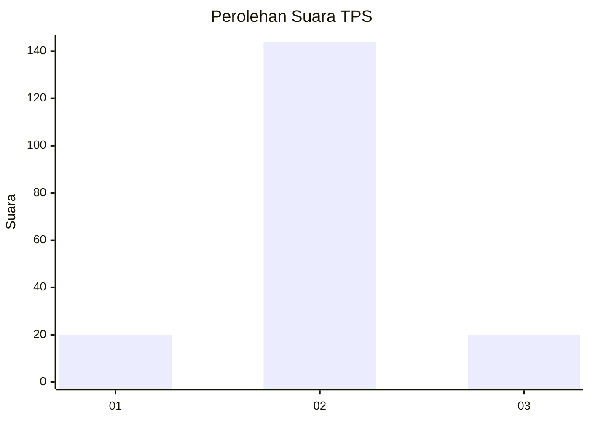
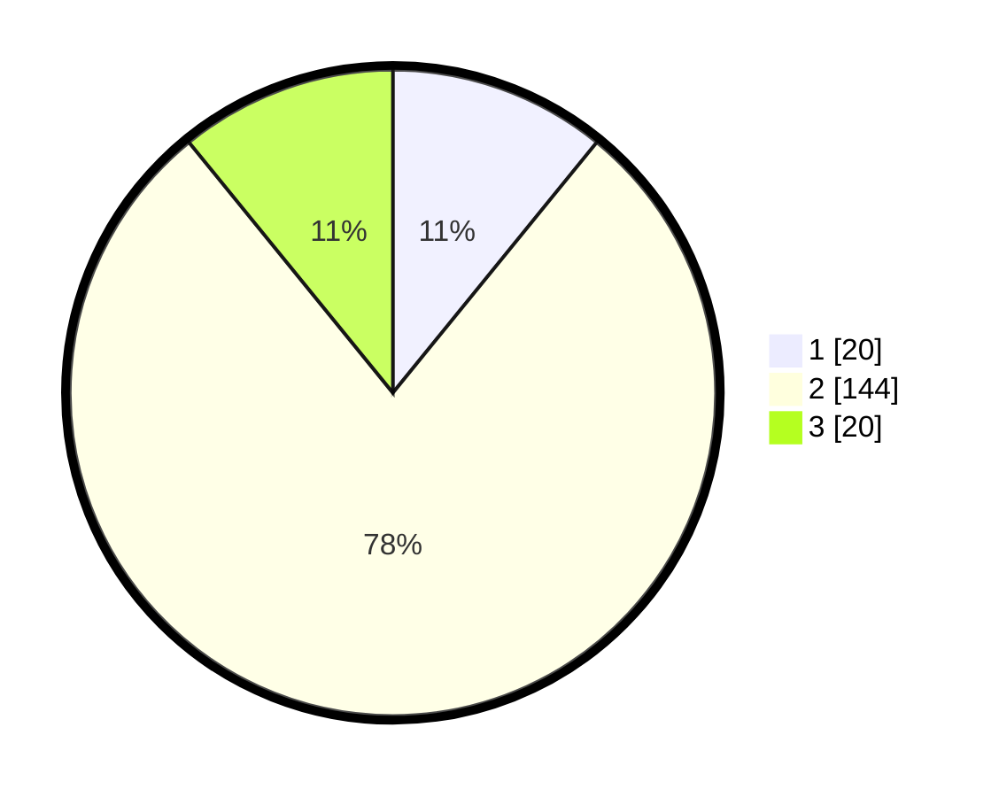

# Hasil

## Grafik

## Tabel

| No. | Nama Paslon    | Suara | Suara (raw) | Persentase |
|:--- |:-------------- | -----:| -----------:| ----------:|
| 1   | ANIES MUHAIMIN | 20    | [20][p-1]   | 10,87      |
| 2   | PRABOWO GIBRAN | 144   | [144][p-2]  | 78,26      |
| 3   | GANJAR MAHFUD  | 20    | [20][p-3]   | 10,87      |

[p-1]: https://github.com/gigit-pemilu/pemilu-2024-17-bengkulu/blob/main/pilpres/hitung-suara/sub/17-bengkulu/sub/01-bengkulu-selatan/sub/01-kedurang/sub/2001-batu-ampar/sub/001-tps/sub/paslon-1.txt
[p-2]: https://github.com/gigit-pemilu/pemilu-2024-17-bengkulu/blob/main/pilpres/hitung-suara/sub/17-bengkulu/sub/01-bengkulu-selatan/sub/01-kedurang/sub/2001-batu-ampar/sub/001-tps/sub/paslon-2.txt
[p-3]: https://github.com/gigit-pemilu/pemilu-2024-17-bengkulu/blob/main/pilpres/hitung-suara/sub/17-bengkulu/sub/01-bengkulu-selatan/sub/01-kedurang/sub/2001-batu-ampar/sub/001-tps/sub/paslon-3.txt

## Foto C Plano

https://sirekap-obj-formc.kpu.go.id/b483/pemilu/ppwp/17/01/01/20/01/1701012001001-20240215-012401--481bb395-661e-44c2-9dc8-588da14d3729.jpg

https://sirekap-obj-formc.kpu.go.id/b483/pemilu/ppwp/17/01/01/20/01/1701012001001-20240215-012644--f6614a05-3d60-468e-8fe7-c034246d37cb.jpg

https://sirekap-obj-formc.kpu.go.id/b483/pemilu/ppwp/17/01/01/20/01/1701012001001-20240215-012756--951a32e8-742d-40ee-9014-31f2b4cb1603.jpg

## Metadata

| Key        | Value               |
| ---------- | ------------------- |
| Time Stamp | 2024-02-15 12:00:28 |

## DATA PEMILIH TETAP

Jumlah pemilih dalam DPT: **233**.
 * L: **118**.
 * P: **115**.

## DATA PENGGUNA HAK PILIH

Jumlah pengguna hak pilih dalam DPT: **184**.
 * L: **89**.
 * P: **95**.

Jumlah pengguna hak pilih dalam DPTb: **2**.
 * L: **2**.
 * P: **0**.

Jumlah pengguna hak pilih dalam DPK: **0**.
 * L: **0**.
 * P: **0**.

Jumlah pengguna hak pilih: **186**.
 * L: **91**.
 * P: **95**.

## JUMLAH SUARA SAH DAN TIDAK SAH

JUMLAH SELURUH SUARA SAH: **184**.

JUMLAH SUARA TIDAK SAH: **2**.

JUMLAH SELURUH SUARA SAH DAN SUARA TIDAK SAH: **186**.

