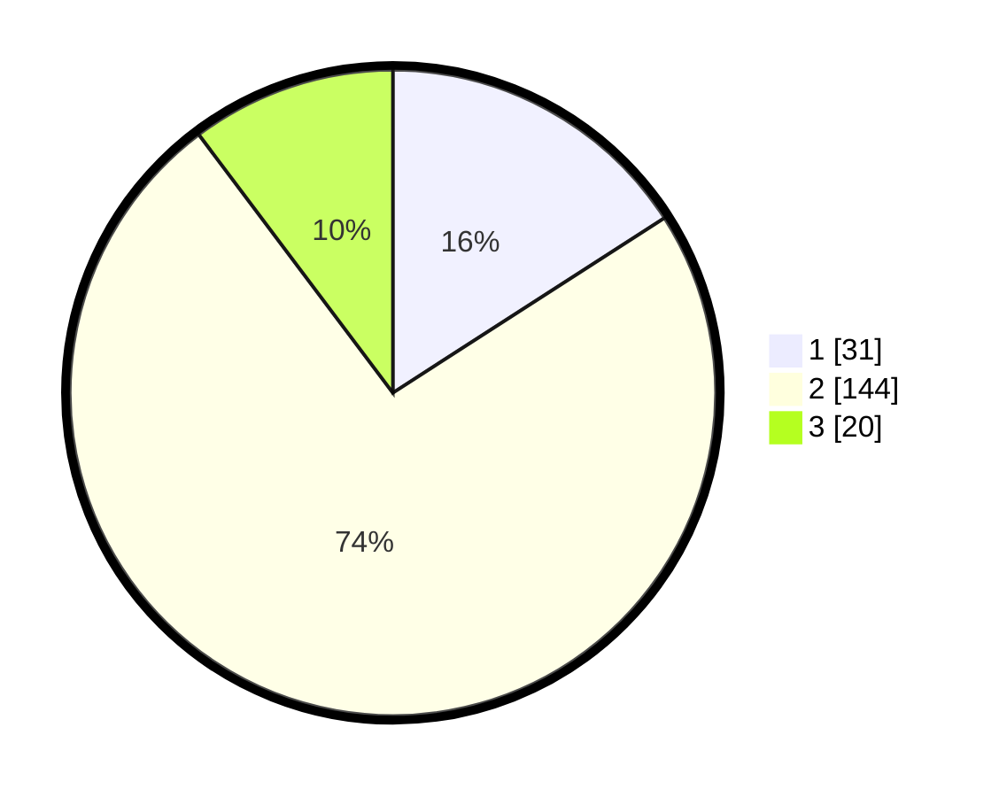

# Hasil

## Grafik

## Tabel

| No. | Nama Paslon    | Suara | Suara (raw) | Persentase |
|:--- |:-------------- | -----:| -----------:| ----------:|
| 1   | ANIES MUHAIMIN | 31    | [31][p-1]   | 15,90      |
| 2   | PRABOWO GIBRAN | 144   | [144][p-2]  | 73,85      |
| 3   | GANJAR MAHFUD  | 20    | [20][p-3]   | 10,26      |

[p-1]: https://github.com/gigit-pemilu/pemilu-2024-17-bengkulu/blob/main/pilpres/hitung-suara/sub/17-bengkulu/sub/01-bengkulu-selatan/sub/01-kedurang/sub/2001-batu-ampar/sub/002-tps/sub/paslon-1.txt
[p-2]: https://github.com/gigit-pemilu/pemilu-2024-17-bengkulu/blob/main/pilpres/hitung-suara/sub/17-bengkulu/sub/01-bengkulu-selatan/sub/01-kedurang/sub/2001-batu-ampar/sub/002-tps/sub/paslon-2.txt
[p-3]: https://github.com/gigit-pemilu/pemilu-2024-17-bengkulu/blob/main/pilpres/hitung-suara/sub/17-bengkulu/sub/01-bengkulu-selatan/sub/01-kedurang/sub/2001-batu-ampar/sub/002-tps/sub/paslon-3.txt

## Foto C Plano

https://sirekap-obj-formc.kpu.go.id/5aff/pemilu/ppwp/17/01/01/20/01/1701012001002-20240215-010902--acd409c3-c054-4645-9842-9c9443cb9b72.jpg

https://sirekap-obj-formc.kpu.go.id/5aff/pemilu/ppwp/17/01/01/20/01/1701012001002-20240215-011226--ceae7882-a84d-49af-837c-7d6c61b10965.jpg

https://sirekap-obj-formc.kpu.go.id/5aff/pemilu/ppwp/17/01/01/20/01/1701012001002-20240215-011458--98af3907-a8a6-4d2f-bbde-501ee6f0f3ae.jpg

## Metadata

| Key        | Value               |
| ---------- | ------------------- |
| Time Stamp | 2024-02-15 17:00:25 |

## DATA PEMILIH TETAP

Jumlah pemilih dalam DPT: **219**.
 * L: **115**.
 * P: **104**.

## DATA PENGGUNA HAK PILIH

Jumlah pengguna hak pilih dalam DPT: **191**.
 * L: **99**.
 * P: **92**.

Jumlah pengguna hak pilih dalam DPTb: **5**.
 * L: **3**.
 * P: **2**.

Jumlah pengguna hak pilih dalam DPK: **3**.
 * L: **2**.
 * P: **1**.

Jumlah pengguna hak pilih: **199**.
 * L: **104**.
 * P: **95**.

## JUMLAH SUARA SAH DAN TIDAK SAH

JUMLAH SELURUH SUARA SAH: **195**.

JUMLAH SUARA TIDAK SAH: **4**.

JUMLAH SELURUH SUARA SAH DAN SUARA TIDAK SAH: **199**.

