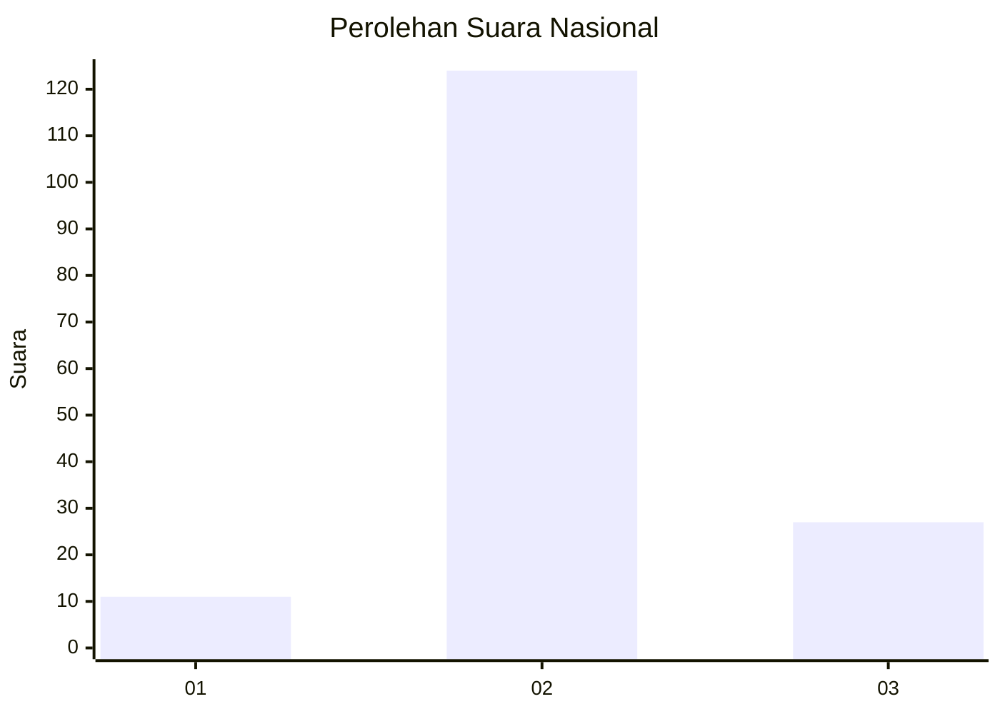
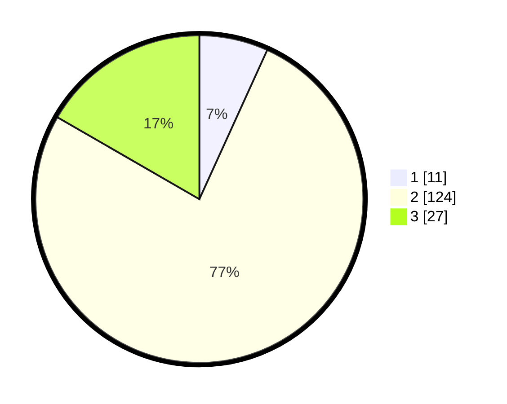

# Hasil

## Grafik

## Tabel

| No. | Nama Paslon    | Suara | Suara (raw) | Persentase |
|:--- |:-------------- | -----:| -----------:| ----------:|
| 1   | ANIES MUHAIMIN | 11    | [11][p-1]   | 6,79       |
| 2   | PRABOWO GIBRAN | 124   | [124][p-2]  | 76,54      |
| 3   | GANJAR MAHFUD  | 27    | [27][p-3]   | 16,67      |

[p-1]: https://github.com/gigit-pemilu/pemilu-2024/blob/main/pilpres/hitung-suara/sub/17-bengkulu/sub/01-bengkulu-selatan/sub/01-kedurang/sub/2002-rantau-sialang/sub/002-tps/sub/paslon-1.txt
[p-2]: https://github.com/gigit-pemilu/pemilu-2024/blob/main/pilpres/hitung-suara/sub/17-bengkulu/sub/01-bengkulu-selatan/sub/01-kedurang/sub/2002-rantau-sialang/sub/002-tps/sub/paslon-2.txt
[p-3]: https://github.com/gigit-pemilu/pemilu-2024/blob/main/pilpres/hitung-suara/sub/17-bengkulu/sub/01-bengkulu-selatan/sub/01-kedurang/sub/2002-rantau-sialang/sub/002-tps/sub/paslon-3.txt

## Foto C Plano

https://sirekap-obj-formc.kpu.go.id/9a66/pemilu/ppwp/17/01/01/20/02/1701012002002-20240215-021359--b5dca2dd-cf4a-473f-ab53-85087d752eb7.jpg

https://sirekap-obj-formc.kpu.go.id/9a66/pemilu/ppwp/17/01/01/20/02/1701012002002-20240215-021241--ddb07512-e48c-4b62-8883-2bf4fd2824c0.jpg

https://sirekap-obj-formc.kpu.go.id/9a66/pemilu/ppwp/17/01/01/20/02/1701012002002-20240215-031740--2b9de784-9d3f-43de-9a3b-ceda6796fe37.jpg

## Metadata

| Key        | Value               |
| ---------- | ------------------- |
| Time Stamp | 2024-02-15 04:00:24 |

## DATA PEMILIH TETAP

Jumlah pemilih dalam DPT: **182**.
 * L: **88**.
 * P: **94**.

## DATA PENGGUNA HAK PILIH

Jumlah pengguna hak pilih dalam DPT: **164**.
 * L: **83**.
 * P: **81**.

Jumlah pengguna hak pilih dalam DPTb: **1**.
 * L: **0**.
 * P: **1**.

Jumlah pengguna hak pilih dalam DPK: **1**.
 * L: **1**.
 * P: **0**.

Jumlah pengguna hak pilih: **166**.
 * L: **84**.
 * P: **82**.

## JUMLAH SUARA SAH DAN TIDAK SAH

JUMLAH SELURUH SUARA SAH: **162**.

JUMLAH SUARA TIDAK SAH: **4**.

JUMLAH SELURUH SUARA SAH DAN SUARA TIDAK SAH: **166**.

