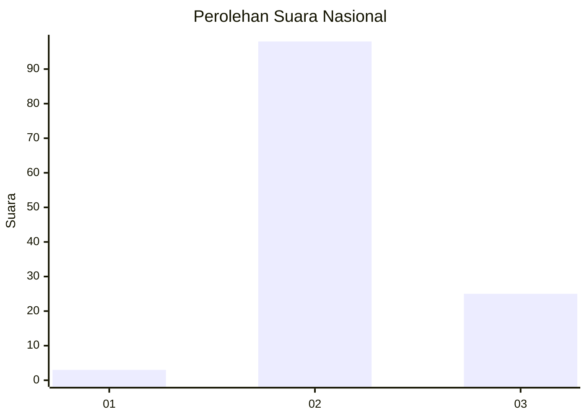
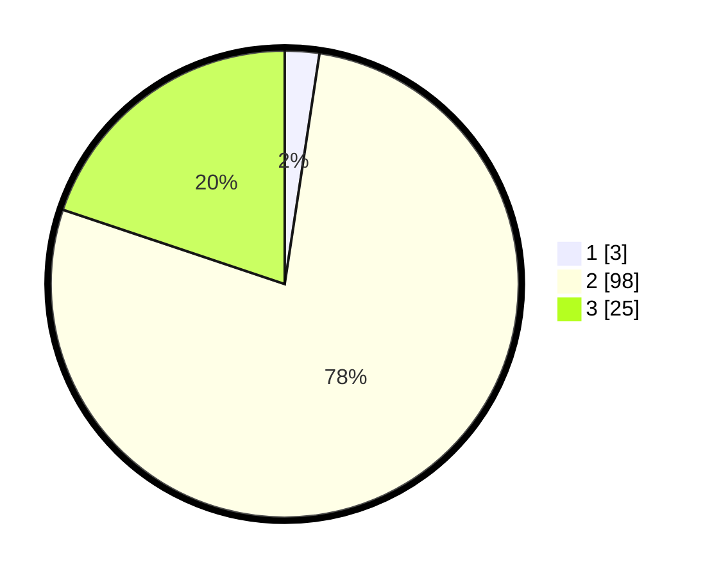

# Hasil

## Grafik

## Tabel

| No. | Nama Paslon    | Suara | Suara (raw) | Persentase |
|:--- |:-------------- | -----:| -----------:| ----------:|
| 1   | ANIES MUHAIMIN | 3     | [3][p-1]    | 2,38       |
| 2   | PRABOWO GIBRAN | 98    | [98][p-2]   | 77,78      |
| 3   | GANJAR MAHFUD  | 25    | [25][p-3]   | 19,84      |

[p-1]: https://github.com/gigit-pemilu/pemilu-2024/blob/main/pilpres/hitung-suara/sub/17-bengkulu/sub/01-bengkulu-selatan/sub/01-kedurang/sub/2007-tanjung-alam/sub/004-tps/sub/paslon-1.txt
[p-2]: https://github.com/gigit-pemilu/pemilu-2024/blob/main/pilpres/hitung-suara/sub/17-bengkulu/sub/01-bengkulu-selatan/sub/01-kedurang/sub/2007-tanjung-alam/sub/004-tps/sub/paslon-2.txt
[p-3]: https://github.com/gigit-pemilu/pemilu-2024/blob/main/pilpres/hitung-suara/sub/17-bengkulu/sub/01-bengkulu-selatan/sub/01-kedurang/sub/2007-tanjung-alam/sub/004-tps/sub/paslon-3.txt

## Foto C Plano

https://sirekap-obj-formc.kpu.go.id/6205/pemilu/ppwp/17/01/01/20/07/1701012007004-20240215-023829--15379b66-02f8-4787-b38e-ec66b34ce6a1.jpg

https://sirekap-obj-formc.kpu.go.id/6205/pemilu/ppwp/17/01/01/20/07/1701012007004-20240215-024728--918a0b10-e56c-4436-bde5-8f97fe775287.jpg

https://sirekap-obj-formc.kpu.go.id/6205/pemilu/ppwp/17/01/01/20/07/1701012007004-20240215-024813--c694846d-8cb9-431a-bc32-aedace3d1dd7.jpg

## Metadata

| Key        | Value               |
| ---------- | ------------------- |
| Time Stamp | 2024-02-15 23:29:50 |

