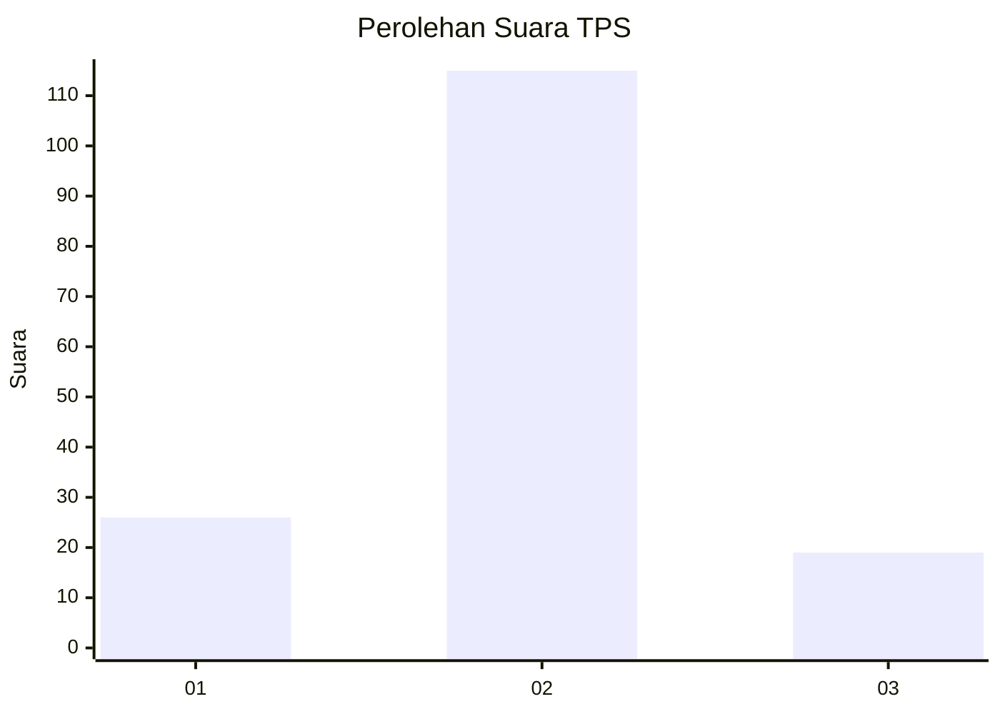
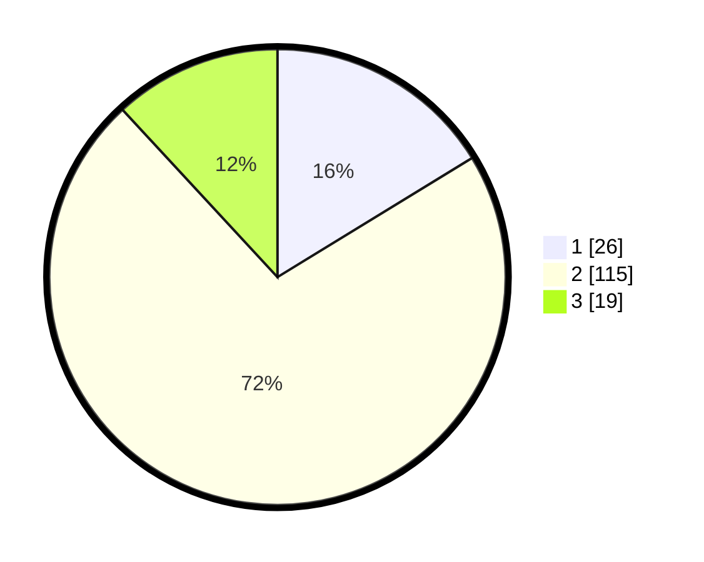

# Hasil

## Grafik

## Tabel

| No. | Nama Paslon    | Suara | Suara (raw) | Persentase |
|:--- |:-------------- | -----:| -----------:| ----------:|
| 1   | ANIES MUHAIMIN | 26    | [26][p-1]   | 16,25      |
| 2   | PRABOWO GIBRAN | 115   | [115][p-2]  | 71,88      |
| 3   | GANJAR MAHFUD  | 19    | [19][p-3]   | 11,88      |

[p-1]: https://github.com/gigit-pemilu/pemilu-2024-17-bengkulu/blob/main/pilpres/hitung-suara/sub/17-bengkulu/sub/01-bengkulu-selatan/sub/03-pino/sub/2001-tanjung-aur-i/sub/001-tps/sub/paslon-1.txt
[p-2]: https://github.com/gigit-pemilu/pemilu-2024-17-bengkulu/blob/main/pilpres/hitung-suara/sub/17-bengkulu/sub/01-bengkulu-selatan/sub/03-pino/sub/2001-tanjung-aur-i/sub/001-tps/sub/paslon-2.txt
[p-3]: https://github.com/gigit-pemilu/pemilu-2024-17-bengkulu/blob/main/pilpres/hitung-suara/sub/17-bengkulu/sub/01-bengkulu-selatan/sub/03-pino/sub/2001-tanjung-aur-i/sub/001-tps/sub/paslon-3.txt

## Foto C Plano

https://sirekap-obj-formc.kpu.go.id/23a8/pemilu/ppwp/17/01/03/20/01/1701032001001-20240216-025827--3549cd82-c584-4c62-b8e6-b4bf5ed18b1f.jpg

https://sirekap-obj-formc.kpu.go.id/23a8/pemilu/ppwp/17/01/03/20/01/1701032001001-20240216-025834--4b07fa97-f59c-4476-8a62-77009d979a3b.jpg

https://sirekap-obj-formc.kpu.go.id/23a8/pemilu/ppwp/17/01/03/20/01/1701032001001-20240216-025831--2cd71ef9-31ca-427f-8c80-54ba4075b7ec.jpg

## Metadata

| Key        | Value               |
| ---------- | ------------------- |
| Time Stamp | 2024-02-26 13:00:00 |

