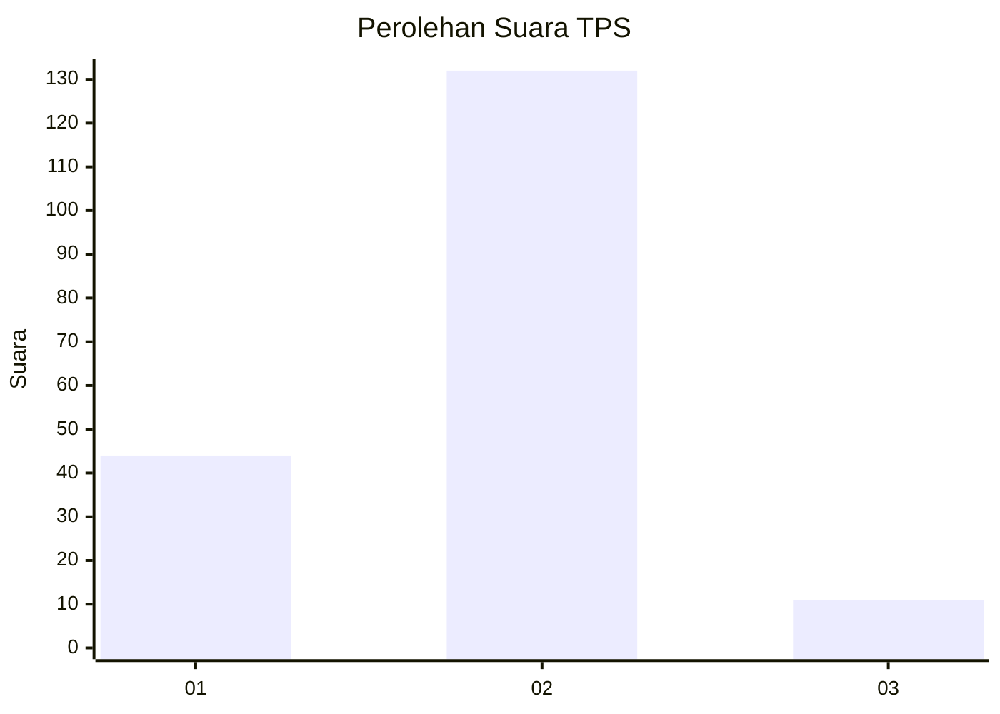

# Hasil

## Grafik

## Tabel

| No. | Nama Paslon    | Suara | Suara (raw) | Persentase |
|:--- |:-------------- | -----:| -----------:| ----------:|
| 1   | ANIES MUHAIMIN | 44    | [44][p-1]   | 23,53      |
| 2   | PRABOWO GIBRAN | 132   | [132][p-2]  | 70,59      |
| 3   | GANJAR MAHFUD  | 11    | [11][p-3]   | 5,88       |

[p-1]: https://github.com/gigit-pemilu/pemilu-2024-17-bengkulu/blob/main/pilpres/hitung-suara/sub/17-bengkulu/sub/01-bengkulu-selatan/sub/05-kota-manna/sub/2005-tebat-kubu/sub/005-tps/sub/paslon-1.txt
[p-2]: https://github.com/gigit-pemilu/pemilu-2024-17-bengkulu/blob/main/pilpres/hitung-suara/sub/17-bengkulu/sub/01-bengkulu-selatan/sub/05-kota-manna/sub/2005-tebat-kubu/sub/005-tps/sub/paslon-2.txt
[p-3]: https://github.com/gigit-pemilu/pemilu-2024-17-bengkulu/blob/main/pilpres/hitung-suara/sub/17-bengkulu/sub/01-bengkulu-selatan/sub/05-kota-manna/sub/2005-tebat-kubu/sub/005-tps/sub/paslon-3.txt

## Foto C Plano

https://sirekap-obj-formc.kpu.go.id/96ca/pemilu/ppwp/17/01/05/20/05/1701052005005-20240215-034713--38a1fbeb-1b2a-45e9-a1bb-28c8f585cf9b.jpg

https://sirekap-obj-formc.kpu.go.id/96ca/pemilu/ppwp/17/01/05/20/05/1701052005005-20240215-034843--f85f783c-6b37-47ba-a4d7-1c3e88521252.jpg

https://sirekap-obj-formc.kpu.go.id/96ca/pemilu/ppwp/17/01/05/20/05/1701052005005-20240228-224245--5428318d-0fbc-4a15-8ac5-2d773ad83c66.jpg

## Metadata

| Key        | Value               |
| ---------- | ------------------- |
| Time Stamp | 2024-02-28 23:00:00 |

