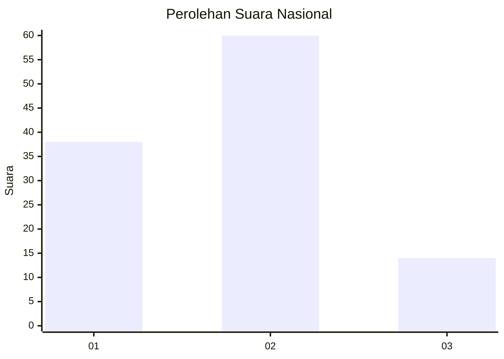
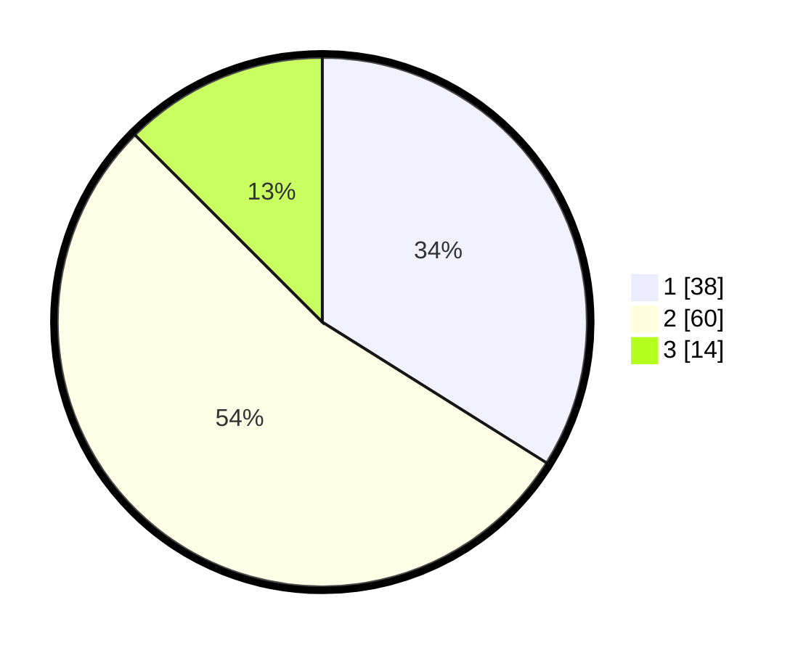

# Hasil

## Grafik

## Tabel

| No. | Nama Paslon    | Suara | Suara (raw) | Persentase |
|:--- |:-------------- | -----:| -----------:| ----------:|
| 1   | ANIES MUHAIMIN | 38    | [38][p-1]   | 33,93      |
| 2   | PRABOWO GIBRAN | 60    | [60][p-2]   | 53,57      |
| 3   | GANJAR MAHFUD  | 14    | [14][p-3]   | 12,50      |

[p-1]: https://github.com/gigit-pemilu/pemilu-2024/blob/main/pilpres/hitung-suara/sub/17-bengkulu/sub/01-bengkulu-selatan/sub/06-pino-raya/sub/2006-tungkal-i/sub/001-tps/sub/paslon-1.txt
[p-2]: https://github.com/gigit-pemilu/pemilu-2024/blob/main/pilpres/hitung-suara/sub/17-bengkulu/sub/01-bengkulu-selatan/sub/06-pino-raya/sub/2006-tungkal-i/sub/001-tps/sub/paslon-2.txt
[p-3]: https://github.com/gigit-pemilu/pemilu-2024/blob/main/pilpres/hitung-suara/sub/17-bengkulu/sub/01-bengkulu-selatan/sub/06-pino-raya/sub/2006-tungkal-i/sub/001-tps/sub/paslon-3.txt

## Foto C Plano

https://sirekap-obj-formc.kpu.go.id/ee4a/pemilu/ppwp/17/01/06/20/06/1701062006001-20240216-193213--09b9d93e-5fd3-43af-8d15-a10944e75634.jpg

https://sirekap-obj-formc.kpu.go.id/ee4a/pemilu/ppwp/17/01/06/20/06/1701062006001-20240216-193214--d4464de7-a12d-4d14-bd80-67f6914950d3.jpg

https://sirekap-obj-formc.kpu.go.id/ee4a/pemilu/ppwp/17/01/06/20/06/1701062006001-20240216-193213--10064c9e-1a43-4c51-94d3-163cae04edc8.jpg

## Metadata

| Key        | Value               |
| ---------- | ------------------- |
| Time Stamp | 2024-02-26 20:00:00 |

