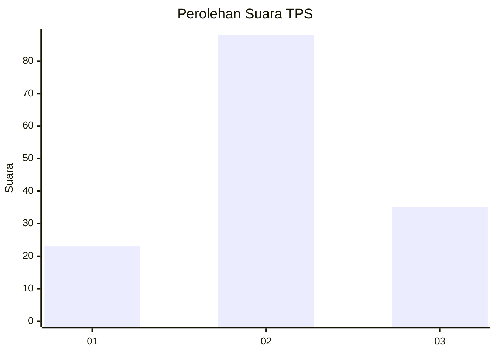
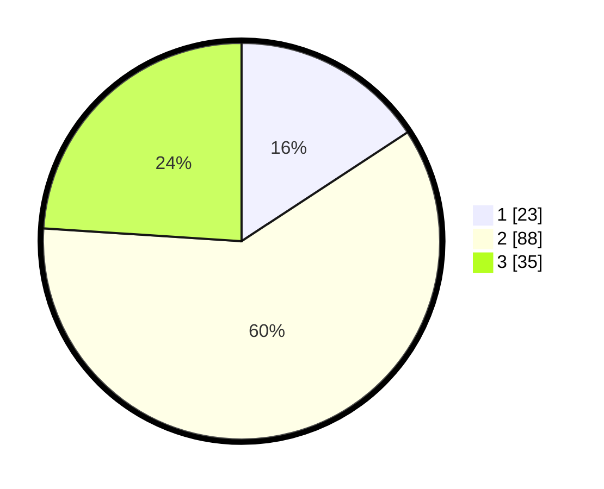

# Hasil

## Grafik

## Tabel

| No. | Nama Paslon    | Suara | Suara (raw) | Persentase |
|:--- |:-------------- | -----:| -----------:| ----------:|
| 1   | ANIES MUHAIMIN | 23    | [23][p-1]   | 15,75      |
| 2   | PRABOWO GIBRAN | 88    | [88][p-2]   | 60,27      |
| 3   | GANJAR MAHFUD  | 35    | [35][p-3]   | 23,97      |

[p-1]: https://github.com/gigit-pemilu/pemilu-2024-17-bengkulu/blob/main/pilpres/hitung-suara/sub/17-bengkulu/sub/01-bengkulu-selatan/sub/09-ulu-manna/sub/2001-batu-panco/sub/001-tps/sub/paslon-1.txt
[p-2]: https://github.com/gigit-pemilu/pemilu-2024-17-bengkulu/blob/main/pilpres/hitung-suara/sub/17-bengkulu/sub/01-bengkulu-selatan/sub/09-ulu-manna/sub/2001-batu-panco/sub/001-tps/sub/paslon-2.txt
[p-3]: https://github.com/gigit-pemilu/pemilu-2024-17-bengkulu/blob/main/pilpres/hitung-suara/sub/17-bengkulu/sub/01-bengkulu-selatan/sub/09-ulu-manna/sub/2001-batu-panco/sub/001-tps/sub/paslon-3.txt

## Foto C Plano

https://sirekap-obj-formc.kpu.go.id/0476/pemilu/ppwp/17/01/09/20/01/1701092001001-20240214-215404--085f221a-48d0-4f09-91ca-45e22085800c.jpg

https://sirekap-obj-formc.kpu.go.id/0476/pemilu/ppwp/17/01/09/20/01/1701092001001-20240214-203935--9a677a67-5dc6-4d25-b4fc-e1c6dea4209d.jpg

https://sirekap-obj-formc.kpu.go.id/0476/pemilu/ppwp/17/01/09/20/01/1701092001001-20240214-215229--800a8345-7adb-4be6-843b-658496815725.jpg

## Metadata

| Key        | Value               |
| ---------- | ------------------- |
| Time Stamp | 2024-02-22 14:00:00 |

