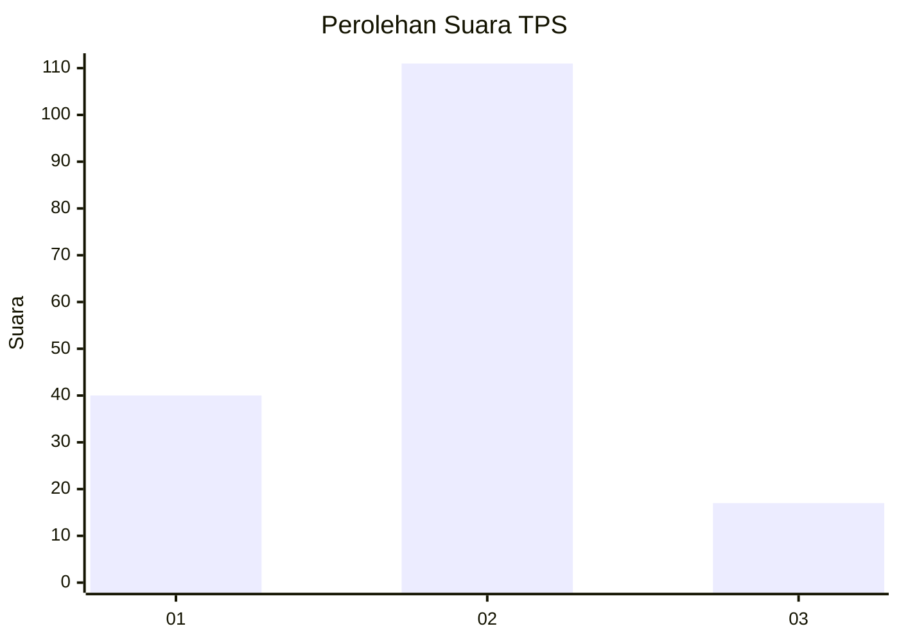

# Hasil

## Grafik

## Tabel

| No. | Nama Paslon    | Suara | Suara (raw) | Persentase |
|:--- |:-------------- | -----:| -----------:| ----------:|
| 1   | ANIES MUHAIMIN | 40    | [40][p-1]   | 23,81      |
| 2   | PRABOWO GIBRAN | 111   | [111][p-2]  | 66,07      |
| 3   | GANJAR MAHFUD  | 17    | [17][p-3]   | 10,12      |

[p-1]: https://github.com/gigit-pemilu/pemilu-2024-17-bengkulu/blob/main/pilpres/hitung-suara/sub/17-bengkulu/sub/01-bengkulu-selatan/sub/09-ulu-manna/sub/2002-batu-kuning/sub/001-tps/sub/paslon-1.txt
[p-2]: https://github.com/gigit-pemilu/pemilu-2024-17-bengkulu/blob/main/pilpres/hitung-suara/sub/17-bengkulu/sub/01-bengkulu-selatan/sub/09-ulu-manna/sub/2002-batu-kuning/sub/001-tps/sub/paslon-2.txt
[p-3]: https://github.com/gigit-pemilu/pemilu-2024-17-bengkulu/blob/main/pilpres/hitung-suara/sub/17-bengkulu/sub/01-bengkulu-selatan/sub/09-ulu-manna/sub/2002-batu-kuning/sub/001-tps/sub/paslon-3.txt

## Foto C Plano

https://sirekap-obj-formc.kpu.go.id/e6fc/pemilu/ppwp/17/01/09/20/02/1701092002001-20240227-202718--4977bf9a-6d2f-45b4-8cac-8bb23118ec57.jpg

https://sirekap-obj-formc.kpu.go.id/e6fc/pemilu/ppwp/17/01/09/20/02/1701092002001-20240214-193402--1cc4ea64-f154-4491-a361-5ed3154c9f2f.jpg

https://sirekap-obj-formc.kpu.go.id/e6fc/pemilu/ppwp/17/01/09/20/02/1701092002001-20240214-193556--778c3ffb-23cd-489d-9fac-7aa82c038ff0.jpg

## Metadata

| Key        | Value               |
| ---------- | ------------------- |
| Time Stamp | 2024-02-27 21:00:04 |

