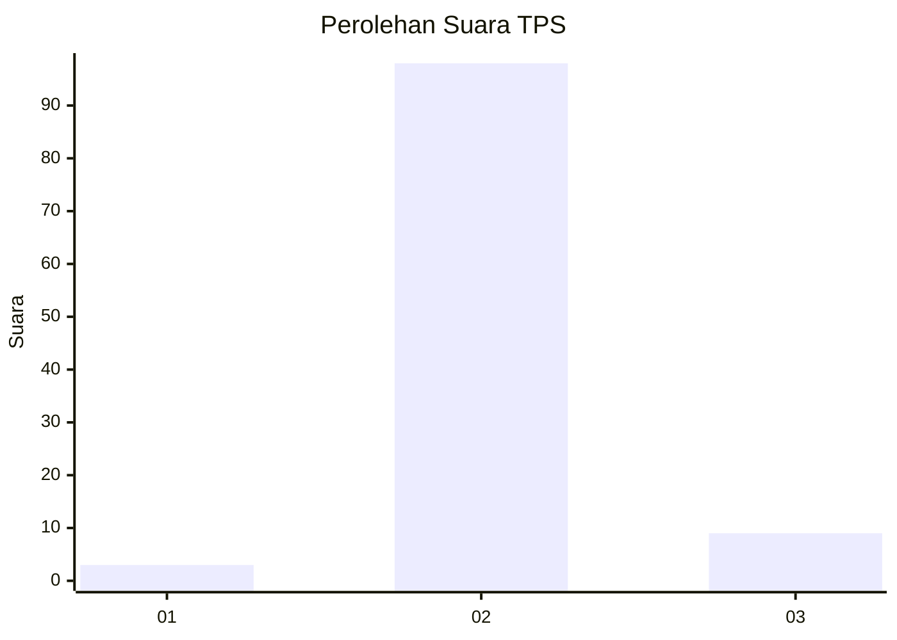
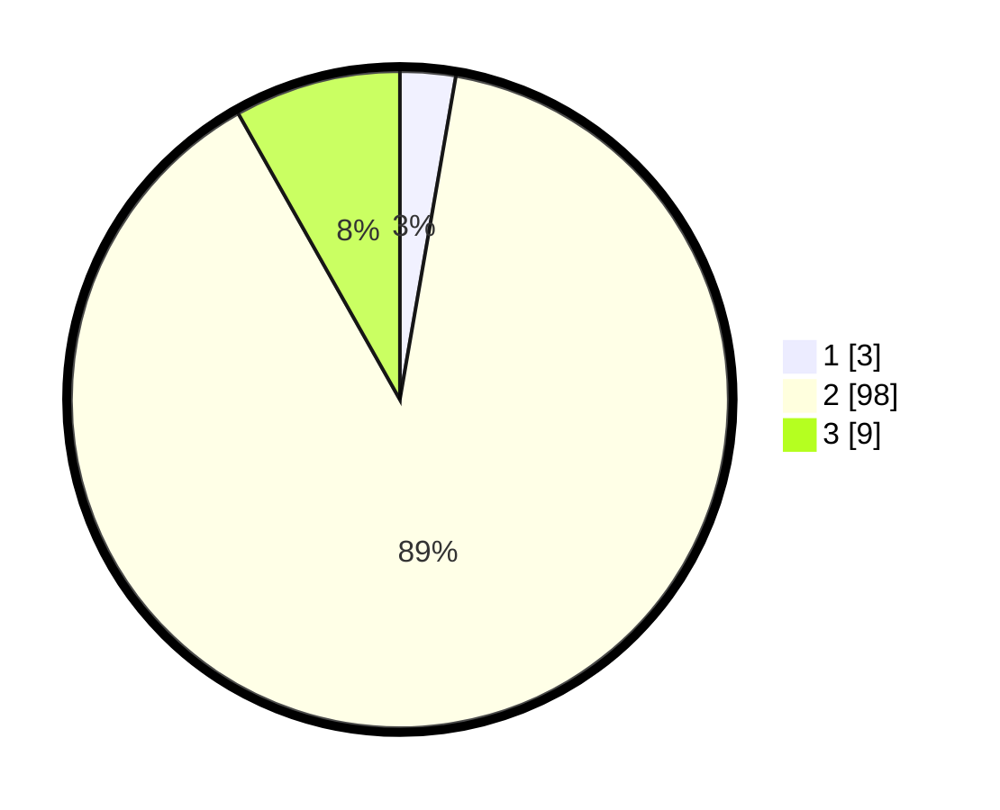

# Hasil

## Grafik

## Tabel

| No. | Nama Paslon    | Suara | Suara (raw) | Persentase |
|:--- |:-------------- | -----:| -----------:| ----------:|
| 1   | ANIES MUHAIMIN | 3     | [3][p-1]    | 2,73       |
| 2   | PRABOWO GIBRAN | 98    | [98][p-2]   | 89,09      |
| 3   | GANJAR MAHFUD  | 9     | [9][p-3]    | 8,18       |

[p-1]: https://github.com/gigit-pemilu/pemilu-2024-17-bengkulu/blob/main/pilpres/hitung-suara/sub/17-bengkulu/sub/01-bengkulu-selatan/sub/09-ulu-manna/sub/2010-air-tenam/sub/001-tps/sub/paslon-1.txt
[p-2]: https://github.com/gigit-pemilu/pemilu-2024-17-bengkulu/blob/main/pilpres/hitung-suara/sub/17-bengkulu/sub/01-bengkulu-selatan/sub/09-ulu-manna/sub/2010-air-tenam/sub/001-tps/sub/paslon-2.txt
[p-3]: https://github.com/gigit-pemilu/pemilu-2024-17-bengkulu/blob/main/pilpres/hitung-suara/sub/17-bengkulu/sub/01-bengkulu-selatan/sub/09-ulu-manna/sub/2010-air-tenam/sub/001-tps/sub/paslon-3.txt

## Foto C Plano

https://sirekap-obj-formc.kpu.go.id/b4c8/pemilu/ppwp/17/01/09/20/10/1701092010001-20240228-223544--f6e23962-ddf5-4817-aba4-b273e6e7c470.jpg

https://sirekap-obj-formc.kpu.go.id/b4c8/pemilu/ppwp/17/01/09/20/10/1701092010001-20240216-164050--d68cd927-486d-418d-8602-3b2386dad63e.jpg

https://sirekap-obj-formc.kpu.go.id/b4c8/pemilu/ppwp/17/01/09/20/10/1701092010001-20240216-164137--d9a8ce2e-7801-4995-889a-3956fc5441f9.jpg

## Metadata

| Key        | Value               |
| ---------- | ------------------- |
| Time Stamp | 2024-02-28 23:00:00 |

