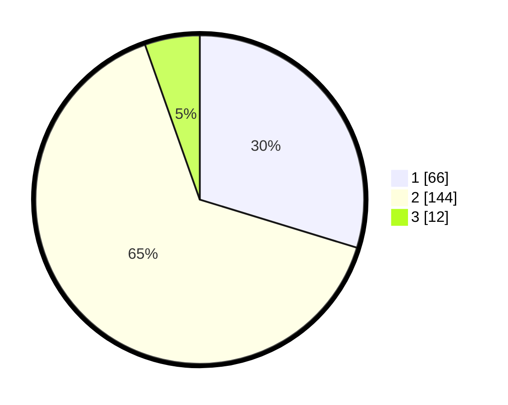

# Hasil

## Grafik

## Tabel

| No. | Nama Paslon    | Suara | Suara (raw) | Persentase |
|:--- |:-------------- | -----:| -----------:| ----------:|
| 1   | ANIES MUHAIMIN | 66    | [66][p-1]   | 29,73      |
| 2   | PRABOWO GIBRAN | 144   | [144][p-2]  | 64,86      |
| 3   | GANJAR MAHFUD  | 12    | [12][p-3]   | 5,41       |

[p-1]: https://github.com/gigit-pemilu/pemilu-2024-17-bengkulu/blob/main/pilpres/hitung-suara/sub/17-bengkulu/sub/02-rejang-lebong/sub/17-curup-timur/sub/2007-air-meles-bawah/sub/008-tps/sub/paslon-1.txt
[p-2]: https://github.com/gigit-pemilu/pemilu-2024-17-bengkulu/blob/main/pilpres/hitung-suara/sub/17-bengkulu/sub/02-rejang-lebong/sub/17-curup-timur/sub/2007-air-meles-bawah/sub/008-tps/sub/paslon-2.txt
[p-3]: https://github.com/gigit-pemilu/pemilu-2024-17-bengkulu/blob/main/pilpres/hitung-suara/sub/17-bengkulu/sub/02-rejang-lebong/sub/17-curup-timur/sub/2007-air-meles-bawah/sub/008-tps/sub/paslon-3.txt

## Foto C Plano

https://sirekap-obj-formc.kpu.go.id/9a52/pemilu/ppwp/17/02/17/20/07/1702172007008-20240218-191815--aaa8dde7-f65d-48d9-bba3-c278fd1ba381.jpg

https://sirekap-obj-formc.kpu.go.id/9a52/pemilu/ppwp/17/02/17/20/07/1702172007008-20240218-191826--2d1242de-b60b-4d60-9023-84feacd23189.jpg

https://sirekap-obj-formc.kpu.go.id/9a52/pemilu/ppwp/17/02/17/20/07/1702172007008-20240218-191833--a4b018e7-4229-41e9-9b73-9eff21b1e05a.jpg

## Metadata

| Key        | Value               |
| ---------- | ------------------- |
| Time Stamp | 2024-02-19 06:16:00 |

## DATA PEMILIH TETAP

Jumlah pemilih dalam DPT: **387**.
 * L: **775**.
 * P: **541**.

## DATA PENGGUNA HAK PILIH

Jumlah pengguna hak pilih dalam DPT: **231**.
 * L: **107**.
 * P: **554**.

Jumlah pengguna hak pilih dalam DPTb: **5**.
 * L: **7**.
 * P: **554**.

Jumlah pengguna hak pilih dalam DPK: **1**.
 * L: **7**.
 * P: **744**.

Jumlah pengguna hak pilih: **231**.
 * L: **104**.
 * P: **444**.

## JUMLAH SUARA SAH DAN TIDAK SAH

JUMLAH SELURUH SUARA SAH: **622**.

JUMLAH SUARA TIDAK SAH: **1**.

JUMLAH SELURUH SUARA SAH DAN SUARA TIDAK SAH: **223**.

