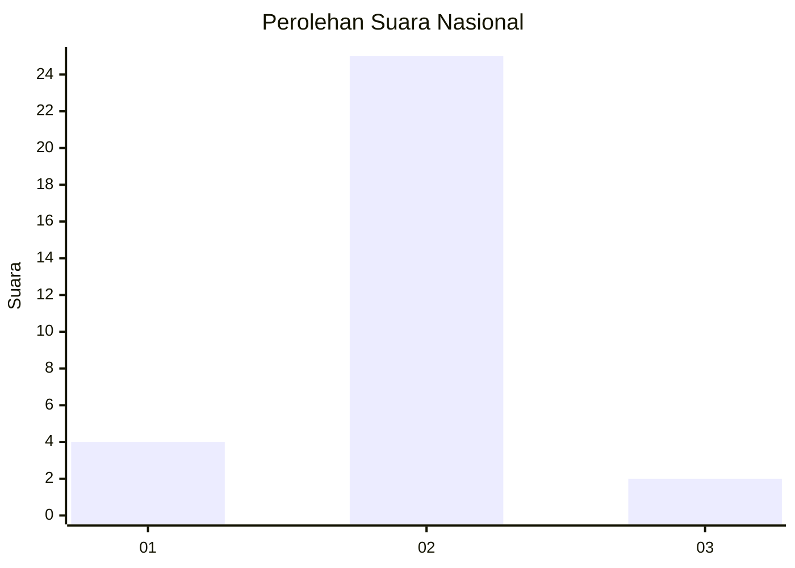
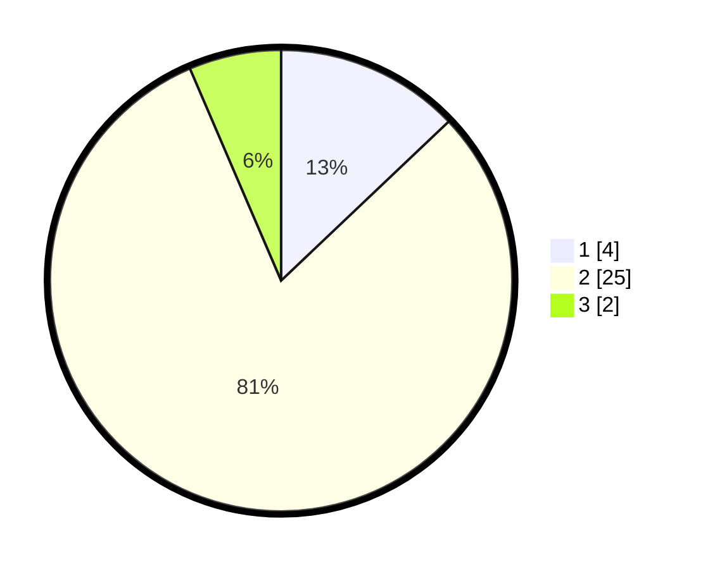

# Hasil

## Grafik

## Tabel

| No. | Nama Paslon    | Suara | Suara (raw) | Persentase |
|:--- |:-------------- | -----:| -----------:| ----------:|
| 1   | ANIES MUHAIMIN | 4     | [4][p-1]    | 12,90      |
| 2   | PRABOWO GIBRAN | 25    | [25][p-2]   | 80,65      |
| 3   | GANJAR MAHFUD  | 2     | [2][p-3]    | 6,45       |

[p-1]: https://github.com/gigit-pemilu/pemilu-2024/blob/main/pilpres/hitung-suara/sub/17-bengkulu/sub/02-rejang-lebong/sub/22-sindang-dataran/sub/2004-sinar-gunung/sub/007-tps/sub/paslon-1.txt
[p-2]: https://github.com/gigit-pemilu/pemilu-2024/blob/main/pilpres/hitung-suara/sub/17-bengkulu/sub/02-rejang-lebong/sub/22-sindang-dataran/sub/2004-sinar-gunung/sub/007-tps/sub/paslon-2.txt
[p-3]: https://github.com/gigit-pemilu/pemilu-2024/blob/main/pilpres/hitung-suara/sub/17-bengkulu/sub/02-rejang-lebong/sub/22-sindang-dataran/sub/2004-sinar-gunung/sub/007-tps/sub/paslon-3.txt

## Foto C Plano

https://sirekap-obj-formc.kpu.go.id/95c9/pemilu/ppwp/17/02/22/20/04/1702222004007-20240215-222259--2f4ca1bb-35f4-4039-a2ca-2c590fa19d1b.jpg

https://sirekap-obj-formc.kpu.go.id/95c9/pemilu/ppwp/17/02/22/20/04/1702222004007-20240215-222301--1bcdd0ad-10c7-40c4-862f-83bc527a9d95.jpg

https://sirekap-obj-formc.kpu.go.id/95c9/pemilu/ppwp/17/02/22/20/04/1702222004007-20240215-222301--d5a1cdcf-6df1-4c4a-9463-3ff3a5a01d9f.jpg

## Metadata

| Key        | Value               |
| ---------- | ------------------- |
| Time Stamp | 2024-02-15 22:30:27 |

## DATA PEMILIH TETAP

Jumlah pemilih dalam DPT: **34**.
 * L: **19**.
 * P: **15**.

## DATA PENGGUNA HAK PILIH

Jumlah pengguna hak pilih dalam DPT: **32**.
 * L: **18**.
 * P: **14**.

Jumlah pengguna hak pilih dalam DPTb: **0**.
 * L: **0**.
 * P: **0**.

Jumlah pengguna hak pilih dalam DPK: **0**.
 * L: **0**.
 * P: **0**.

Jumlah pengguna hak pilih: **32**.
 * L: **18**.
 * P: **14**.

## JUMLAH SUARA SAH DAN TIDAK SAH

JUMLAH SELURUH SUARA SAH: **31**.

JUMLAH SUARA TIDAK SAH: **1**.

JUMLAH SELURUH SUARA SAH DAN SUARA TIDAK SAH: **32**.

