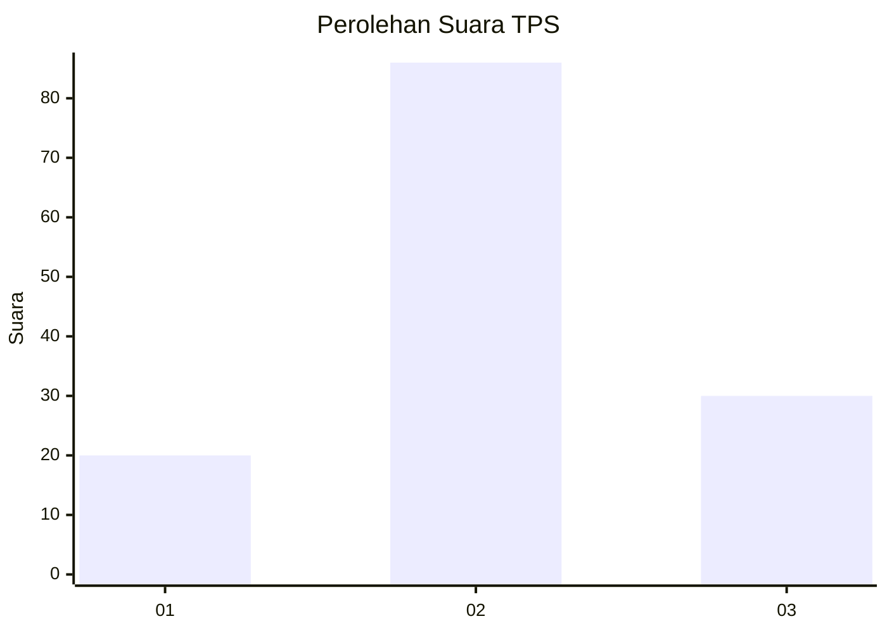
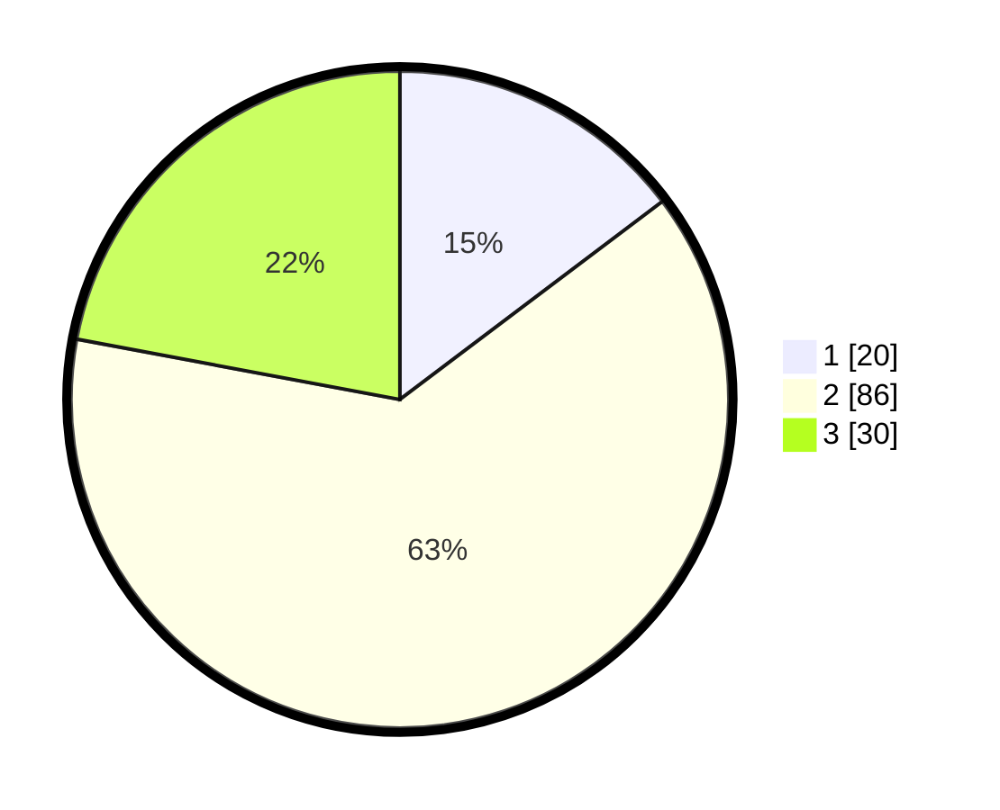

# Hasil

## Grafik

## Tabel

| No. | Nama Paslon    | Suara | Suara (raw) | Persentase |
|:--- |:-------------- | -----:| -----------:| ----------:|
| 1   | ANIES MUHAIMIN | 20    | [20][p-1]   | 14,71      |
| 2   | PRABOWO GIBRAN | 86    | [86][p-2]   | 63,24      |
| 3   | GANJAR MAHFUD  | 30    | [30][p-3]   | 22,06      |

[p-1]: https://github.com/gigit-pemilu/pemilu-2024-17-bengkulu/blob/main/pilpres/hitung-suara/sub/17-bengkulu/sub/03-bengkulu-utara/sub/13-napal-putih/sub/2020-kinal-jaya/sub/002-tps/sub/paslon-1.txt
[p-2]: https://github.com/gigit-pemilu/pemilu-2024-17-bengkulu/blob/main/pilpres/hitung-suara/sub/17-bengkulu/sub/03-bengkulu-utara/sub/13-napal-putih/sub/2020-kinal-jaya/sub/002-tps/sub/paslon-2.txt
[p-3]: https://github.com/gigit-pemilu/pemilu-2024-17-bengkulu/blob/main/pilpres/hitung-suara/sub/17-bengkulu/sub/03-bengkulu-utara/sub/13-napal-putih/sub/2020-kinal-jaya/sub/002-tps/sub/paslon-3.txt

## Foto C Plano

https://sirekap-obj-formc.kpu.go.id/37ea/pemilu/ppwp/17/03/13/20/20/1703132020002-20240221-121638--cf386af9-9766-4b87-a3d1-950375a68cfb.jpg

https://sirekap-obj-formc.kpu.go.id/37ea/pemilu/ppwp/17/03/13/20/20/1703132020002-20240221-121903--c55dd68d-3fdf-47e6-bac4-4ea95f22f16b.jpg

https://sirekap-obj-formc.kpu.go.id/37ea/pemilu/ppwp/17/03/13/20/20/1703132020002-20240222-103733--ac13bbde-cff5-4786-9621-e55b128e5946.jpg

## Metadata

| Key        | Value               |
| ---------- | ------------------- |
| Time Stamp | 2024-02-22 11:00:00 |

