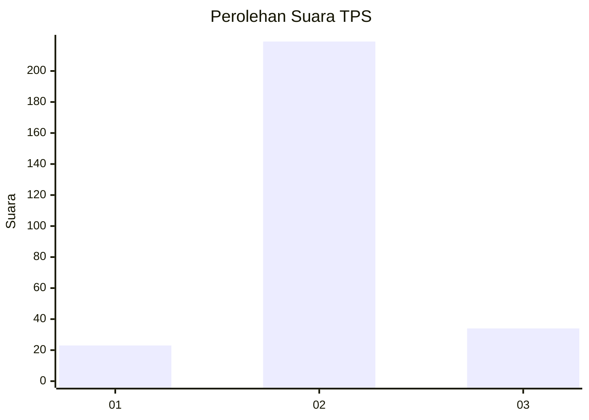
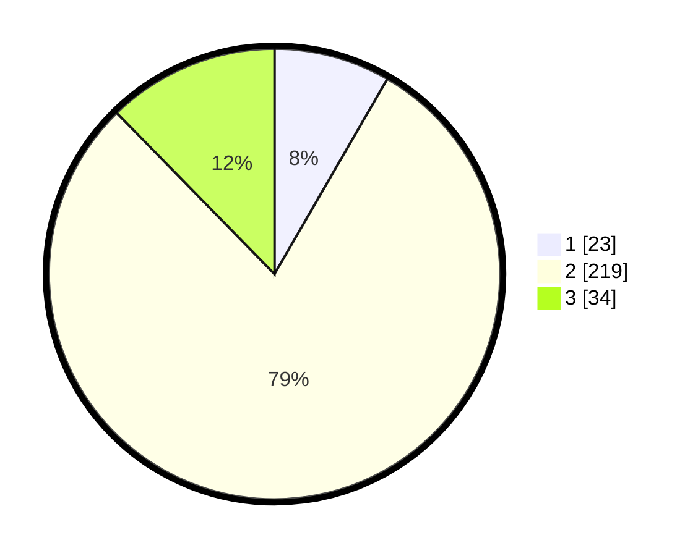

# Hasil

## Grafik

## Tabel

| No. | Nama Paslon    | Suara | Suara (raw) | Persentase |
|:--- |:-------------- | -----:| -----------:| ----------:|
| 1   | ANIES MUHAIMIN | 23    | [23][p-1]   | 8,33       |
| 2   | PRABOWO GIBRAN | 219   | [219][p-2]  | 79,35      |
| 3   | GANJAR MAHFUD  | 34    | [34][p-3]   | 12,32      |

[p-1]: https://github.com/gigit-pemilu/pemilu-2024-17-bengkulu/blob/main/pilpres/hitung-suara/sub/17-bengkulu/sub/03-bengkulu-utara/sub/24-pinang-raya/sub/2001-air-sebayur/sub/005-tps/sub/paslon-1.txt
[p-2]: https://github.com/gigit-pemilu/pemilu-2024-17-bengkulu/blob/main/pilpres/hitung-suara/sub/17-bengkulu/sub/03-bengkulu-utara/sub/24-pinang-raya/sub/2001-air-sebayur/sub/005-tps/sub/paslon-2.txt
[p-3]: https://github.com/gigit-pemilu/pemilu-2024-17-bengkulu/blob/main/pilpres/hitung-suara/sub/17-bengkulu/sub/03-bengkulu-utara/sub/24-pinang-raya/sub/2001-air-sebayur/sub/005-tps/sub/paslon-3.txt

## Foto C Plano

https://sirekap-obj-formc.kpu.go.id/66c6/pemilu/ppwp/17/03/24/20/01/1703242001005-20240216-093243--eea4d181-94ba-44f0-a1b8-de19e3bf9a24.jpg

https://sirekap-obj-formc.kpu.go.id/66c6/pemilu/ppwp/17/03/24/20/01/1703242001005-20240216-093247--a289703d-1291-4959-9938-4e41447722fd.jpg

https://sirekap-obj-formc.kpu.go.id/66c6/pemilu/ppwp/17/03/24/20/01/1703242001005-20240216-093246--e1f30293-54bb-4ee3-a1d9-ab74e2c8fd18.jpg

## Metadata

| Key        | Value               |
| ---------- | ------------------- |
| Time Stamp | 2024-02-16 12:51:22 |

## DATA PEMILIH TETAP

Jumlah pemilih dalam DPT: **295**.
 * L: **162**.
 * P: **133**.

## DATA PENGGUNA HAK PILIH

Jumlah pengguna hak pilih dalam DPT: **271**.
 * L: **145**.
 * P: **126**.

Jumlah pengguna hak pilih dalam DPTb: **0**.
 * L: **0**.
 * P: **0**.

Jumlah pengguna hak pilih dalam DPK: **13**.
 * L: **6**.
 * P: **7**.

Jumlah pengguna hak pilih: **284**.
 * L: **151**.
 * P: **133**.

## JUMLAH SUARA SAH DAN TIDAK SAH

JUMLAH SELURUH SUARA SAH: **276**.

JUMLAH SUARA TIDAK SAH: **8**.

JUMLAH SELURUH SUARA SAH DAN SUARA TIDAK SAH: **284**.

