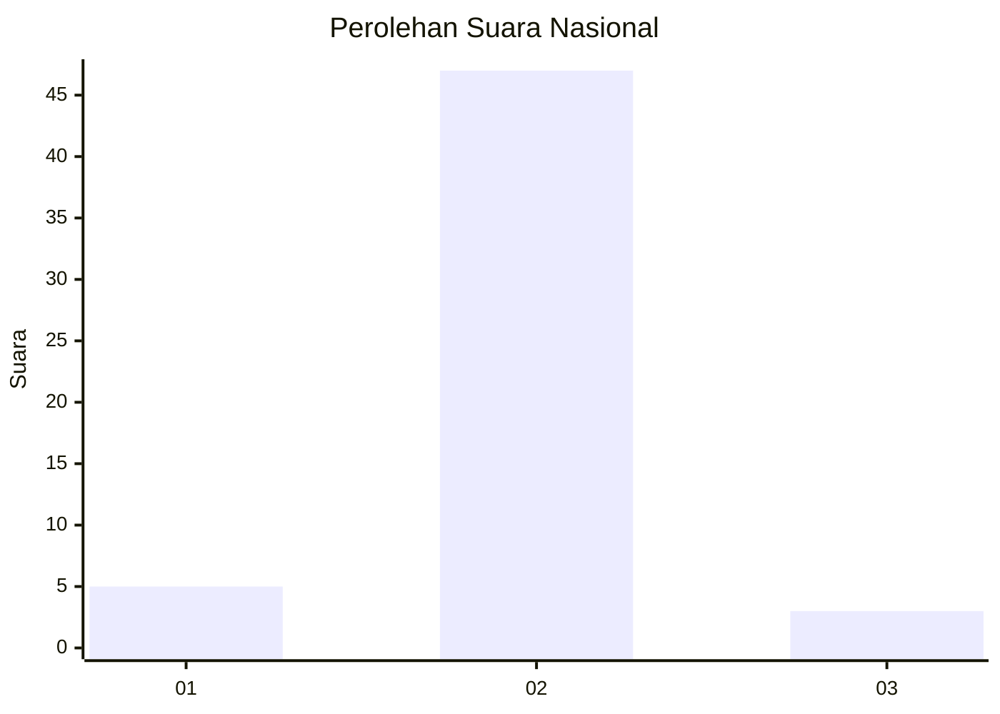
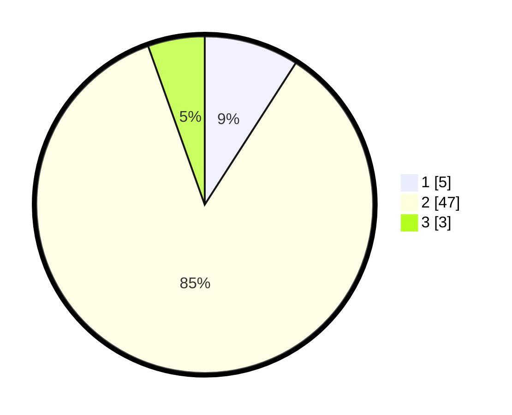

# Hasil

## Grafik

## Tabel

| No. | Nama Paslon    | Suara | Suara (raw) | Persentase |
|:--- |:-------------- | -----:| -----------:| ----------:|
| 1   | ANIES MUHAIMIN | 5     | [5][p-1]    | 9,09       |
| 2   | PRABOWO GIBRAN | 47    | [47][p-2]   | 85,45      |
| 3   | GANJAR MAHFUD  | 3     | [3][p-3]    | 5,45       |

[p-1]: https://github.com/gigit-pemilu/pemilu-2024/blob/main/pilpres/hitung-suara/sub/17-bengkulu/sub/03-bengkulu-utara/sub/25-marga-sakti-sebelat/sub/2005-suka-baru/sub/901-tps/sub/paslon-1.txt
[p-2]: https://github.com/gigit-pemilu/pemilu-2024/blob/main/pilpres/hitung-suara/sub/17-bengkulu/sub/03-bengkulu-utara/sub/25-marga-sakti-sebelat/sub/2005-suka-baru/sub/901-tps/sub/paslon-2.txt
[p-3]: https://github.com/gigit-pemilu/pemilu-2024/blob/main/pilpres/hitung-suara/sub/17-bengkulu/sub/03-bengkulu-utara/sub/25-marga-sakti-sebelat/sub/2005-suka-baru/sub/901-tps/sub/paslon-3.txt

## Foto C Plano

https://sirekap-obj-formc.kpu.go.id/4716/pemilu/ppwp/17/03/25/20/05/1703252005901-20240220-141355--9f78f0e2-0e9e-4e54-a851-d6e6def4662e.jpg

https://sirekap-obj-formc.kpu.go.id/4716/pemilu/ppwp/17/03/25/20/05/1703252005901-20240220-141451--273a461f-fb2c-4294-838b-6a06a89d9f34.jpg

https://sirekap-obj-formc.kpu.go.id/4716/pemilu/ppwp/17/03/25/20/05/1703252005901-20240220-140807--43f9493d-479c-4178-adeb-bce00104263f.jpg

## Metadata

| Key        | Value               |
| ---------- | ------------------- |
| Time Stamp | 2024-02-20 15:00:00 |

## DATA PEMILIH TETAP

Jumlah pemilih dalam DPT: **103**.
 * L: **77**.
 * P: **26**.

## DATA PENGGUNA HAK PILIH

Jumlah pengguna hak pilih dalam DPT: **39**.
 * L: **31**.
 * P: **8**.

Jumlah pengguna hak pilih dalam DPTb: **10**.
 * L: **7**.
 * P: **3**.

Jumlah pengguna hak pilih dalam DPK: **1**.
 * L: **1**.
 * P: **0**.

Jumlah pengguna hak pilih: **50**.
 * L: **39**.
 * P: **11**.

## JUMLAH SUARA SAH DAN TIDAK SAH

JUMLAH SELURUH SUARA SAH: **48**.

JUMLAH SUARA TIDAK SAH: **2**.

JUMLAH SELURUH SUARA SAH DAN SUARA TIDAK SAH: **50**.

