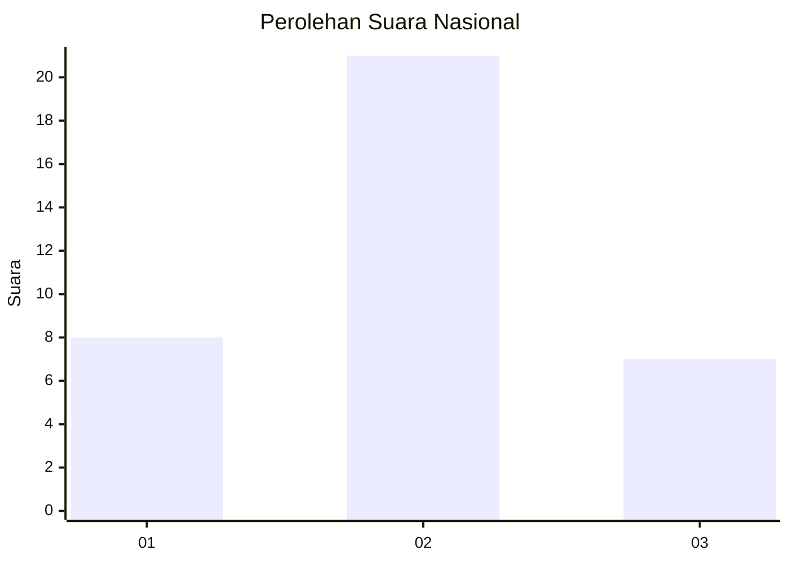
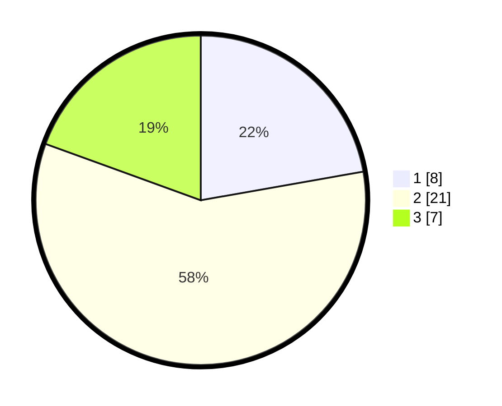

# Hasil

## Grafik

## Tabel

| No. | Nama Paslon    | Suara | Suara (raw) | Persentase |
|:--- |:-------------- | -----:| -----------:| ----------:|
| 1   | ANIES MUHAIMIN | 8     | [8][p-1]    | 22,22      |
| 2   | PRABOWO GIBRAN | 21    | [21][p-2]   | 58,33      |
| 3   | GANJAR MAHFUD  | 7     | [7][p-3]    | 19,44      |

[p-1]: https://github.com/gigit-pemilu/pemilu-2024/blob/main/pilpres/hitung-suara/sub/17-bengkulu/sub/04-kaur/sub/11-muara-sahung/sub/2007-bukit-makmur/sub/005-tps/sub/paslon-1.txt
[p-2]: https://github.com/gigit-pemilu/pemilu-2024/blob/main/pilpres/hitung-suara/sub/17-bengkulu/sub/04-kaur/sub/11-muara-sahung/sub/2007-bukit-makmur/sub/005-tps/sub/paslon-2.txt
[p-3]: https://github.com/gigit-pemilu/pemilu-2024/blob/main/pilpres/hitung-suara/sub/17-bengkulu/sub/04-kaur/sub/11-muara-sahung/sub/2007-bukit-makmur/sub/005-tps/sub/paslon-3.txt

## Foto C Plano

https://sirekap-obj-formc.kpu.go.id/840d/pemilu/ppwp/17/04/11/20/07/1704112007005-20240220-210312--41f59281-fe84-453e-a31d-78b51ba709b8.jpg

https://sirekap-obj-formc.kpu.go.id/840d/pemilu/ppwp/17/04/11/20/07/1704112007005-20240220-210313--288e6ce5-ec96-4070-a928-309c52f78f26.jpg

https://sirekap-obj-formc.kpu.go.id/840d/pemilu/ppwp/17/04/11/20/07/1704112007005-20240220-210312--69eed0d9-6dad-40b2-9eb1-5693ed22c028.jpg

## Metadata

| Key        | Value               |
| ---------- | ------------------- |
| Time Stamp | 2024-02-20 22:00:00 |

## DATA PEMILIH TETAP

Jumlah pemilih dalam DPT: **46**.
 * L: **27**.
 * P: **19**.

## DATA PENGGUNA HAK PILIH

Jumlah pengguna hak pilih dalam DPT: **29**.
 * L: **19**.
 * P: **10**.

Jumlah pengguna hak pilih dalam DPTb: **7**.
 * L: **7**.
 * P: **0**.

Jumlah pengguna hak pilih dalam DPK: **0**.
 * L: **0**.
 * P: **0**.

Jumlah pengguna hak pilih: **36**.
 * L: **26**.
 * P: **10**.

## JUMLAH SUARA SAH DAN TIDAK SAH

JUMLAH SELURUH SUARA SAH: **36**.

JUMLAH SUARA TIDAK SAH: **0**.

JUMLAH SELURUH SUARA SAH DAN SUARA TIDAK SAH: **36**.

