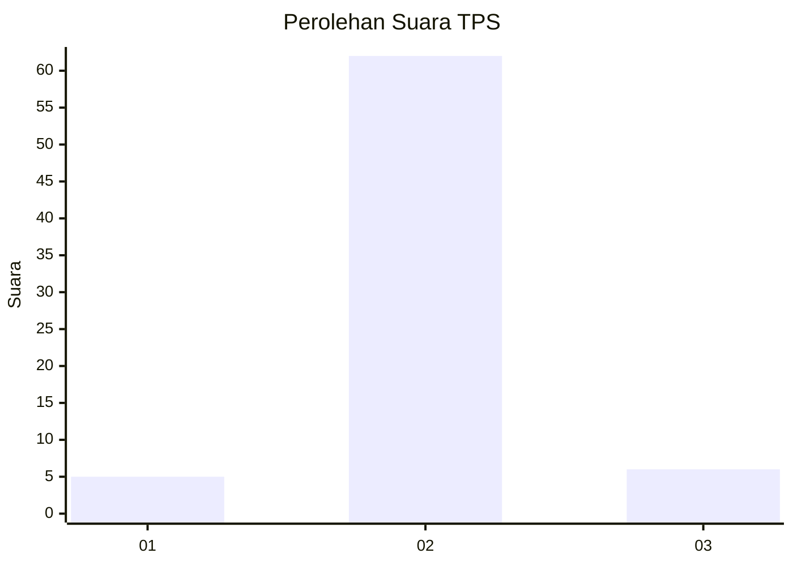
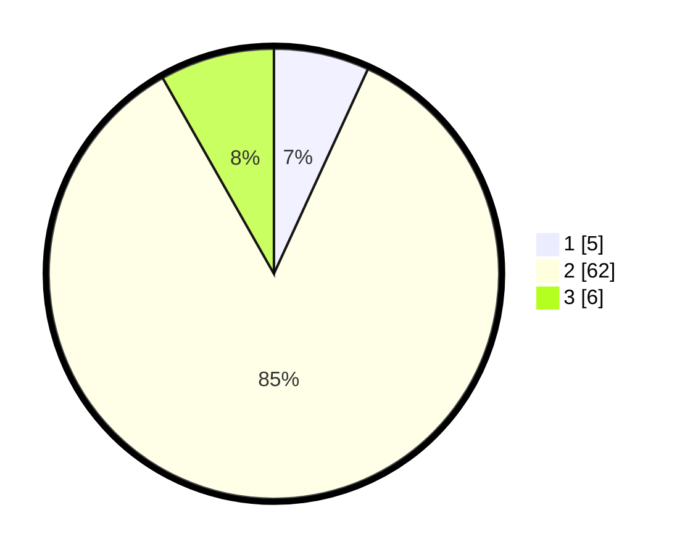

# Hasil

## Grafik

## Tabel

| No. | Nama Paslon    | Suara | Suara (raw) | Persentase |
|:--- |:-------------- | -----:| -----------:| ----------:|
| 1   | ANIES MUHAIMIN | 5     | [5][p-1]    | 6,85       |
| 2   | PRABOWO GIBRAN | 62    | [62][p-2]   | 84,93      |
| 3   | GANJAR MAHFUD  | 6     | [6][p-3]    | 8,22       |

[p-1]: https://github.com/gigit-pemilu/pemilu-2024-17-bengkulu/blob/main/pilpres/hitung-suara/sub/17-bengkulu/sub/05-seluma/sub/01-sukaraja/sub/2034-kuti-agung/sub/001-tps/sub/paslon-1.txt
[p-2]: https://github.com/gigit-pemilu/pemilu-2024-17-bengkulu/blob/main/pilpres/hitung-suara/sub/17-bengkulu/sub/05-seluma/sub/01-sukaraja/sub/2034-kuti-agung/sub/001-tps/sub/paslon-2.txt
[p-3]: https://github.com/gigit-pemilu/pemilu-2024-17-bengkulu/blob/main/pilpres/hitung-suara/sub/17-bengkulu/sub/05-seluma/sub/01-sukaraja/sub/2034-kuti-agung/sub/001-tps/sub/paslon-3.txt

## Foto C Plano

https://sirekap-obj-formc.kpu.go.id/e890/pemilu/ppwp/17/05/01/20/34/1705012034001-20240215-094829--47e1feeb-4a03-4a83-b663-f9ad083811df.jpg

https://sirekap-obj-formc.kpu.go.id/e890/pemilu/ppwp/17/05/01/20/34/1705012034001-20240215-095716--542af4c2-315a-48f4-bbb3-22b0b6aa35a0.jpg

https://sirekap-obj-formc.kpu.go.id/e890/pemilu/ppwp/17/05/01/20/34/1705012034001-20240215-105231--d967a6c8-f365-47ab-8ada-db056959f49a.jpg

## Metadata

| Key        | Value               |
| ---------- | ------------------- |
| Time Stamp | 2024-02-15 22:30:27 |

