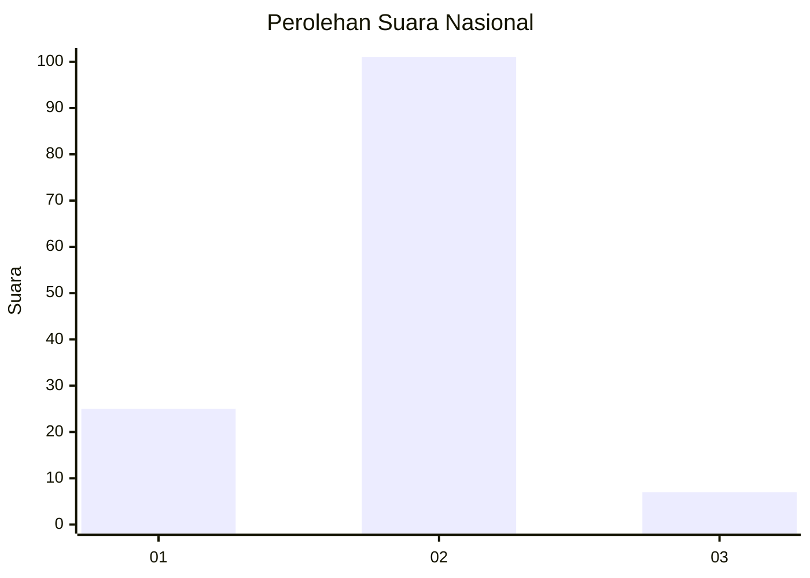
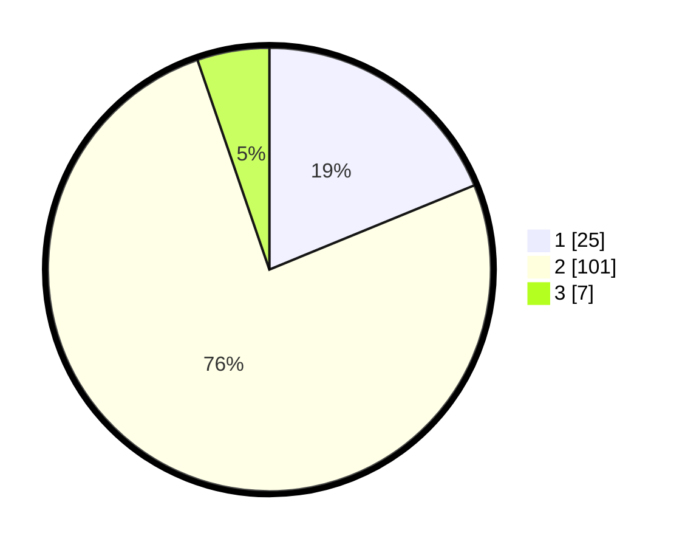

# Hasil

## Grafik

## Tabel

| No. | Nama Paslon    | Suara | Suara (raw) | Persentase |
|:--- |:-------------- | -----:| -----------:| ----------:|
| 1   | ANIES MUHAIMIN | 25    | [25][p-1]   | 18,80      |
| 2   | PRABOWO GIBRAN | 101   | [101][p-2]  | 75,94      |
| 3   | GANJAR MAHFUD  | 7     | [7][p-3]    | 5,26       |

[p-1]: https://github.com/gigit-pemilu/pemilu-2024/blob/main/pilpres/hitung-suara/sub/17-bengkulu/sub/05-seluma/sub/11-seluma-selatan/sub/1008-rimbo-kedui/sub/005-tps/sub/paslon-1.txt
[p-2]: https://github.com/gigit-pemilu/pemilu-2024/blob/main/pilpres/hitung-suara/sub/17-bengkulu/sub/05-seluma/sub/11-seluma-selatan/sub/1008-rimbo-kedui/sub/005-tps/sub/paslon-2.txt
[p-3]: https://github.com/gigit-pemilu/pemilu-2024/blob/main/pilpres/hitung-suara/sub/17-bengkulu/sub/05-seluma/sub/11-seluma-selatan/sub/1008-rimbo-kedui/sub/005-tps/sub/paslon-3.txt

## Foto C Plano

https://sirekap-obj-formc.kpu.go.id/3559/pemilu/ppwp/17/05/11/10/08/1705111008005-20240216-153651--2cfa4bcc-fd3c-4f67-8bd1-93c942bc57d8.jpg

https://sirekap-obj-formc.kpu.go.id/3559/pemilu/ppwp/17/05/11/10/08/1705111008005-20240216-153652--34c11a74-78d1-4404-91df-63475892972d.jpg

https://sirekap-obj-formc.kpu.go.id/3559/pemilu/ppwp/17/05/11/10/08/1705111008005-20240216-153651--0c88a7b9-21d1-4cb3-8a66-f6fbdc09d23e.jpg

## Metadata

| Key        | Value               |
| ---------- | ------------------- |
| Time Stamp | 2024-02-16 16:25:10 |

## DATA PEMILIH TETAP

Jumlah pemilih dalam DPT: **204**.
 * L: **109**.
 * P: **95**.

## DATA PENGGUNA HAK PILIH

Jumlah pengguna hak pilih dalam DPT: **138**.
 * L: **72**.
 * P: **66**.

Jumlah pengguna hak pilih dalam DPTb: **1**.
 * L: **0**.
 * P: **1**.

Jumlah pengguna hak pilih dalam DPK: **0**.
 * L: **0**.
 * P: **0**.

Jumlah pengguna hak pilih: **139**.
 * L: **72**.
 * P: **67**.

## JUMLAH SUARA SAH DAN TIDAK SAH

JUMLAH SELURUH SUARA SAH: **133**.

JUMLAH SUARA TIDAK SAH: **6**.

JUMLAH SELURUH SUARA SAH DAN SUARA TIDAK SAH: **139**.

