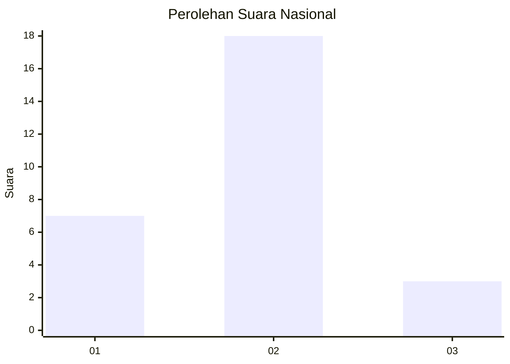

# Hasil

## Grafik

## Tabel

| No. | Nama Paslon    | Suara | Suara (raw) | Persentase |
|:--- |:-------------- | -----:| -----------:| ----------:|
| 1   | ANIES MUHAIMIN | 7     | [7][p-1]    | 25,00      |
| 2   | PRABOWO GIBRAN | 18    | [18][p-2]   | 64,29      |
| 3   | GANJAR MAHFUD  | 3     | [3][p-3]    | 10,71      |

[p-1]: https://github.com/gigit-pemilu/pemilu-2024/blob/main/pilpres/hitung-suara/sub/17-bengkulu/sub/05-seluma/sub/13-ulu-talo/sub/2002-muara-simpur/sub/001-tps/sub/paslon-1.txt
[p-2]: https://github.com/gigit-pemilu/pemilu-2024/blob/main/pilpres/hitung-suara/sub/17-bengkulu/sub/05-seluma/sub/13-ulu-talo/sub/2002-muara-simpur/sub/001-tps/sub/paslon-2.txt
[p-3]: https://github.com/gigit-pemilu/pemilu-2024/blob/main/pilpres/hitung-suara/sub/17-bengkulu/sub/05-seluma/sub/13-ulu-talo/sub/2002-muara-simpur/sub/001-tps/sub/paslon-3.txt

## Foto C Plano

https://sirekap-obj-formc.kpu.go.id/fcd9/pemilu/ppwp/17/05/13/20/02/1705132002001-20240216-143024--f843c9e2-e4b0-4562-ae47-5fff3d620712.jpg

https://sirekap-obj-formc.kpu.go.id/fcd9/pemilu/ppwp/17/05/13/20/02/1705132002001-20240216-143026--822206c8-fbcb-4b3d-aa7b-55e56629a852.jpg

https://sirekap-obj-formc.kpu.go.id/fcd9/pemilu/ppwp/17/05/13/20/02/1705132002001-20240216-143025--a3fcac94-3e82-4ba7-9b92-c13ac28584fd.jpg

## Metadata

| Key        | Value               |
| ---------- | ------------------- |
| Time Stamp | 2024-02-16 16:25:10 |

## DATA PEMILIH TETAP

Jumlah pemilih dalam DPT: **150**.
 * L: **74**.
 * P: **76**.

## DATA PENGGUNA HAK PILIH

Jumlah pengguna hak pilih dalam DPT: **28**.
 * L: **14**.
 * P: **14**.

Jumlah pengguna hak pilih dalam DPTb: **0**.
 * L: **0**.
 * P: **0**.

Jumlah pengguna hak pilih dalam DPK: **1**.
 * L: **0**.
 * P: **1**.

Jumlah pengguna hak pilih: **29**.
 * L: **14**.
 * P: **15**.

## JUMLAH SUARA SAH DAN TIDAK SAH

JUMLAH SELURUH SUARA SAH: **28**.

JUMLAH SUARA TIDAK SAH: **1**.

JUMLAH SELURUH SUARA SAH DAN SUARA TIDAK SAH: **29**.

