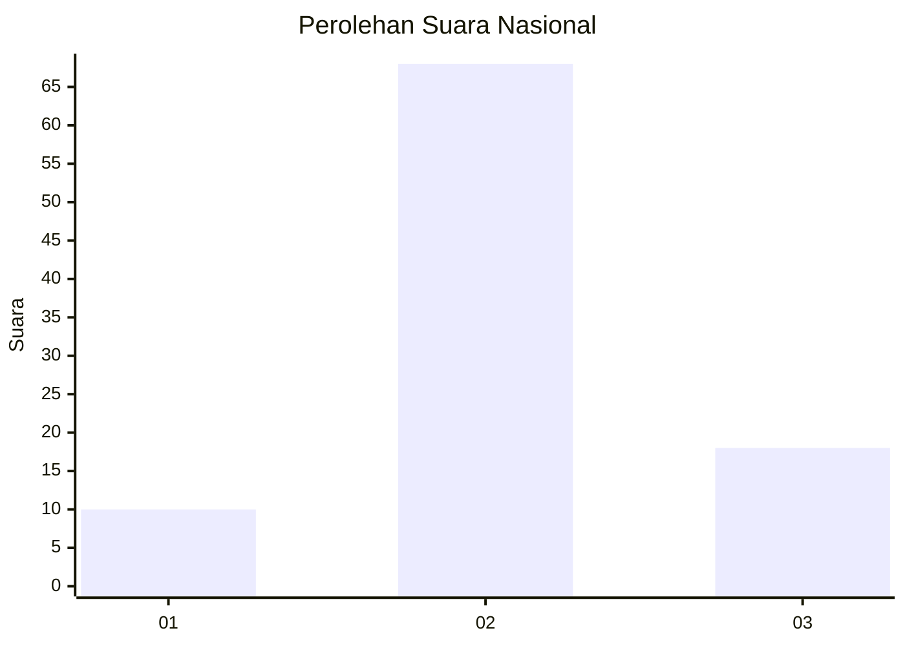
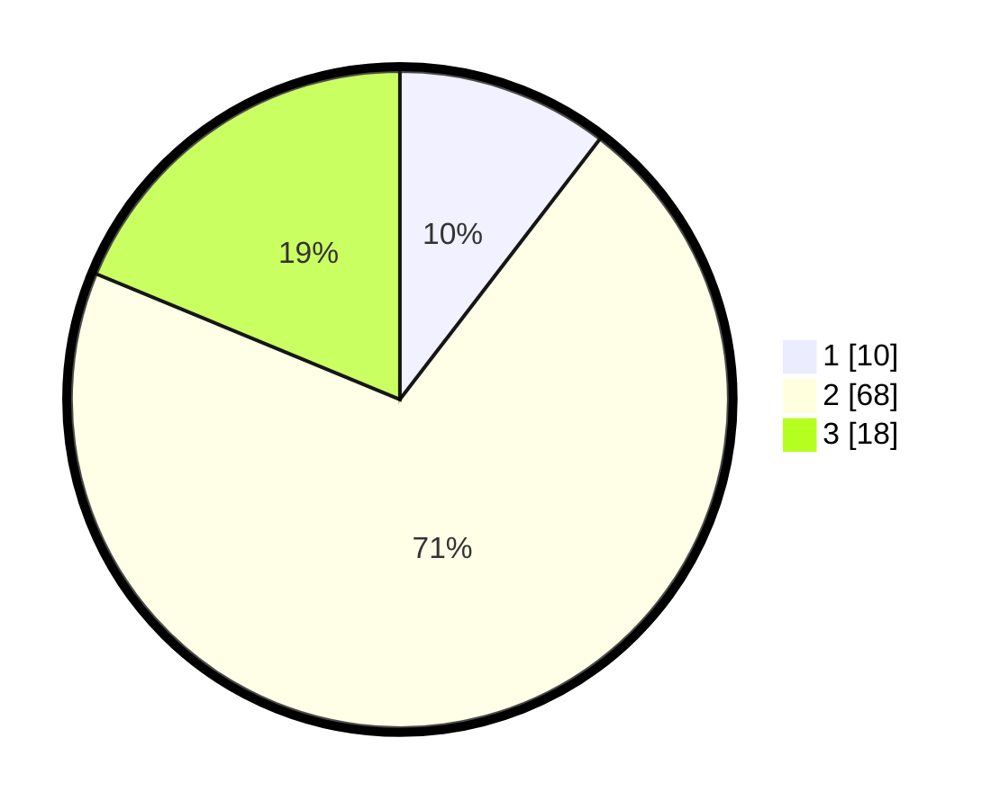

# Hasil

## Grafik

## Tabel

| No. | Nama Paslon    | Suara | Suara (raw) | Persentase |
|:--- |:-------------- | -----:| -----------:| ----------:|
| 1   | ANIES MUHAIMIN | 10    | [10][p-1]   | 10,42      |
| 2   | PRABOWO GIBRAN | 68    | [68][p-2]   | 70,83      |
| 3   | GANJAR MAHFUD  | 18    | [18][p-3]   | 18,75      |

[p-1]: https://github.com/gigit-pemilu/pemilu-2024/blob/main/pilpres/hitung-suara/sub/17-bengkulu/sub/05-seluma/sub/13-ulu-talo/sub/2002-muara-simpur/sub/002-tps/sub/paslon-1.txt
[p-2]: https://github.com/gigit-pemilu/pemilu-2024/blob/main/pilpres/hitung-suara/sub/17-bengkulu/sub/05-seluma/sub/13-ulu-talo/sub/2002-muara-simpur/sub/002-tps/sub/paslon-2.txt
[p-3]: https://github.com/gigit-pemilu/pemilu-2024/blob/main/pilpres/hitung-suara/sub/17-bengkulu/sub/05-seluma/sub/13-ulu-talo/sub/2002-muara-simpur/sub/002-tps/sub/paslon-3.txt

## Foto C Plano

https://sirekap-obj-formc.kpu.go.id/b6a6/pemilu/ppwp/17/05/13/20/02/1705132002002-20240216-155521--5d76cb96-f696-4843-98be-5127144ba9e2.jpg

https://sirekap-obj-formc.kpu.go.id/b6a6/pemilu/ppwp/17/05/13/20/02/1705132002002-20240216-155523--76c3436a-c1fb-4ae4-8e14-d8ceed3ef90f.jpg

https://sirekap-obj-formc.kpu.go.id/b6a6/pemilu/ppwp/17/05/13/20/02/1705132002002-20240216-155522--d8d4e457-fd7f-46f7-a28f-5e877d9dc030.jpg

## Metadata

| Key        | Value               |
| ---------- | ------------------- |
| Time Stamp | 2024-02-16 16:25:10 |

## DATA PEMILIH TETAP

Jumlah pemilih dalam DPT: **0**.
 * L: **0**.
 * P: **0**.

## DATA PENGGUNA HAK PILIH

Jumlah pengguna hak pilih dalam DPT: **0**.
 * L: **0**.
 * P: **0**.

Jumlah pengguna hak pilih dalam DPTb: **0**.
 * L: **0**.
 * P: **0**.

Jumlah pengguna hak pilih dalam DPK: **0**.
 * L: **0**.
 * P: **0**.

Jumlah pengguna hak pilih: **0**.
 * L: **0**.
 * P: **0**.

## JUMLAH SUARA SAH DAN TIDAK SAH

JUMLAH SELURUH SUARA SAH: **96**.

JUMLAH SUARA TIDAK SAH: **0**.

JUMLAH SELURUH SUARA SAH DAN SUARA TIDAK SAH: **96**.

