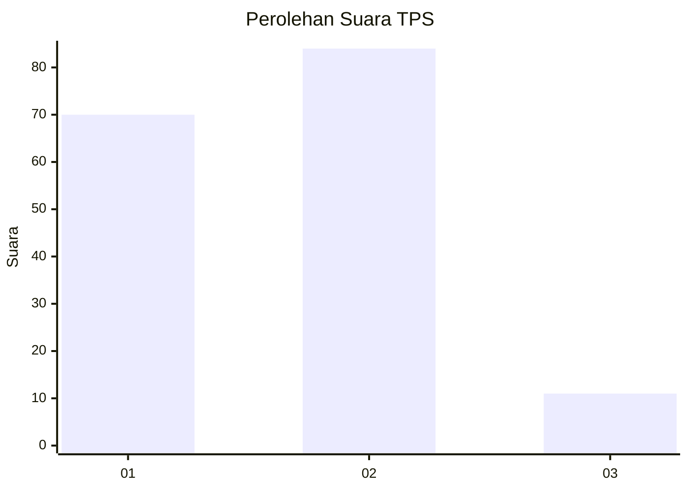
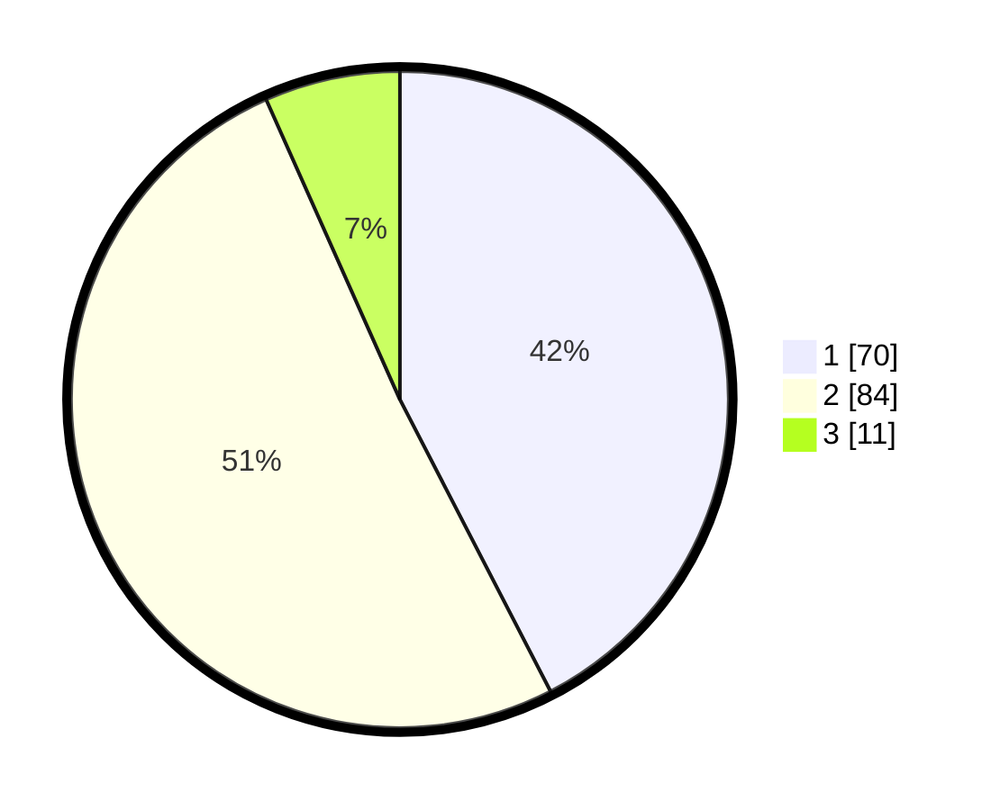

# Hasil

## Grafik

## Tabel

| No. | Nama Paslon    | Suara | Suara (raw) | Persentase |
|:--- |:-------------- | -----:| -----------:| ----------:|
| 1   | ANIES MUHAIMIN | 70    | [70][p-1]   | 42,42      |
| 2   | PRABOWO GIBRAN | 84    | [84][p-2]   | 50,91      |
| 3   | GANJAR MAHFUD  | 11    | [11][p-3]   | 6,67       |

[p-1]: https://github.com/gigit-pemilu/pemilu-2024-17-bengkulu/blob/main/pilpres/hitung-suara/sub/17-bengkulu/sub/06-muko-muko/sub/02-kota-mukomuko/sub/1009-pasar-muko-muko/sub/003-tps/sub/paslon-1.txt
[p-2]: https://github.com/gigit-pemilu/pemilu-2024-17-bengkulu/blob/main/pilpres/hitung-suara/sub/17-bengkulu/sub/06-muko-muko/sub/02-kota-mukomuko/sub/1009-pasar-muko-muko/sub/003-tps/sub/paslon-2.txt
[p-3]: https://github.com/gigit-pemilu/pemilu-2024-17-bengkulu/blob/main/pilpres/hitung-suara/sub/17-bengkulu/sub/06-muko-muko/sub/02-kota-mukomuko/sub/1009-pasar-muko-muko/sub/003-tps/sub/paslon-3.txt

## Foto C Plano

https://sirekap-obj-formc.kpu.go.id/9e5d/pemilu/ppwp/17/06/02/10/09/1706021009003-20240215-040124--20ac4396-000f-498a-9de6-1a55c4ff3e1d.jpg

https://sirekap-obj-formc.kpu.go.id/9e5d/pemilu/ppwp/17/06/02/10/09/1706021009003-20240215-040147--6a5a01dd-9380-4c07-b917-8bef149e736d.jpg

https://sirekap-obj-formc.kpu.go.id/9e5d/pemilu/ppwp/17/06/02/10/09/1706021009003-20240215-040206--2d756515-6bc7-44f3-b52a-93f96ed206d2.jpg

## Metadata

| Key        | Value               |
| ---------- | ------------------- |
| Time Stamp | 2024-02-15 12:00:28 |

