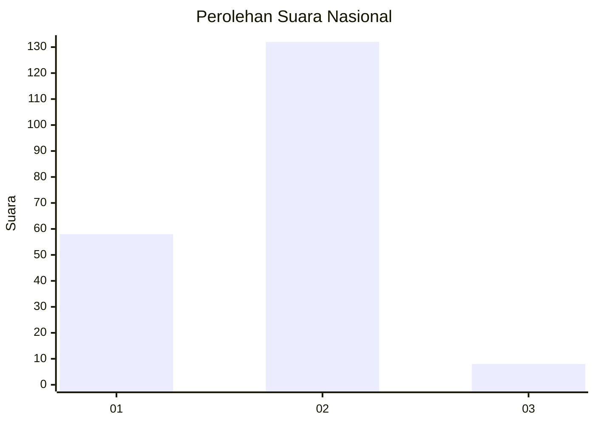
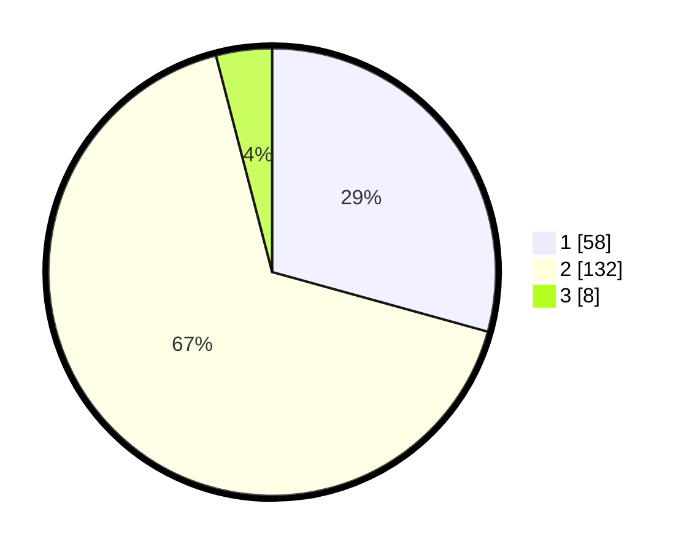

# Hasil

## Grafik

## Tabel

| No. | Nama Paslon    | Suara | Suara (raw) | Persentase |
|:--- |:-------------- | -----:| -----------:| ----------:|
| 1   | ANIES MUHAIMIN | 58    | [58][p-1]   | 29,29      |
| 2   | PRABOWO GIBRAN | 132   | [132][p-2]  | 66,67      |
| 3   | GANJAR MAHFUD  | 8     | [8][p-3]    | 4,04       |

[p-1]: https://github.com/gigit-pemilu/pemilu-2024/blob/main/pilpres/hitung-suara/sub/17-bengkulu/sub/06-muko-muko/sub/02-kota-mukomuko/sub/1009-pasar-muko-muko/sub/007-tps/sub/paslon-1.txt
[p-2]: https://github.com/gigit-pemilu/pemilu-2024/blob/main/pilpres/hitung-suara/sub/17-bengkulu/sub/06-muko-muko/sub/02-kota-mukomuko/sub/1009-pasar-muko-muko/sub/007-tps/sub/paslon-2.txt
[p-3]: https://github.com/gigit-pemilu/pemilu-2024/blob/main/pilpres/hitung-suara/sub/17-bengkulu/sub/06-muko-muko/sub/02-kota-mukomuko/sub/1009-pasar-muko-muko/sub/007-tps/sub/paslon-3.txt

## Foto C Plano

https://sirekap-obj-formc.kpu.go.id/defb/pemilu/ppwp/17/06/02/10/09/1706021009007-20240215-100932--417446ff-4fe4-4710-a31e-c78c18bb3ca4.jpg

https://sirekap-obj-formc.kpu.go.id/defb/pemilu/ppwp/17/06/02/10/09/1706021009007-20240215-101000--e30ea842-340a-4e9d-b37b-1b488669460f.jpg

https://sirekap-obj-formc.kpu.go.id/defb/pemilu/ppwp/17/06/02/10/09/1706021009007-20240215-101021--6710b69e-1ef8-4e62-a055-b49c854101fc.jpg

## Metadata

| Key        | Value               |
| ---------- | ------------------- |
| Time Stamp | 2024-02-15 18:00:26 |

