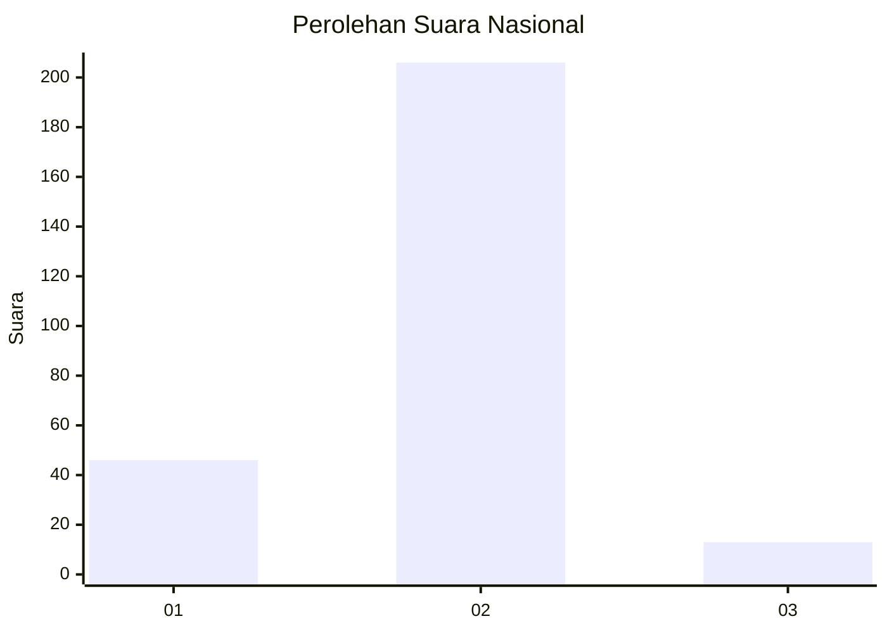
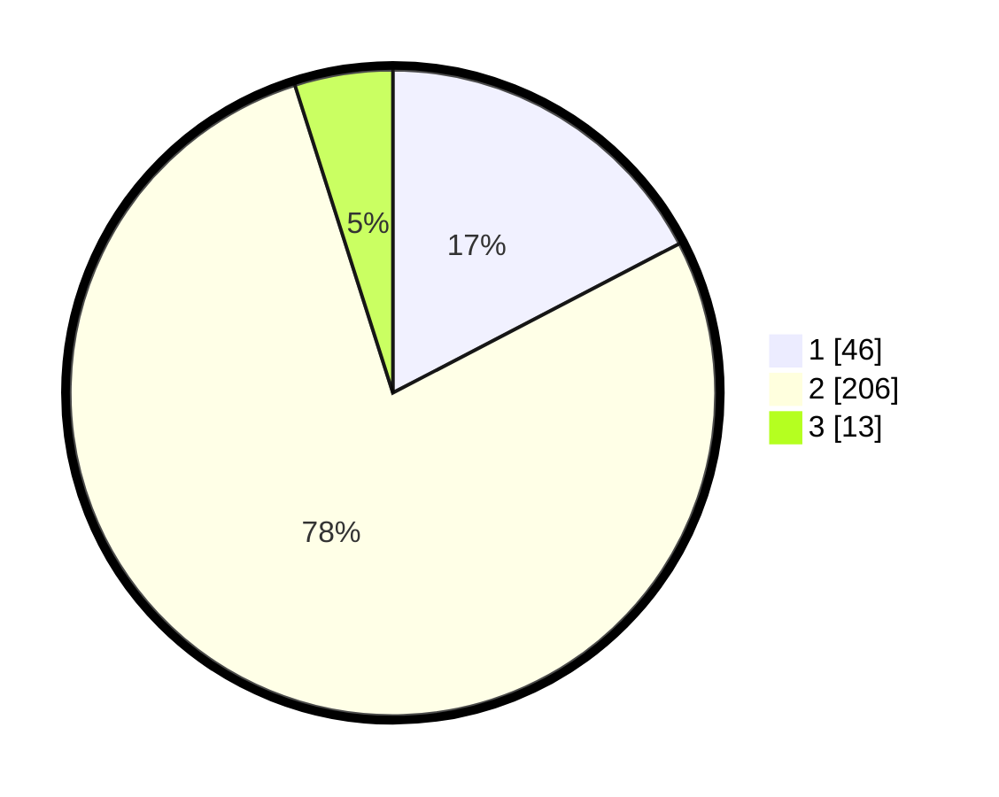

# Hasil

## Grafik

## Tabel

| No. | Nama Paslon    | Suara | Suara (raw) | Persentase |
|:--- |:-------------- | -----:| -----------:| ----------:|
| 1   | ANIES MUHAIMIN | 46    | [46][p-1]   | 17,36      |
| 2   | PRABOWO GIBRAN | 206   | [206][p-2]  | 77,74      |
| 3   | GANJAR MAHFUD  | 13    | [13][p-3]   | 4,91       |

[p-1]: https://github.com/gigit-pemilu/pemilu-2024/blob/main/pilpres/hitung-suara/sub/17-bengkulu/sub/06-muko-muko/sub/03-teras-terunjam/sub/2009-pondok-kopi/sub/001-tps/sub/paslon-1.txt
[p-2]: https://github.com/gigit-pemilu/pemilu-2024/blob/main/pilpres/hitung-suara/sub/17-bengkulu/sub/06-muko-muko/sub/03-teras-terunjam/sub/2009-pondok-kopi/sub/001-tps/sub/paslon-2.txt
[p-3]: https://github.com/gigit-pemilu/pemilu-2024/blob/main/pilpres/hitung-suara/sub/17-bengkulu/sub/06-muko-muko/sub/03-teras-terunjam/sub/2009-pondok-kopi/sub/001-tps/sub/paslon-3.txt

## Foto C Plano

https://sirekap-obj-formc.kpu.go.id/a567/pemilu/ppwp/17/06/03/20/09/1706032009001-20240217-143449--ae0fa425-845a-4994-9a6f-fe520b934ab7.jpg

https://sirekap-obj-formc.kpu.go.id/a567/pemilu/ppwp/17/06/03/20/09/1706032009001-20240217-142356--65111d42-6511-4a81-9ac6-96113a38d5e5.jpg

https://sirekap-obj-formc.kpu.go.id/a567/pemilu/ppwp/17/06/03/20/09/1706032009001-20240217-142443--72d7a6f1-9417-4bd8-8b9f-1f644aa83c61.jpg

## Metadata

| Key        | Value               |
| ---------- | ------------------- |
| Time Stamp | 2024-02-19 19:00:00 |

