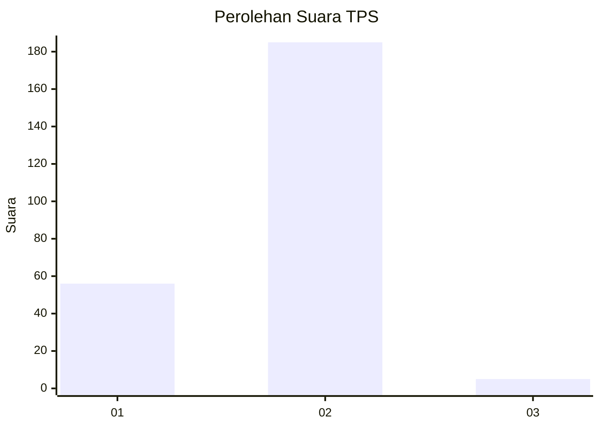
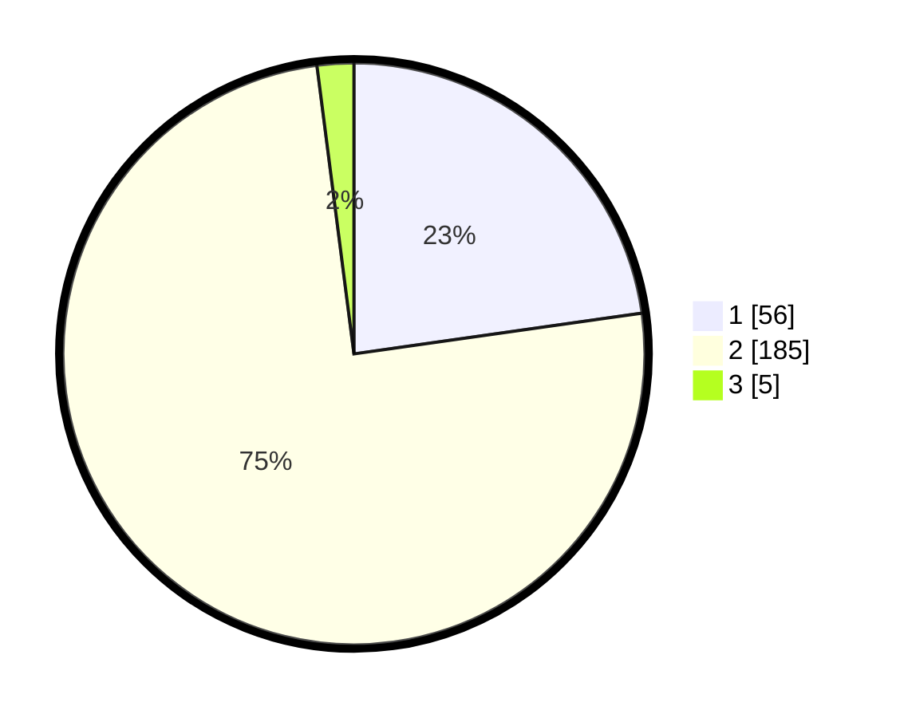

# Hasil

## Grafik

## Tabel

| No. | Nama Paslon    | Suara | Suara (raw) | Persentase |
|:--- |:-------------- | -----:| -----------:| ----------:|
| 1   | ANIES MUHAIMIN | 56    | [56][p-1]   | 22,76      |
| 2   | PRABOWO GIBRAN | 185   | [185][p-2]  | 75,20      |
| 3   | GANJAR MAHFUD  | 5     | [5][p-3]    | 2,03       |

[p-1]: https://github.com/gigit-pemilu/pemilu-2024-17-bengkulu/blob/main/pilpres/hitung-suara/sub/17-bengkulu/sub/06-muko-muko/sub/04-pondok-suguh/sub/2001-air-bikuk/sub/003-tps/sub/paslon-1.txt
[p-2]: https://github.com/gigit-pemilu/pemilu-2024-17-bengkulu/blob/main/pilpres/hitung-suara/sub/17-bengkulu/sub/06-muko-muko/sub/04-pondok-suguh/sub/2001-air-bikuk/sub/003-tps/sub/paslon-2.txt
[p-3]: https://github.com/gigit-pemilu/pemilu-2024-17-bengkulu/blob/main/pilpres/hitung-suara/sub/17-bengkulu/sub/06-muko-muko/sub/04-pondok-suguh/sub/2001-air-bikuk/sub/003-tps/sub/paslon-3.txt

## Foto C Plano

https://sirekap-obj-formc.kpu.go.id/9b6c/pemilu/ppwp/17/06/04/20/01/1706042001003-20240215-031259--cc3b2c03-bfde-48a1-aee5-6c23ee3eb9f5.jpg

https://sirekap-obj-formc.kpu.go.id/9b6c/pemilu/ppwp/17/06/04/20/01/1706042001003-20240215-032217--084e785f-bf46-43b3-95e1-26b599dca836.jpg

https://sirekap-obj-formc.kpu.go.id/9b6c/pemilu/ppwp/17/06/04/20/01/1706042001003-20240215-032449--3b77f049-b24f-4fa9-90ef-64f7e23f4418.jpg

## Metadata

| Key        | Value               |
| ---------- | ------------------- |
| Time Stamp | 2024-02-15 15:00:29 |

