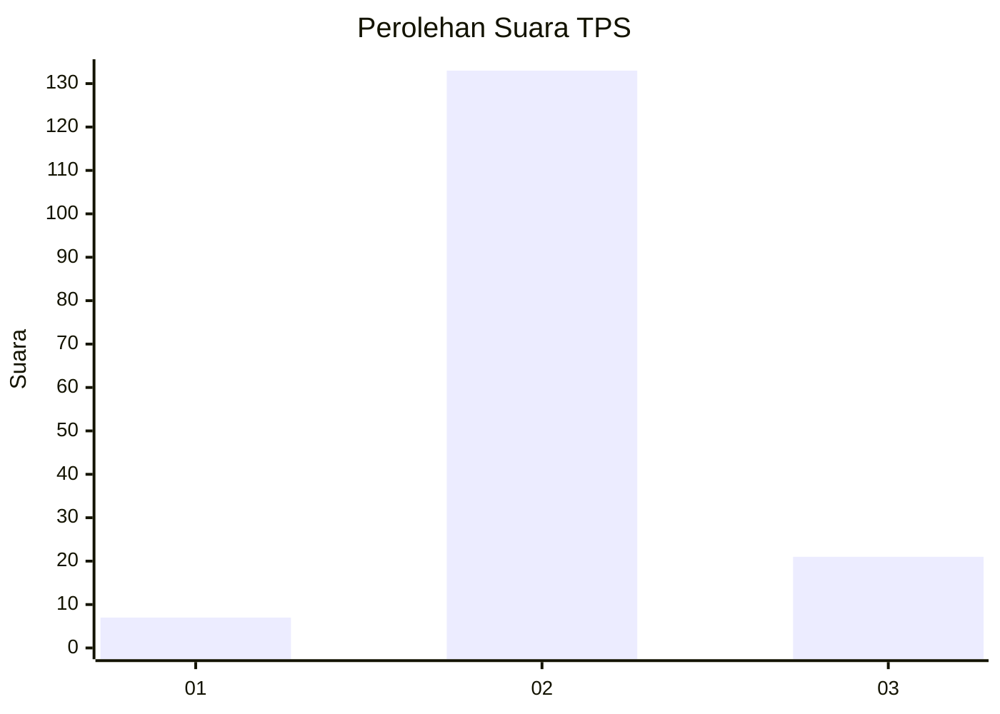
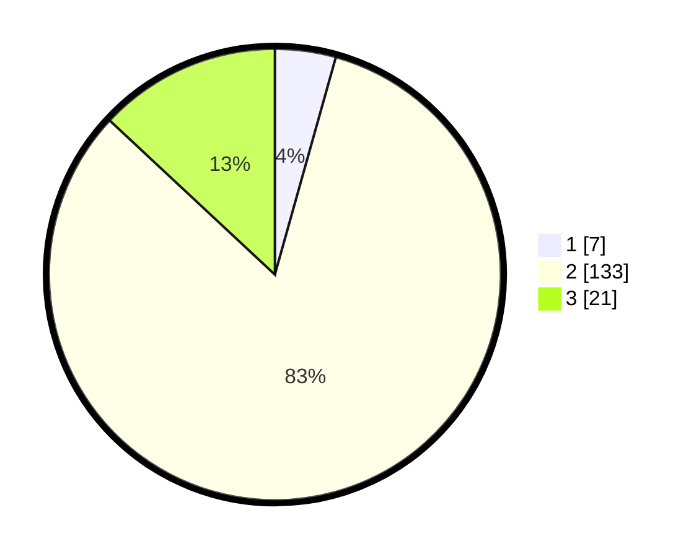

# Hasil

## Grafik

## Tabel

| No. | Nama Paslon    | Suara | Suara (raw) | Persentase |
|:--- |:-------------- | -----:| -----------:| ----------:|
| 1   | ANIES MUHAIMIN | 7     | [7][p-1]    | 4,35       |
| 2   | PRABOWO GIBRAN | 133   | [133][p-2]  | 82,61      |
| 3   | GANJAR MAHFUD  | 21    | [21][p-3]   | 13,04      |

[p-1]: https://github.com/gigit-pemilu/pemilu-2024-17-bengkulu/blob/main/pilpres/hitung-suara/sub/17-bengkulu/sub/06-muko-muko/sub/04-pondok-suguh/sub/2001-air-bikuk/sub/005-tps/sub/paslon-1.txt
[p-2]: https://github.com/gigit-pemilu/pemilu-2024-17-bengkulu/blob/main/pilpres/hitung-suara/sub/17-bengkulu/sub/06-muko-muko/sub/04-pondok-suguh/sub/2001-air-bikuk/sub/005-tps/sub/paslon-2.txt
[p-3]: https://github.com/gigit-pemilu/pemilu-2024-17-bengkulu/blob/main/pilpres/hitung-suara/sub/17-bengkulu/sub/06-muko-muko/sub/04-pondok-suguh/sub/2001-air-bikuk/sub/005-tps/sub/paslon-3.txt

## Foto C Plano

https://sirekap-obj-formc.kpu.go.id/a5e6/pemilu/ppwp/17/06/04/20/01/1706042001005-20240215-011124--5d4f7b54-a16a-4384-8077-460a5f863699.jpg

https://sirekap-obj-formc.kpu.go.id/a5e6/pemilu/ppwp/17/06/04/20/01/1706042001005-20240215-011313--a7f616e4-7b42-4a2d-abee-03dfcd23498b.jpg

https://sirekap-obj-formc.kpu.go.id/a5e6/pemilu/ppwp/17/06/04/20/01/1706042001005-20240215-011418--45f40c73-67c6-4539-8c2c-55314f40925c.jpg

## Metadata

| Key        | Value               |
| ---------- | ------------------- |
| Time Stamp | 2024-02-15 12:00:28 |

