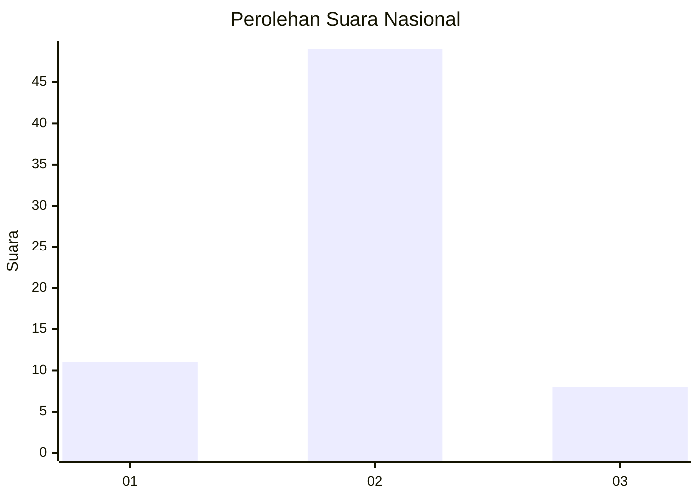
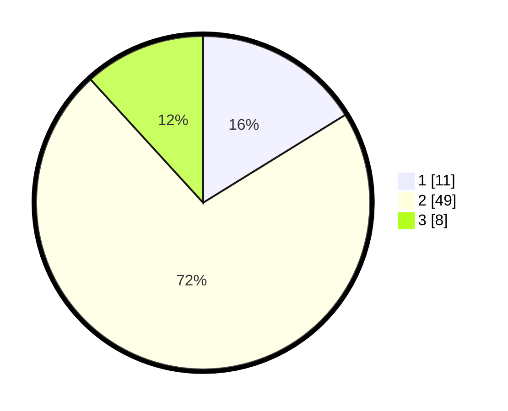

# Hasil

## Grafik

## Tabel

| No. | Nama Paslon    | Suara | Suara (raw) | Persentase |
|:--- |:-------------- | -----:| -----------:| ----------:|
| 1   | ANIES MUHAIMIN | 11    | [11][p-1]   | 16,18      |
| 2   | PRABOWO GIBRAN | 49    | [49][p-2]   | 72,06      |
| 3   | GANJAR MAHFUD  | 8     | [8][p-3]    | 11,76      |

[p-1]: https://github.com/gigit-pemilu/pemilu-2024/blob/main/pilpres/hitung-suara/sub/17-bengkulu/sub/06-muko-muko/sub/05-ipuh/sub/2004-air-buluh/sub/004-tps/sub/paslon-1.txt
[p-2]: https://github.com/gigit-pemilu/pemilu-2024/blob/main/pilpres/hitung-suara/sub/17-bengkulu/sub/06-muko-muko/sub/05-ipuh/sub/2004-air-buluh/sub/004-tps/sub/paslon-2.txt
[p-3]: https://github.com/gigit-pemilu/pemilu-2024/blob/main/pilpres/hitung-suara/sub/17-bengkulu/sub/06-muko-muko/sub/05-ipuh/sub/2004-air-buluh/sub/004-tps/sub/paslon-3.txt

## Foto C Plano

https://sirekap-obj-formc.kpu.go.id/c194/pemilu/ppwp/17/06/05/20/04/1706052004004-20240218-132027--4b69d83e-be4b-4b95-bb54-0d4d7983c895.jpg

https://sirekap-obj-formc.kpu.go.id/c194/pemilu/ppwp/17/06/05/20/04/1706052004004-20240218-132029--44875d41-c681-4b4d-962c-c599302dc169.jpg

https://sirekap-obj-formc.kpu.go.id/c194/pemilu/ppwp/17/06/05/20/04/1706052004004-20240218-132028--5429951d-6510-426c-8f72-239c9705e516.jpg

## Metadata

| Key        | Value               |
| ---------- | ------------------- |
| Time Stamp | 2024-02-19 06:16:00 |

## DATA PEMILIH TETAP

Jumlah pemilih dalam DPT: **80**.
 * L: **40**.
 * P: **40**.

## DATA PENGGUNA HAK PILIH

Jumlah pengguna hak pilih dalam DPT: **60**.
 * L: **32**.
 * P: **28**.

Jumlah pengguna hak pilih dalam DPTb: **7**.
 * L: **3**.
 * P: **4**.

Jumlah pengguna hak pilih dalam DPK: **2**.
 * L: **1**.
 * P: **1**.

Jumlah pengguna hak pilih: **69**.
 * L: **36**.
 * P: **33**.

## JUMLAH SUARA SAH DAN TIDAK SAH

JUMLAH SELURUH SUARA SAH: **68**.

JUMLAH SUARA TIDAK SAH: **1**.

JUMLAH SELURUH SUARA SAH DAN SUARA TIDAK SAH: **69**.

