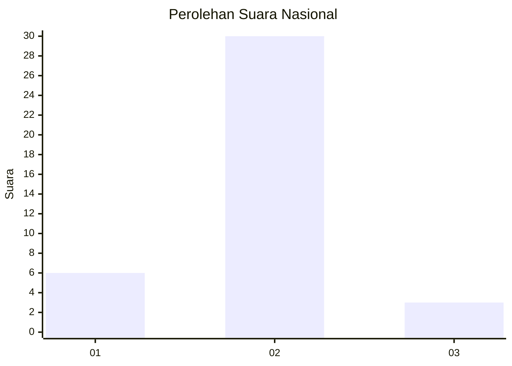
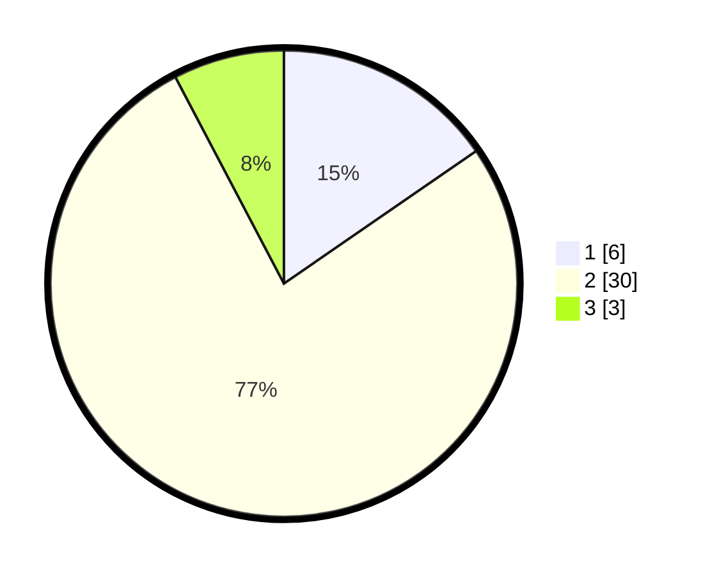

# Hasil

## Grafik

## Tabel

| No. | Nama Paslon    | Suara | Suara (raw) | Persentase |
|:--- |:-------------- | -----:| -----------:| ----------:|
| 1   | ANIES MUHAIMIN | 6     | [6][p-1]    | 15,38      |
| 2   | PRABOWO GIBRAN | 30    | [30][p-2]   | 76,92      |
| 3   | GANJAR MAHFUD  | 3     | [3][p-3]    | 7,69       |

[p-1]: https://github.com/gigit-pemilu/pemilu-2024/blob/main/pilpres/hitung-suara/sub/17-bengkulu/sub/06-muko-muko/sub/05-ipuh/sub/2004-air-buluh/sub/005-tps/sub/paslon-1.txt
[p-2]: https://github.com/gigit-pemilu/pemilu-2024/blob/main/pilpres/hitung-suara/sub/17-bengkulu/sub/06-muko-muko/sub/05-ipuh/sub/2004-air-buluh/sub/005-tps/sub/paslon-2.txt
[p-3]: https://github.com/gigit-pemilu/pemilu-2024/blob/main/pilpres/hitung-suara/sub/17-bengkulu/sub/06-muko-muko/sub/05-ipuh/sub/2004-air-buluh/sub/005-tps/sub/paslon-3.txt

## Foto C Plano

https://sirekap-obj-formc.kpu.go.id/4aa0/pemilu/ppwp/17/06/05/20/04/1706052004005-20240220-170350--820173cf-c9a4-43ef-9ed0-1c6cb5960e8e.jpg

https://sirekap-obj-formc.kpu.go.id/4aa0/pemilu/ppwp/17/06/05/20/04/1706052004005-20240220-170752--b067aaee-6348-4a49-8461-8f04933c2a34.jpg

https://sirekap-obj-formc.kpu.go.id/4aa0/pemilu/ppwp/17/06/05/20/04/1706052004005-20240220-171024--64c93c50-dc8f-484d-bc85-6117fc38f201.jpg

## Metadata

| Key        | Value               |
| ---------- | ------------------- |
| Time Stamp | 2024-02-21 02:00:00 |

## DATA PEMILIH TETAP

Jumlah pemilih dalam DPT: **43**.
 * L: **21**.
 * P: **22**.

## DATA PENGGUNA HAK PILIH

Jumlah pengguna hak pilih dalam DPT: **37**.
 * L: **19**.
 * P: **18**.

Jumlah pengguna hak pilih dalam DPTb: **2**.
 * L: **2**.
 * P: **0**.

Jumlah pengguna hak pilih dalam DPK: **0**.
 * L: **0**.
 * P: **0**.

Jumlah pengguna hak pilih: **39**.
 * L: **21**.
 * P: **18**.

## JUMLAH SUARA SAH DAN TIDAK SAH

JUMLAH SELURUH SUARA SAH: **39**.

JUMLAH SUARA TIDAK SAH: **0**.

JUMLAH SELURUH SUARA SAH DAN SUARA TIDAK SAH: **39**.

