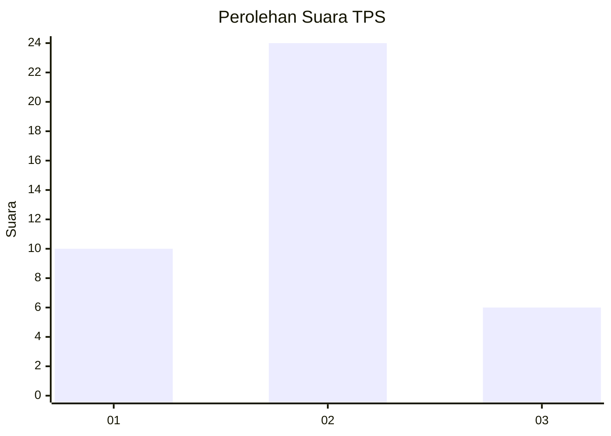
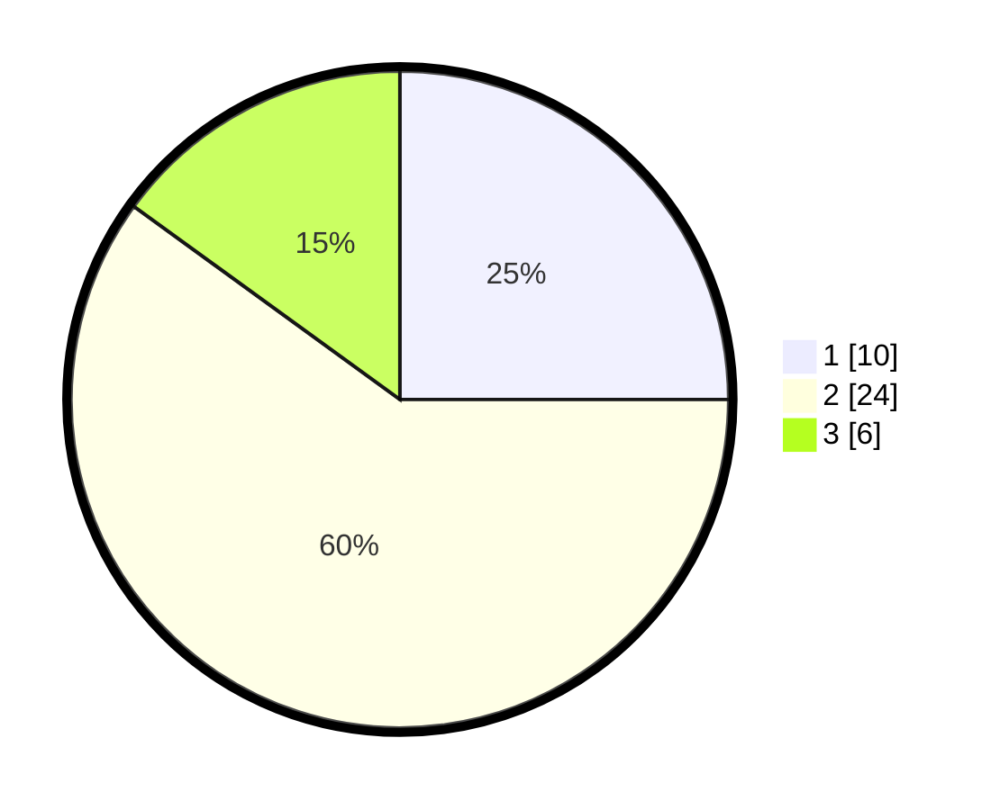

# Hasil

## Grafik

## Tabel

| No. | Nama Paslon    | Suara | Suara (raw) | Persentase |
|:--- |:-------------- | -----:| -----------:| ----------:|
| 1   | ANIES MUHAIMIN | 10    | [10][p-1]   | 25,00      |
| 2   | PRABOWO GIBRAN | 24    | [24][p-2]   | 60,00      |
| 3   | GANJAR MAHFUD  | 6     | [6][p-3]    | 15,00      |

[p-1]: https://github.com/gigit-pemilu/pemilu-2024-17-bengkulu/blob/main/pilpres/hitung-suara/sub/17-bengkulu/sub/06-muko-muko/sub/06-malin-deman/sub/2004-gajah-makmur/sub/004-tps/sub/paslon-1.txt
[p-2]: https://github.com/gigit-pemilu/pemilu-2024-17-bengkulu/blob/main/pilpres/hitung-suara/sub/17-bengkulu/sub/06-muko-muko/sub/06-malin-deman/sub/2004-gajah-makmur/sub/004-tps/sub/paslon-2.txt
[p-3]: https://github.com/gigit-pemilu/pemilu-2024-17-bengkulu/blob/main/pilpres/hitung-suara/sub/17-bengkulu/sub/06-muko-muko/sub/06-malin-deman/sub/2004-gajah-makmur/sub/004-tps/sub/paslon-3.txt

## Foto C Plano

https://sirekap-obj-formc.kpu.go.id/5b9d/pemilu/ppwp/17/06/06/20/04/1706062004004-20240217-095616--fa50af7f-3080-4099-a8ae-915802ac4673.jpg

https://sirekap-obj-formc.kpu.go.id/5b9d/pemilu/ppwp/17/06/06/20/04/1706062004004-20240217-095618--2d2c1c2c-af8b-4185-8c71-5253e06ceef6.jpg

https://sirekap-obj-formc.kpu.go.id/5b9d/pemilu/ppwp/17/06/06/20/04/1706062004004-20240217-095617--8e603684-5563-40f2-a20a-9a2c762680b4.jpg

## Metadata

| Key        | Value               |
| ---------- | ------------------- |
| Time Stamp | 2024-02-17 10:30:03 |

## DATA PEMILIH TETAP

Jumlah pemilih dalam DPT: **50**.
 * L: **24**.
 * P: **26**.

## DATA PENGGUNA HAK PILIH

Jumlah pengguna hak pilih dalam DPT: **36**.
 * L: **17**.
 * P: **19**.

Jumlah pengguna hak pilih dalam DPTb: **3**.
 * L: **1**.
 * P: **2**.

Jumlah pengguna hak pilih dalam DPK: **1**.
 * L: **1**.
 * P: **0**.

Jumlah pengguna hak pilih: **40**.
 * L: **19**.
 * P: **21**.

## JUMLAH SUARA SAH DAN TIDAK SAH

JUMLAH SELURUH SUARA SAH: **40**.

JUMLAH SUARA TIDAK SAH: **0**.

JUMLAH SELURUH SUARA SAH DAN SUARA TIDAK SAH: **40**.

