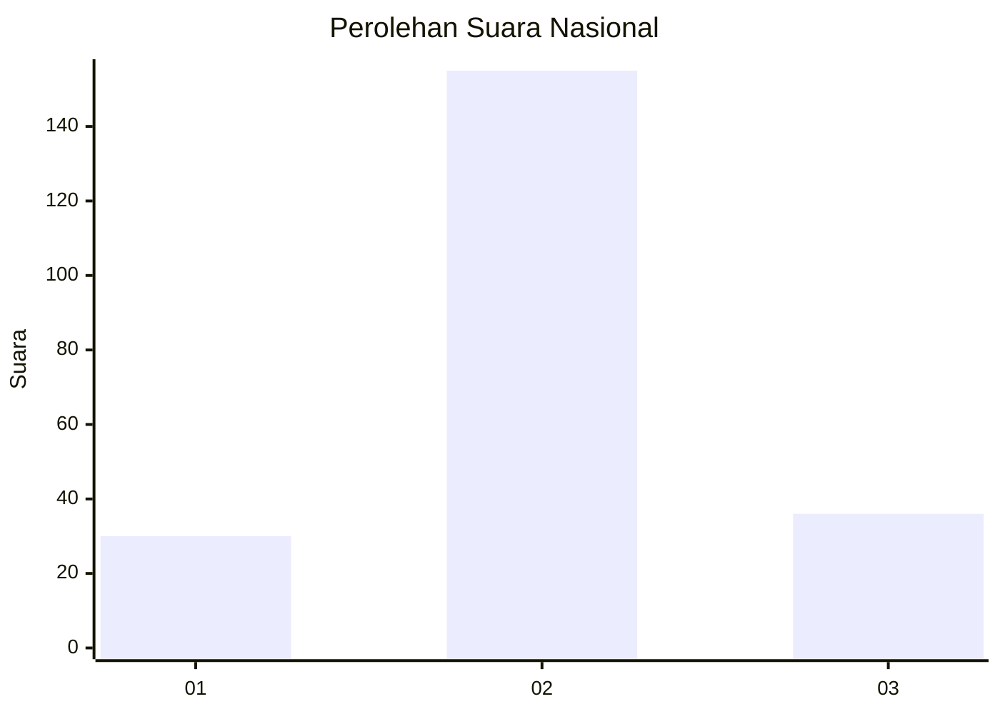
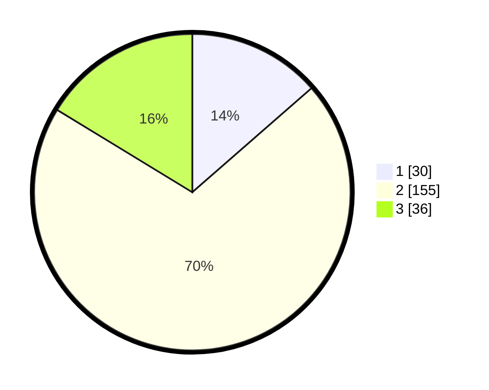

# Hasil

## Grafik

## Tabel

| No. | Nama Paslon    | Suara | Suara (raw) | Persentase |
|:--- |:-------------- | -----:| -----------:| ----------:|
| 1   | ANIES MUHAIMIN | 30    | [30][p-1]   | 13,57      |
| 2   | PRABOWO GIBRAN | 155   | [155][p-2]  | 70,14      |
| 3   | GANJAR MAHFUD  | 36    | [36][p-3]   | 16,29      |

[p-1]: https://github.com/gigit-pemilu/pemilu-2024/blob/main/pilpres/hitung-suara/sub/17-bengkulu/sub/06-muko-muko/sub/11-xiv-koto/sub/2005-pauh-tarenja/sub/001-tps/sub/paslon-1.txt
[p-2]: https://github.com/gigit-pemilu/pemilu-2024/blob/main/pilpres/hitung-suara/sub/17-bengkulu/sub/06-muko-muko/sub/11-xiv-koto/sub/2005-pauh-tarenja/sub/001-tps/sub/paslon-2.txt
[p-3]: https://github.com/gigit-pemilu/pemilu-2024/blob/main/pilpres/hitung-suara/sub/17-bengkulu/sub/06-muko-muko/sub/11-xiv-koto/sub/2005-pauh-tarenja/sub/001-tps/sub/paslon-3.txt

## Foto C Plano

https://sirekap-obj-formc.kpu.go.id/ccab/pemilu/ppwp/17/06/11/20/05/1706112005001-20240220-142138--0fd42b41-2b97-4f96-a9c3-7af26ad1cf53.jpg

https://sirekap-obj-formc.kpu.go.id/ccab/pemilu/ppwp/17/06/11/20/05/1706112005001-20240220-142239--ea7a2b3b-893e-4d88-8871-fb995da5a276.jpg

https://sirekap-obj-formc.kpu.go.id/ccab/pemilu/ppwp/17/06/11/20/05/1706112005001-20240220-142316--109d314a-77f5-478f-97e7-814b5843f768.jpg

## Metadata

| Key        | Value               |
| ---------- | ------------------- |
| Time Stamp | 2024-02-24 22:31:28 |

