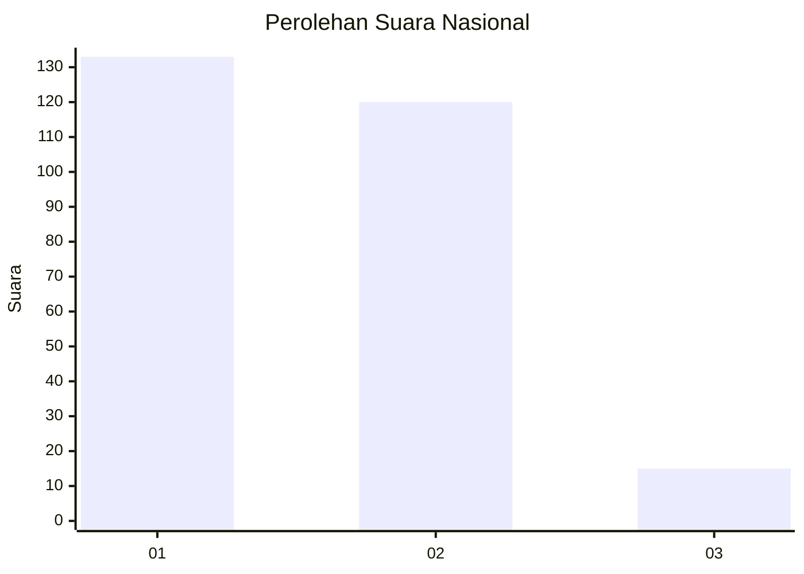
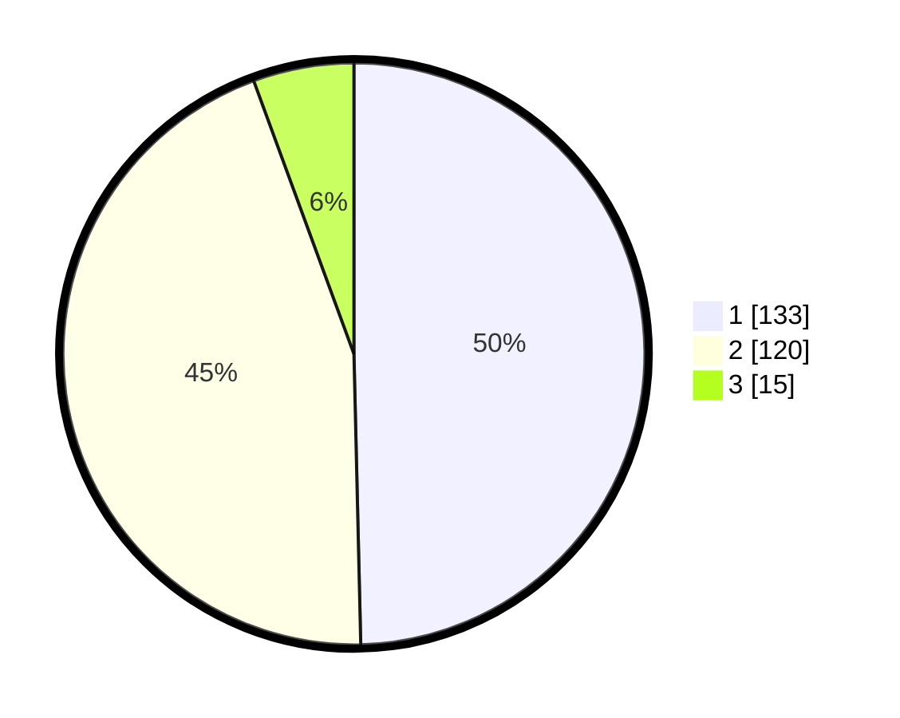

# Hasil

## Grafik

## Tabel

| No. | Nama Paslon    | Suara | Suara (raw) | Persentase |
|:--- |:-------------- | -----:| -----------:| ----------:|
| 1   | ANIES MUHAIMIN | 133   | [133][p-1]  | 49,63      |
| 2   | PRABOWO GIBRAN | 120   | [120][p-2]  | 44,78      |
| 3   | GANJAR MAHFUD  | 15    | [15][p-3]   | 5,60       |

[p-1]: https://github.com/gigit-pemilu/pemilu-2024/blob/main/pilpres/hitung-suara/sub/17-bengkulu/sub/06-muko-muko/sub/15-sungai-rumbai/sub/2001-retak-mudik/sub/003-tps/sub/paslon-1.txt
[p-2]: https://github.com/gigit-pemilu/pemilu-2024/blob/main/pilpres/hitung-suara/sub/17-bengkulu/sub/06-muko-muko/sub/15-sungai-rumbai/sub/2001-retak-mudik/sub/003-tps/sub/paslon-2.txt
[p-3]: https://github.com/gigit-pemilu/pemilu-2024/blob/main/pilpres/hitung-suara/sub/17-bengkulu/sub/06-muko-muko/sub/15-sungai-rumbai/sub/2001-retak-mudik/sub/003-tps/sub/paslon-3.txt

## Foto C Plano

https://sirekap-obj-formc.kpu.go.id/2a54/pemilu/ppwp/17/06/15/20/01/1706152001003-20240216-123608--faf9227e-3db4-45df-92ea-1f6af2578da8.jpg

https://sirekap-obj-formc.kpu.go.id/2a54/pemilu/ppwp/17/06/15/20/01/1706152001003-20240216-125432--cb7d9c8f-b096-4d12-bb07-4b035e856661.jpg

https://sirekap-obj-formc.kpu.go.id/2a54/pemilu/ppwp/17/06/15/20/01/1706152001003-20240216-125944--e43c05a4-b399-42db-b070-f3d8f3a19477.jpg

## Metadata

| Key        | Value               |
| ---------- | ------------------- |
| Time Stamp | 2024-02-17 00:28:35 |

## DATA PEMILIH TETAP

Jumlah pemilih dalam DPT: **293**.
 * L: **145**.
 * P: **145**.

## DATA PENGGUNA HAK PILIH

Jumlah pengguna hak pilih dalam DPT: **274**.
 * L: **634**.
 * P: **649**.

Jumlah pengguna hak pilih dalam DPTb: **0**.
 * L: **0**.
 * P: **0**.

Jumlah pengguna hak pilih dalam DPK: **0**.
 * L: **0**.
 * P: **0**.

Jumlah pengguna hak pilih: **274**.
 * L: **134**.
 * P: **140**.

## JUMLAH SUARA SAH DAN TIDAK SAH

JUMLAH SELURUH SUARA SAH: **268**.

JUMLAH SUARA TIDAK SAH: **6**.

JUMLAH SELURUH SUARA SAH DAN SUARA TIDAK SAH: **274**.

