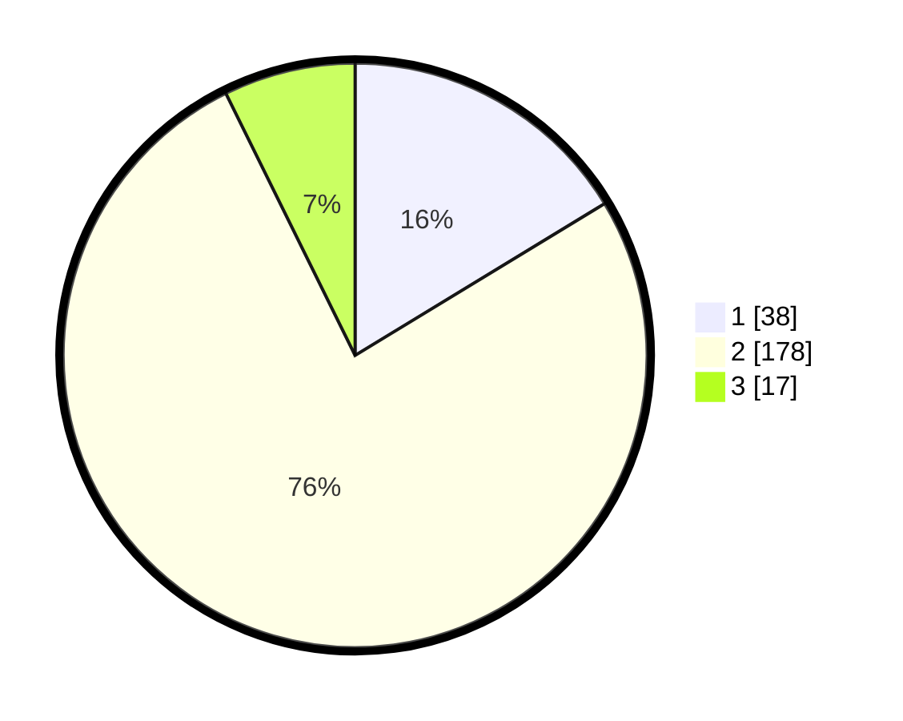

# Hasil

## Grafik

## Tabel

| No. | Nama Paslon    | Suara | Suara (raw) | Persentase |
|:--- |:-------------- | -----:| -----------:| ----------:|
| 1   | ANIES MUHAIMIN | 38    | [38][p-1]   | 16,31      |
| 2   | PRABOWO GIBRAN | 178   | [178][p-2]  | 76,39      |
| 3   | GANJAR MAHFUD  | 17    | [17][p-3]   | 7,30       |

[p-1]: https://github.com/gigit-pemilu/pemilu-2024/blob/main/pilpres/hitung-suara/sub/17-bengkulu/sub/07-lebong/sub/01-lebong-utara/sub/2016-lebong-tambang/sub/001-tps/sub/paslon-1.txt
[p-2]: https://github.com/gigit-pemilu/pemilu-2024/blob/main/pilpres/hitung-suara/sub/17-bengkulu/sub/07-lebong/sub/01-lebong-utara/sub/2016-lebong-tambang/sub/001-tps/sub/paslon-2.txt
[p-3]: https://github.com/gigit-pemilu/pemilu-2024/blob/main/pilpres/hitung-suara/sub/17-bengkulu/sub/07-lebong/sub/01-lebong-utara/sub/2016-lebong-tambang/sub/001-tps/sub/paslon-3.txt

## Foto C Plano

https://sirekap-obj-formc.kpu.go.id/a71f/pemilu/ppwp/17/07/01/20/16/1707012016001-20240219-224058--b4a3a6e8-fac9-436c-832a-fcfa2098d9d7.jpg

https://sirekap-obj-formc.kpu.go.id/a71f/pemilu/ppwp/17/07/01/20/16/1707012016001-20240215-022634--aba70d0e-b26b-451c-a693-2e99cf387a83.jpg

https://sirekap-obj-formc.kpu.go.id/a71f/pemilu/ppwp/17/07/01/20/16/1707012016001-20240215-023048--3c2871aa-1765-4839-9d42-9671f8db8f73.jpg

## Metadata

| Key        | Value               |
| ---------- | ------------------- |
| Time Stamp | 2024-02-19 23:00:00 |

