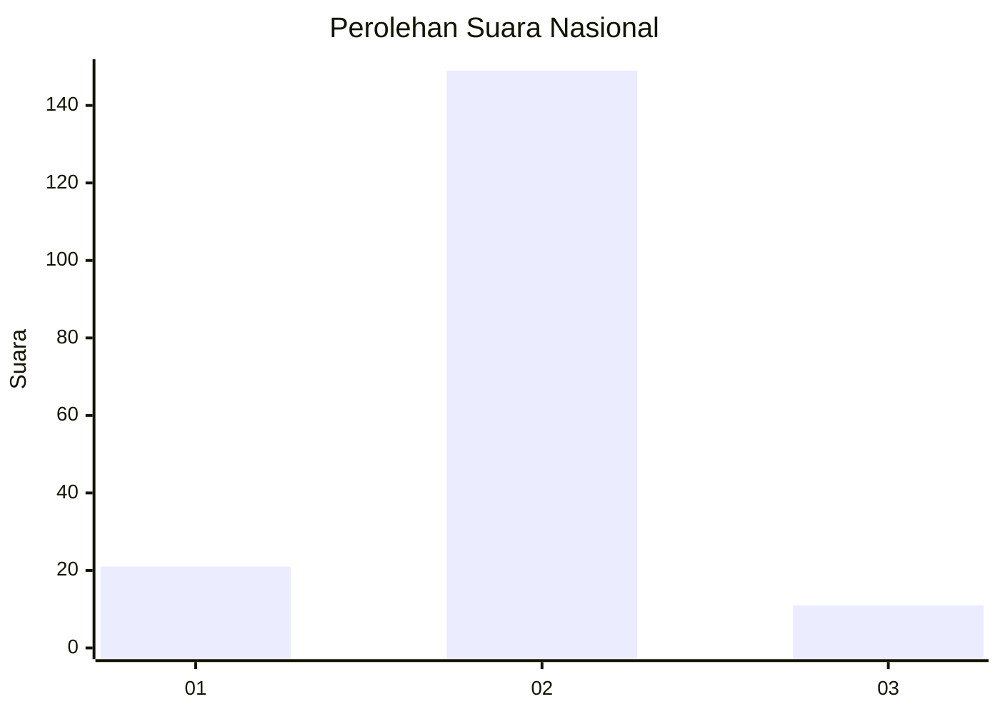
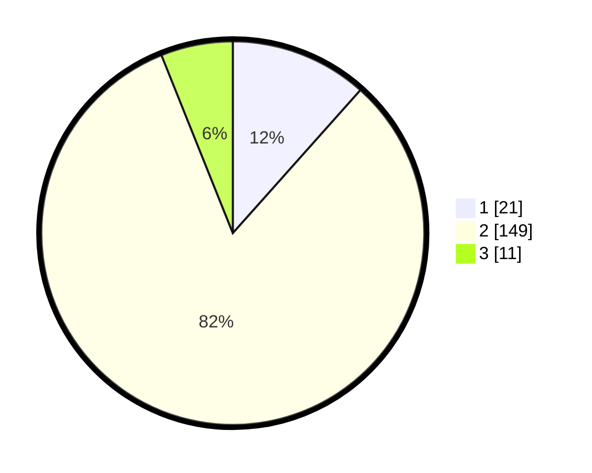

# Hasil

## Grafik

## Tabel

| No. | Nama Paslon    | Suara | Suara (raw) | Persentase |
|:--- |:-------------- | -----:| -----------:| ----------:|
| 1   | ANIES MUHAIMIN | 21    | [21][p-1]   | 11,60      |
| 2   | PRABOWO GIBRAN | 149   | [149][p-2]  | 82,32      |
| 3   | GANJAR MAHFUD  | 11    | [11][p-3]   | 6,08       |

[p-1]: https://github.com/gigit-pemilu/pemilu-2024/blob/main/pilpres/hitung-suara/sub/17-bengkulu/sub/07-lebong/sub/04-lebong-selatan/sub/2001-kutai-donok/sub/004-tps/sub/paslon-1.txt
[p-2]: https://github.com/gigit-pemilu/pemilu-2024/blob/main/pilpres/hitung-suara/sub/17-bengkulu/sub/07-lebong/sub/04-lebong-selatan/sub/2001-kutai-donok/sub/004-tps/sub/paslon-2.txt
[p-3]: https://github.com/gigit-pemilu/pemilu-2024/blob/main/pilpres/hitung-suara/sub/17-bengkulu/sub/07-lebong/sub/04-lebong-selatan/sub/2001-kutai-donok/sub/004-tps/sub/paslon-3.txt

## Foto C Plano

https://sirekap-obj-formc.kpu.go.id/2c6f/pemilu/ppwp/17/07/04/20/01/1707042001004-20240214-190920--1bf12213-eff4-4ae0-a180-2a01b97664c7.jpg

https://sirekap-obj-formc.kpu.go.id/2c6f/pemilu/ppwp/17/07/04/20/01/1707042001004-20240214-190931--ae1be513-0ed0-4e72-b401-62c616d13026.jpg

https://sirekap-obj-formc.kpu.go.id/2c6f/pemilu/ppwp/17/07/04/20/01/1707042001004-20240214-190937--09b6996d-84a1-4f86-bb9d-5b6fcc82d775.jpg

## Metadata

| Key        | Value               |
| ---------- | ------------------- |
| Time Stamp | 2024-02-16 12:51:22 |

