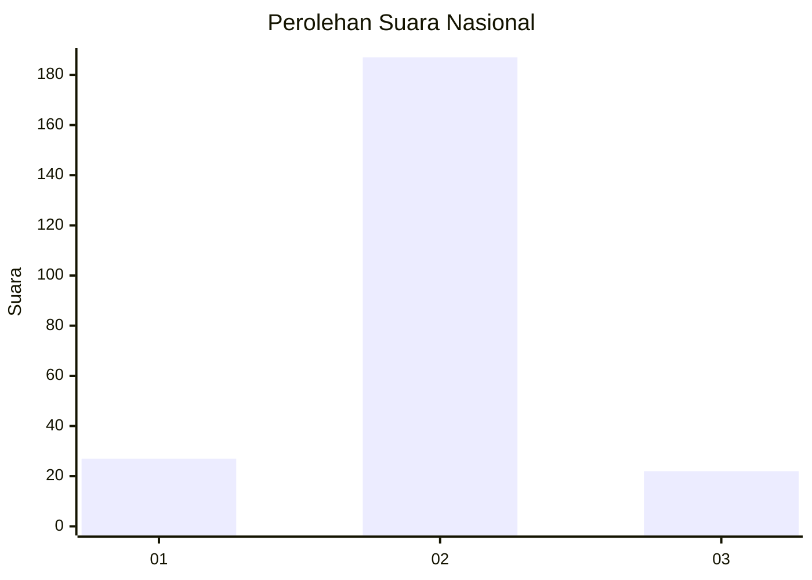
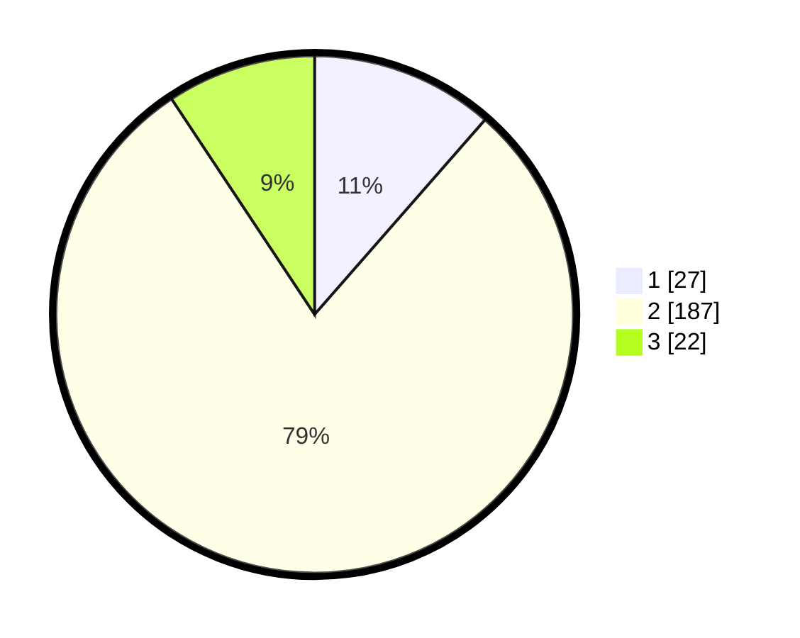

# Hasil

## Grafik

## Tabel

| No. | Nama Paslon    | Suara | Suara (raw) | Persentase |
|:--- |:-------------- | -----:| -----------:| ----------:|
| 1   | ANIES MUHAIMIN | 27    | [27][p-1]   | 11,44      |
| 2   | PRABOWO GIBRAN | 187   | [187][p-2]  | 79,24      |
| 3   | GANJAR MAHFUD  | 22    | [22][p-3]   | 9,32       |

[p-1]: https://github.com/gigit-pemilu/pemilu-2024/blob/main/pilpres/hitung-suara/sub/17-bengkulu/sub/07-lebong/sub/08-lebong-sakti/sub/2001-ujung-tanjung-i/sub/001-tps/sub/paslon-1.txt
[p-2]: https://github.com/gigit-pemilu/pemilu-2024/blob/main/pilpres/hitung-suara/sub/17-bengkulu/sub/07-lebong/sub/08-lebong-sakti/sub/2001-ujung-tanjung-i/sub/001-tps/sub/paslon-2.txt
[p-3]: https://github.com/gigit-pemilu/pemilu-2024/blob/main/pilpres/hitung-suara/sub/17-bengkulu/sub/07-lebong/sub/08-lebong-sakti/sub/2001-ujung-tanjung-i/sub/001-tps/sub/paslon-3.txt

## Foto C Plano

https://sirekap-obj-formc.kpu.go.id/3a2e/pemilu/ppwp/17/07/08/20/01/1707082001001-20240219-202318--73a395c6-535d-4c89-87ea-a1fb2458be54.jpg

https://sirekap-obj-formc.kpu.go.id/3a2e/pemilu/ppwp/17/07/08/20/01/1707082001001-20240219-202331--c763ccf9-f4e3-481f-8809-22c571e3743f.jpg

https://sirekap-obj-formc.kpu.go.id/3a2e/pemilu/ppwp/17/07/08/20/01/1707082001001-20240219-202344--3bc3f396-7daa-4eb4-b0e1-c5ff61acd37a.jpg

## Metadata

| Key        | Value               |
| ---------- | ------------------- |
| Time Stamp | 2024-02-21 11:00:00 |

