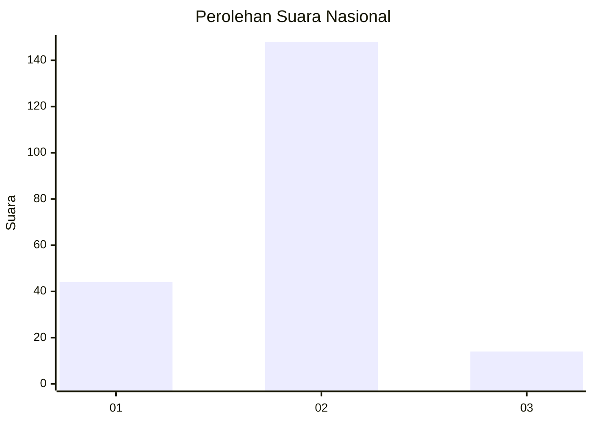

# Hasil

## Grafik

## Tabel

| No. | Nama Paslon    | Suara | Suara (raw) | Persentase |
|:--- |:-------------- | -----:| -----------:| ----------:|
| 1   | ANIES MUHAIMIN | 44    | [44][p-1]   | 21,36      |
| 2   | PRABOWO GIBRAN | 148   | [148][p-2]  | 71,84      |
| 3   | GANJAR MAHFUD  | 14    | [14][p-3]   | 6,80       |

[p-1]: https://github.com/gigit-pemilu/pemilu-2024/blob/main/pilpres/hitung-suara/sub/17-bengkulu/sub/07-lebong/sub/08-lebong-sakti/sub/2008-tabeak-dipoa/sub/002-tps/sub/paslon-1.txt
[p-2]: https://github.com/gigit-pemilu/pemilu-2024/blob/main/pilpres/hitung-suara/sub/17-bengkulu/sub/07-lebong/sub/08-lebong-sakti/sub/2008-tabeak-dipoa/sub/002-tps/sub/paslon-2.txt
[p-3]: https://github.com/gigit-pemilu/pemilu-2024/blob/main/pilpres/hitung-suara/sub/17-bengkulu/sub/07-lebong/sub/08-lebong-sakti/sub/2008-tabeak-dipoa/sub/002-tps/sub/paslon-3.txt

## Foto C Plano

https://sirekap-obj-formc.kpu.go.id/2caf/pemilu/ppwp/17/07/08/20/08/1707082008002-20240215-043752--1f5d505a-bbd1-4ba8-a6f4-7f3ba1dc4f02.jpg

https://sirekap-obj-formc.kpu.go.id/2caf/pemilu/ppwp/17/07/08/20/08/1707082008002-20240215-043814--11b1dde0-d300-4e41-96f1-e0cd2ba6205b.jpg

https://sirekap-obj-formc.kpu.go.id/2caf/pemilu/ppwp/17/07/08/20/08/1707082008002-20240215-043833--455d6c6d-3675-4622-9dad-13b0991bfcbe.jpg

## Metadata

| Key        | Value               |
| ---------- | ------------------- |
| Time Stamp | 2024-02-16 16:25:10 |

