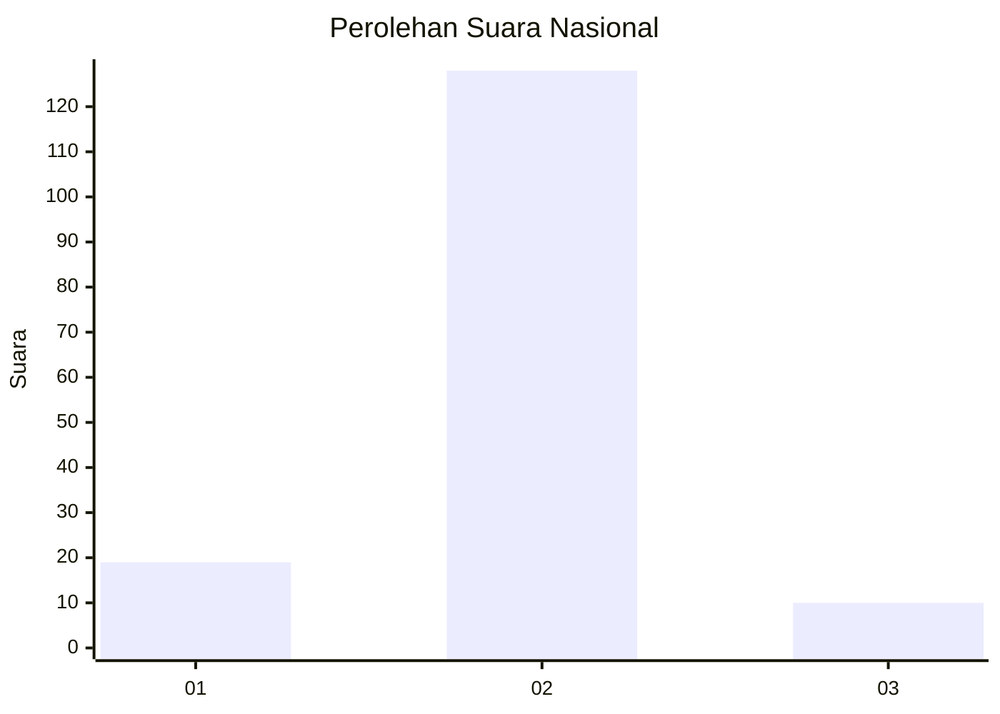
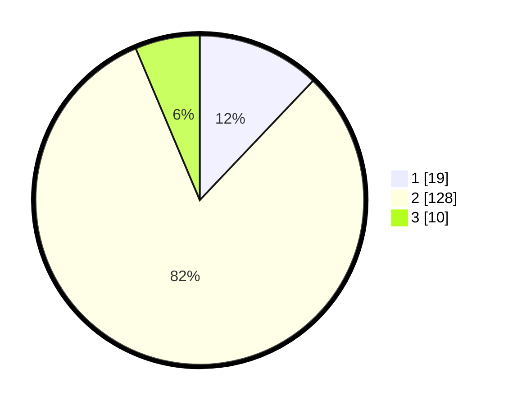

# Hasil

## Grafik

## Tabel

| No. | Nama Paslon    | Suara | Suara (raw) | Persentase |
|:--- |:-------------- | -----:| -----------:| ----------:|
| 1   | ANIES MUHAIMIN | 19    | [19][p-1]   | 12,10      |
| 2   | PRABOWO GIBRAN | 128   | [128][p-2]  | 81,53      |
| 3   | GANJAR MAHFUD  | 10    | [10][p-3]   | 6,37       |

[p-1]: https://github.com/gigit-pemilu/pemilu-2024/blob/main/pilpres/hitung-suara/sub/17-bengkulu/sub/07-lebong/sub/09-tubei/sub/1001-tanjung-agung/sub/003-tps/sub/paslon-1.txt
[p-2]: https://github.com/gigit-pemilu/pemilu-2024/blob/main/pilpres/hitung-suara/sub/17-bengkulu/sub/07-lebong/sub/09-tubei/sub/1001-tanjung-agung/sub/003-tps/sub/paslon-2.txt
[p-3]: https://github.com/gigit-pemilu/pemilu-2024/blob/main/pilpres/hitung-suara/sub/17-bengkulu/sub/07-lebong/sub/09-tubei/sub/1001-tanjung-agung/sub/003-tps/sub/paslon-3.txt

## Foto C Plano

https://sirekap-obj-formc.kpu.go.id/c9f2/pemilu/ppwp/17/07/09/10/01/1707091001003-20240214-225056--ede94177-1075-4f14-ae8a-7ad8a97ea710.jpg

https://sirekap-obj-formc.kpu.go.id/c9f2/pemilu/ppwp/17/07/09/10/01/1707091001003-20240214-225300--19f3f3cf-f619-43e0-abc0-f043f9597f82.jpg

https://sirekap-obj-formc.kpu.go.id/c9f2/pemilu/ppwp/17/07/09/10/01/1707091001003-20240214-225833--f6a555e7-06f0-4ab0-b89c-175880050a07.jpg

## Metadata

| Key        | Value               |
| ---------- | ------------------- |
| Time Stamp | 2024-02-24 22:31:28 |

