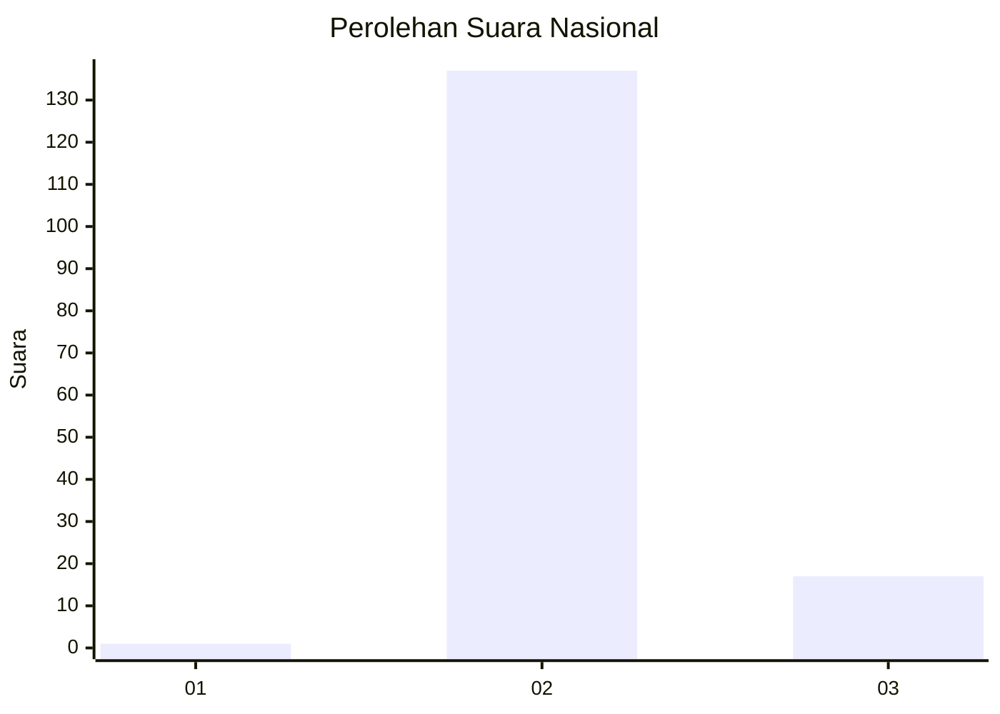
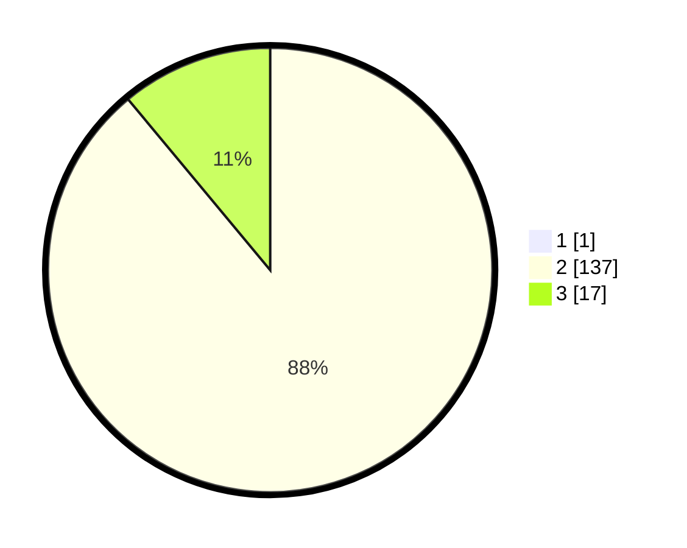

# Hasil

## Grafik

## Tabel

| No. | Nama Paslon    | Suara | Suara (raw) | Persentase |
|:--- |:-------------- | -----:| -----------:| ----------:|
| 1   | ANIES MUHAIMIN | 1     | [1][p-1]    | 0,65       |
| 2   | PRABOWO GIBRAN | 137   | [137][p-2]  | 88,39      |
| 3   | GANJAR MAHFUD  | 17    | [17][p-3]   | 10,97      |

[p-1]: https://github.com/gigit-pemilu/pemilu-2024/blob/main/pilpres/hitung-suara/sub/17-bengkulu/sub/08-kepahiang/sub/01-bermani-ilir/sub/2023-sosokan-cinta-mandi/sub/003-tps/sub/paslon-1.txt
[p-2]: https://github.com/gigit-pemilu/pemilu-2024/blob/main/pilpres/hitung-suara/sub/17-bengkulu/sub/08-kepahiang/sub/01-bermani-ilir/sub/2023-sosokan-cinta-mandi/sub/003-tps/sub/paslon-2.txt
[p-3]: https://github.com/gigit-pemilu/pemilu-2024/blob/main/pilpres/hitung-suara/sub/17-bengkulu/sub/08-kepahiang/sub/01-bermani-ilir/sub/2023-sosokan-cinta-mandi/sub/003-tps/sub/paslon-3.txt

## Foto C Plano

https://sirekap-obj-formc.kpu.go.id/43d8/pemilu/ppwp/17/08/01/20/23/1708012023003-20240214-201733--bdd4aad7-6e93-41e3-a93d-332bc8a49512.jpg

https://sirekap-obj-formc.kpu.go.id/43d8/pemilu/ppwp/17/08/01/20/23/1708012023003-20240214-195445--3b03a707-ff6f-472c-a78b-0b636ed8d28c.jpg

https://sirekap-obj-formc.kpu.go.id/43d8/pemilu/ppwp/17/08/01/20/23/1708012023003-20240214-195725--656b5aaf-0826-424f-837d-ea5591d17b5a.jpg

## Metadata

| Key        | Value               |
| ---------- | ------------------- |
| Time Stamp | 2024-02-15 22:30:27 |

