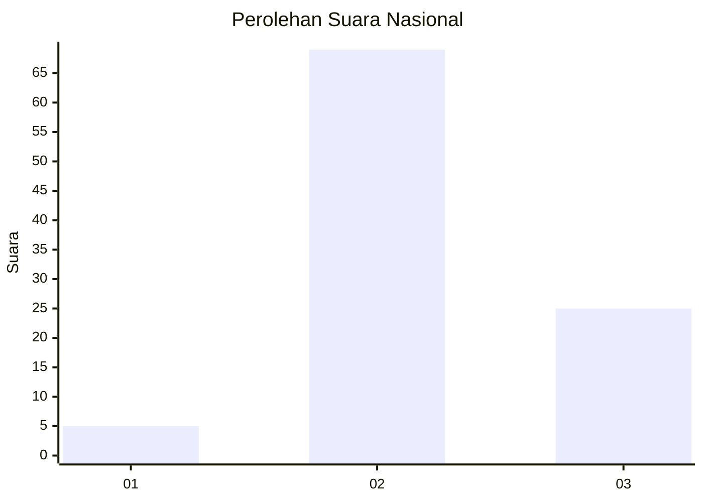
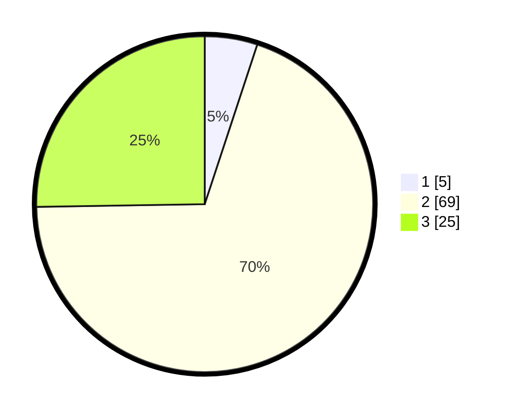

# Hasil

## Grafik

## Tabel

| No. | Nama Paslon    | Suara | Suara (raw) | Persentase |
|:--- |:-------------- | -----:| -----------:| ----------:|
| 1   | ANIES MUHAIMIN | 5     | [5][p-1]    | 5,05       |
| 2   | PRABOWO GIBRAN | 69    | [69][p-2]   | 69,70      |
| 3   | GANJAR MAHFUD  | 25    | [25][p-3]   | 25,25      |

[p-1]: https://github.com/gigit-pemilu/pemilu-2024/blob/main/pilpres/hitung-suara/sub/17-bengkulu/sub/08-kepahiang/sub/01-bermani-ilir/sub/2028-langgar-jaya/sub/002-tps/sub/paslon-1.txt
[p-2]: https://github.com/gigit-pemilu/pemilu-2024/blob/main/pilpres/hitung-suara/sub/17-bengkulu/sub/08-kepahiang/sub/01-bermani-ilir/sub/2028-langgar-jaya/sub/002-tps/sub/paslon-2.txt
[p-3]: https://github.com/gigit-pemilu/pemilu-2024/blob/main/pilpres/hitung-suara/sub/17-bengkulu/sub/08-kepahiang/sub/01-bermani-ilir/sub/2028-langgar-jaya/sub/002-tps/sub/paslon-3.txt

## Foto C Plano

https://sirekap-obj-formc.kpu.go.id/4881/pemilu/ppwp/17/08/01/20/28/1708012028002-20240220-130542--18394d6e-8a43-4bd3-81a3-a5e3231bf077.jpg

https://sirekap-obj-formc.kpu.go.id/4881/pemilu/ppwp/17/08/01/20/28/1708012028002-20240220-130013--76d417cc-4ae7-4ab4-99c4-272f02f9198d.jpg

https://sirekap-obj-formc.kpu.go.id/4881/pemilu/ppwp/17/08/01/20/28/1708012028002-20240220-130246--7efb413a-41a6-4d63-972a-8d48cc0fd950.jpg

## Metadata

| Key        | Value               |
| ---------- | ------------------- |
| Time Stamp | 2024-02-24 22:31:28 |

