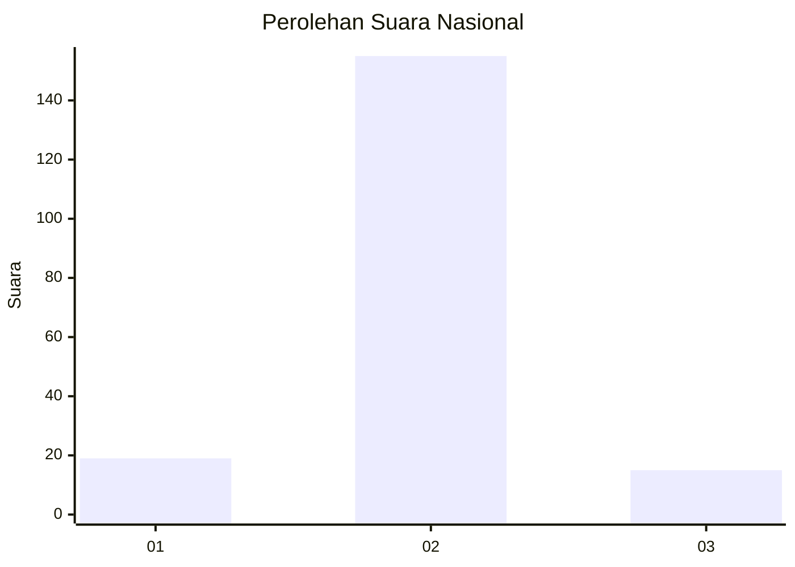
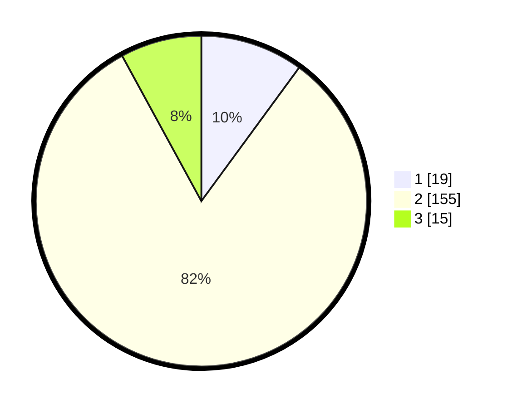

# Hasil

## Grafik

## Tabel

| No. | Nama Paslon    | Suara | Suara (raw) | Persentase |
|:--- |:-------------- | -----:| -----------:| ----------:|
| 1   | ANIES MUHAIMIN | 19    | [19][p-1]   | 10,05      |
| 2   | PRABOWO GIBRAN | 155   | [155][p-2]  | 82,01      |
| 3   | GANJAR MAHFUD  | 15    | [15][p-3]   | 7,94       |

[p-1]: https://github.com/gigit-pemilu/pemilu-2024/blob/main/pilpres/hitung-suara/sub/17-bengkulu/sub/08-kepahiang/sub/02-ujan-mas/sub/1002-ujan-mas-atas/sub/007-tps/sub/paslon-1.txt
[p-2]: https://github.com/gigit-pemilu/pemilu-2024/blob/main/pilpres/hitung-suara/sub/17-bengkulu/sub/08-kepahiang/sub/02-ujan-mas/sub/1002-ujan-mas-atas/sub/007-tps/sub/paslon-2.txt
[p-3]: https://github.com/gigit-pemilu/pemilu-2024/blob/main/pilpres/hitung-suara/sub/17-bengkulu/sub/08-kepahiang/sub/02-ujan-mas/sub/1002-ujan-mas-atas/sub/007-tps/sub/paslon-3.txt

## Foto C Plano

https://sirekap-obj-formc.kpu.go.id/7195/pemilu/ppwp/17/08/02/10/02/1708021002007-20240216-123050--7e9b50ce-b7d3-454c-9774-7004d60438ad.jpg

https://sirekap-obj-formc.kpu.go.id/7195/pemilu/ppwp/17/08/02/10/02/1708021002007-20240216-123211--5de483d6-e3fc-40f7-9de5-891e60986ac5.jpg

https://sirekap-obj-formc.kpu.go.id/7195/pemilu/ppwp/17/08/02/10/02/1708021002007-20240216-123724--245a2fc0-2edd-42db-95fd-6e0eedf2b1da.jpg

## Metadata

| Key        | Value               |
| ---------- | ------------------- |
| Time Stamp | 2024-02-16 14:30:33 |

