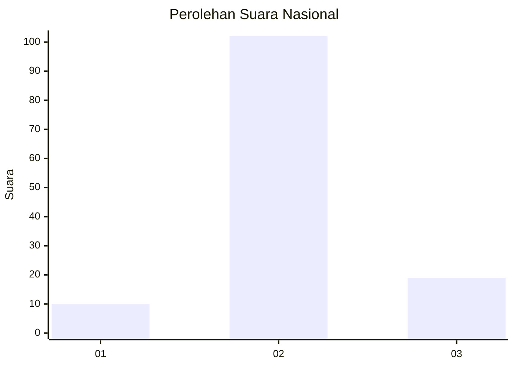

# Hasil

## Grafik

## Tabel

| No. | Nama Paslon    | Suara | Suara (raw) | Persentase |
|:--- |:-------------- | -----:| -----------:| ----------:|
| 1   | ANIES MUHAIMIN | 10    | [10][p-1]   | 7,63       |
| 2   | PRABOWO GIBRAN | 102   | [102][p-2]  | 77,86      |
| 3   | GANJAR MAHFUD  | 19    | [19][p-3]   | 14,50      |

[p-1]: https://github.com/gigit-pemilu/pemilu-2024/blob/main/pilpres/hitung-suara/sub/17-bengkulu/sub/08-kepahiang/sub/02-ujan-mas/sub/1002-ujan-mas-atas/sub/009-tps/sub/paslon-1.txt
[p-2]: https://github.com/gigit-pemilu/pemilu-2024/blob/main/pilpres/hitung-suara/sub/17-bengkulu/sub/08-kepahiang/sub/02-ujan-mas/sub/1002-ujan-mas-atas/sub/009-tps/sub/paslon-2.txt
[p-3]: https://github.com/gigit-pemilu/pemilu-2024/blob/main/pilpres/hitung-suara/sub/17-bengkulu/sub/08-kepahiang/sub/02-ujan-mas/sub/1002-ujan-mas-atas/sub/009-tps/sub/paslon-3.txt

## Foto C Plano

https://sirekap-obj-formc.kpu.go.id/4f6d/pemilu/ppwp/17/08/02/10/02/1708021002009-20240214-233844--209d7bb8-c711-4d1a-be29-6d88c381fb7c.jpg

https://sirekap-obj-formc.kpu.go.id/4f6d/pemilu/ppwp/17/08/02/10/02/1708021002009-20240214-233948--88034286-50da-4198-9145-44e884bbaadc.jpg

https://sirekap-obj-formc.kpu.go.id/4f6d/pemilu/ppwp/17/08/02/10/02/1708021002009-20240214-234028--201bca02-0679-404b-983e-083f2bffbca4.jpg

## Metadata

| Key        | Value               |
| ---------- | ------------------- |
| Time Stamp | 2024-02-15 20:30:46 |

