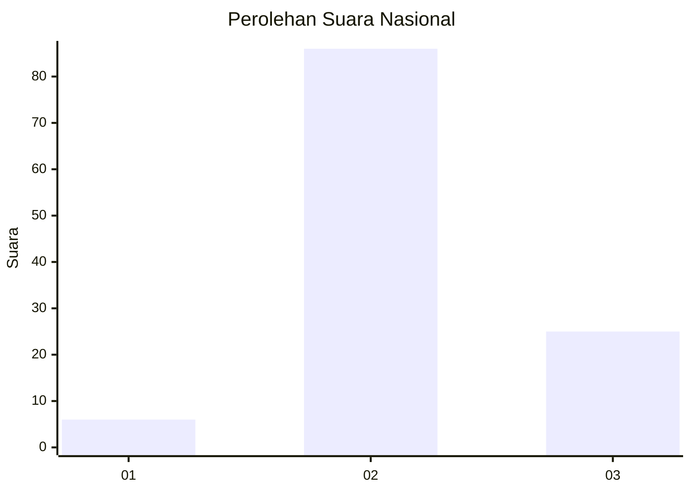

# Hasil

## Grafik

## Tabel

| No. | Nama Paslon    | Suara | Suara (raw) | Persentase |
|:--- |:-------------- | -----:| -----------:| ----------:|
| 1   | ANIES MUHAIMIN | 6     | [6][p-1]    | 5,13       |
| 2   | PRABOWO GIBRAN | 86    | [86][p-2]   | 73,50      |
| 3   | GANJAR MAHFUD  | 25    | [25][p-3]   | 21,37      |

[p-1]: https://github.com/gigit-pemilu/pemilu-2024/blob/main/pilpres/hitung-suara/sub/17-bengkulu/sub/08-kepahiang/sub/02-ujan-mas/sub/2009-bumi-sari/sub/005-tps/sub/paslon-1.txt
[p-2]: https://github.com/gigit-pemilu/pemilu-2024/blob/main/pilpres/hitung-suara/sub/17-bengkulu/sub/08-kepahiang/sub/02-ujan-mas/sub/2009-bumi-sari/sub/005-tps/sub/paslon-2.txt
[p-3]: https://github.com/gigit-pemilu/pemilu-2024/blob/main/pilpres/hitung-suara/sub/17-bengkulu/sub/08-kepahiang/sub/02-ujan-mas/sub/2009-bumi-sari/sub/005-tps/sub/paslon-3.txt

## Foto C Plano

https://sirekap-obj-formc.kpu.go.id/57be/pemilu/ppwp/17/08/02/20/09/1708022009005-20240214-221322--b33dc650-2ecb-4c01-88a3-b1aeaf9659eb.jpg

https://sirekap-obj-formc.kpu.go.id/57be/pemilu/ppwp/17/08/02/20/09/1708022009005-20240214-221329--ef0e3287-c0af-49cf-a71f-e9115ad1ce45.jpg

https://sirekap-obj-formc.kpu.go.id/57be/pemilu/ppwp/17/08/02/20/09/1708022009005-20240214-221334--a1f5fece-7295-402f-aa61-7df701f7260f.jpg

## Metadata

| Key        | Value               |
| ---------- | ------------------- |
| Time Stamp | 2024-02-15 22:00:27 |

