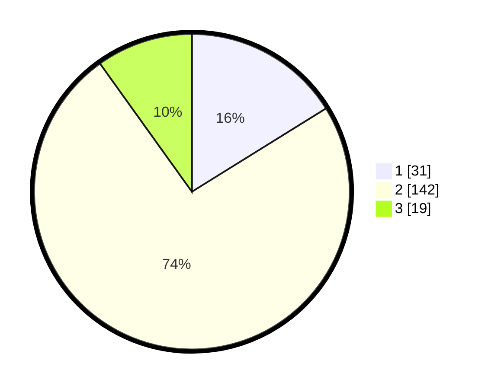

# Hasil

## Grafik

## Tabel

| No. | Nama Paslon    | Suara | Suara (raw) | Persentase |
|:--- |:-------------- | -----:| -----------:| ----------:|
| 1   | ANIES MUHAIMIN | 31    | [31][p-1]   | 16,15      |
| 2   | PRABOWO GIBRAN | 142   | [142][p-2]  | 73,96      |
| 3   | GANJAR MAHFUD  | 19    | [19][p-3]   | 9,90       |

[p-1]: https://github.com/gigit-pemilu/pemilu-2024/blob/main/pilpres/hitung-suara/sub/17-bengkulu/sub/08-kepahiang/sub/03-tebat-karai/sub/1008-tebat-karai/sub/002-tps/sub/paslon-1.txt
[p-2]: https://github.com/gigit-pemilu/pemilu-2024/blob/main/pilpres/hitung-suara/sub/17-bengkulu/sub/08-kepahiang/sub/03-tebat-karai/sub/1008-tebat-karai/sub/002-tps/sub/paslon-2.txt
[p-3]: https://github.com/gigit-pemilu/pemilu-2024/blob/main/pilpres/hitung-suara/sub/17-bengkulu/sub/08-kepahiang/sub/03-tebat-karai/sub/1008-tebat-karai/sub/002-tps/sub/paslon-3.txt

## Foto C Plano

https://sirekap-obj-formc.kpu.go.id/9c42/pemilu/ppwp/17/08/03/10/08/1708031008002-20240215-043219--109836ed-c009-457f-b676-a8dbff7a3d2d.jpg

https://sirekap-obj-formc.kpu.go.id/9c42/pemilu/ppwp/17/08/03/10/08/1708031008002-20240215-043507--fcac0d9a-aa90-4b91-902b-1e145b25ca45.jpg

https://sirekap-obj-formc.kpu.go.id/9c42/pemilu/ppwp/17/08/03/10/08/1708031008002-20240215-011658--b3b96b90-35ad-46aa-8109-31ec9586c835.jpg

## Metadata

| Key        | Value               |
| ---------- | ------------------- |
| Time Stamp | 2024-02-15 22:30:27 |

