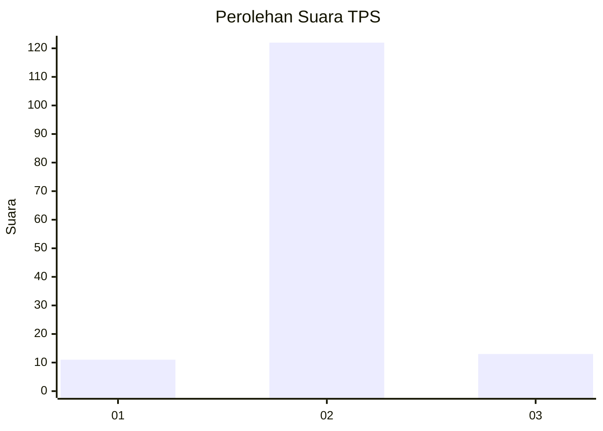
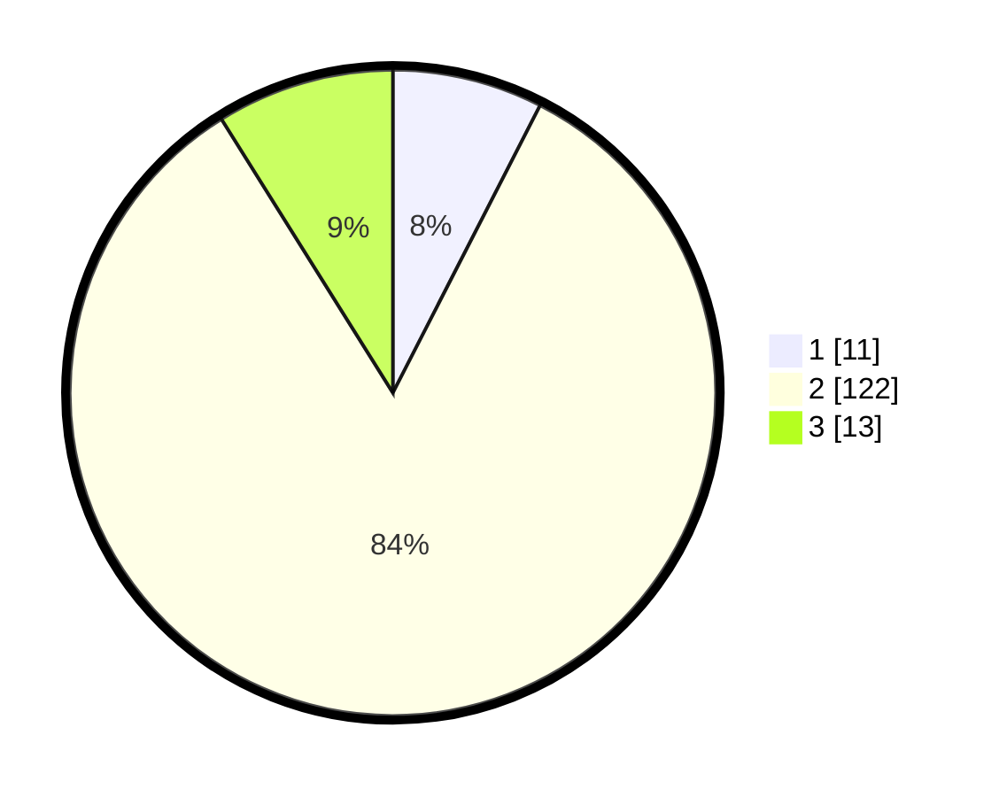

# Hasil

## Grafik

## Tabel

| No. | Nama Paslon    | Suara | Suara (raw) | Persentase |
|:--- |:-------------- | -----:| -----------:| ----------:|
| 1   | ANIES MUHAIMIN | 11    | [11][p-1]   | 7,53       |
| 2   | PRABOWO GIBRAN | 122   | [122][p-2]  | 83,56      |
| 3   | GANJAR MAHFUD  | 13    | [13][p-3]   | 8,90       |

[p-1]: https://github.com/gigit-pemilu/pemilu-2024-17-bengkulu/blob/main/pilpres/hitung-suara/sub/17-bengkulu/sub/08-kepahiang/sub/03-tebat-karai/sub/2009-talang-karet/sub/004-tps/sub/paslon-1.txt
[p-2]: https://github.com/gigit-pemilu/pemilu-2024-17-bengkulu/blob/main/pilpres/hitung-suara/sub/17-bengkulu/sub/08-kepahiang/sub/03-tebat-karai/sub/2009-talang-karet/sub/004-tps/sub/paslon-2.txt
[p-3]: https://github.com/gigit-pemilu/pemilu-2024-17-bengkulu/blob/main/pilpres/hitung-suara/sub/17-bengkulu/sub/08-kepahiang/sub/03-tebat-karai/sub/2009-talang-karet/sub/004-tps/sub/paslon-3.txt

## Foto C Plano

https://sirekap-obj-formc.kpu.go.id/3a3a/pemilu/ppwp/17/08/03/20/09/1708032009004-20240215-013220--e64bc78e-86c1-41b8-a0cd-9fa3a63d5669.jpg

https://sirekap-obj-formc.kpu.go.id/3a3a/pemilu/ppwp/17/08/03/20/09/1708032009004-20240219-112958--1bccd354-77f8-4f3a-9a2f-6174f0293acd.jpg

https://sirekap-obj-formc.kpu.go.id/3a3a/pemilu/ppwp/17/08/03/20/09/1708032009004-20240219-112957--801797c4-cc8e-453d-8f81-4c782546c18f.jpg

## Metadata

| Key        | Value               |
| ---------- | ------------------- |
| Time Stamp | 2024-02-24 22:31:28 |

