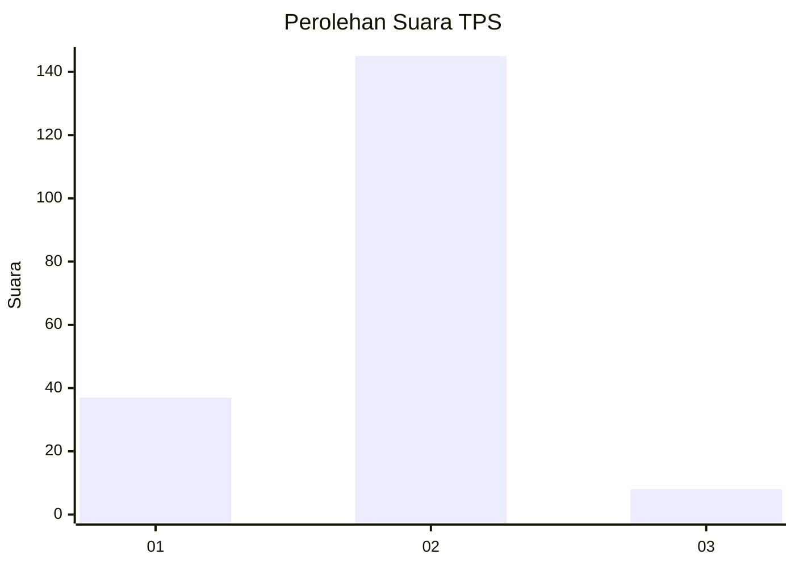
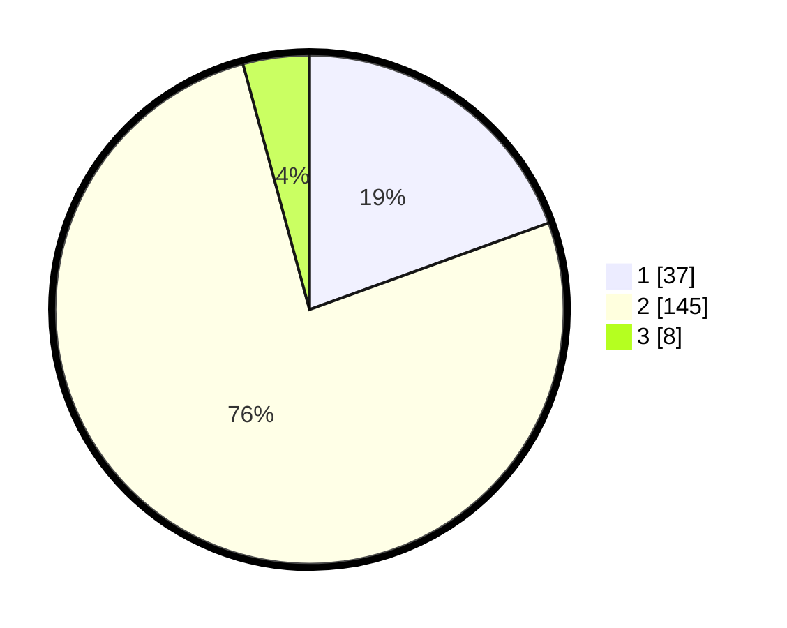

# Hasil

## Grafik

## Tabel

| No. | Nama Paslon    | Suara | Suara (raw) | Persentase |
|:--- |:-------------- | -----:| -----------:| ----------:|
| 1   | ANIES MUHAIMIN | 37    | [37][p-1]   | 19,47      |
| 2   | PRABOWO GIBRAN | 145   | [145][p-2]  | 76,32      |
| 3   | GANJAR MAHFUD  | 8     | [8][p-3]    | 4,21       |

[p-1]: https://github.com/gigit-pemilu/pemilu-2024-17-bengkulu/blob/main/pilpres/hitung-suara/sub/17-bengkulu/sub/08-kepahiang/sub/03-tebat-karai/sub/2010-peraduan-binjai/sub/004-tps/sub/paslon-1.txt
[p-2]: https://github.com/gigit-pemilu/pemilu-2024-17-bengkulu/blob/main/pilpres/hitung-suara/sub/17-bengkulu/sub/08-kepahiang/sub/03-tebat-karai/sub/2010-peraduan-binjai/sub/004-tps/sub/paslon-2.txt
[p-3]: https://github.com/gigit-pemilu/pemilu-2024-17-bengkulu/blob/main/pilpres/hitung-suara/sub/17-bengkulu/sub/08-kepahiang/sub/03-tebat-karai/sub/2010-peraduan-binjai/sub/004-tps/sub/paslon-3.txt

## Foto C Plano

https://sirekap-obj-formc.kpu.go.id/4338/pemilu/ppwp/17/08/03/20/10/1708032010004-20240215-014648--3bfd36b3-be24-4c1e-aea1-2148b096bea3.jpg

https://sirekap-obj-formc.kpu.go.id/4338/pemilu/ppwp/17/08/03/20/10/1708032010004-20240215-014839--4b8f9ba3-b298-438b-9d93-bd2cbb9fbb46.jpg

https://sirekap-obj-formc.kpu.go.id/4338/pemilu/ppwp/17/08/03/20/10/1708032010004-20240215-015119--644e9cb3-53b9-4f81-b9bd-7c592b3ce0b2.jpg

## Metadata

| Key        | Value               |
| ---------- | ------------------- |
| Time Stamp | 2024-02-15 03:06:03 |

