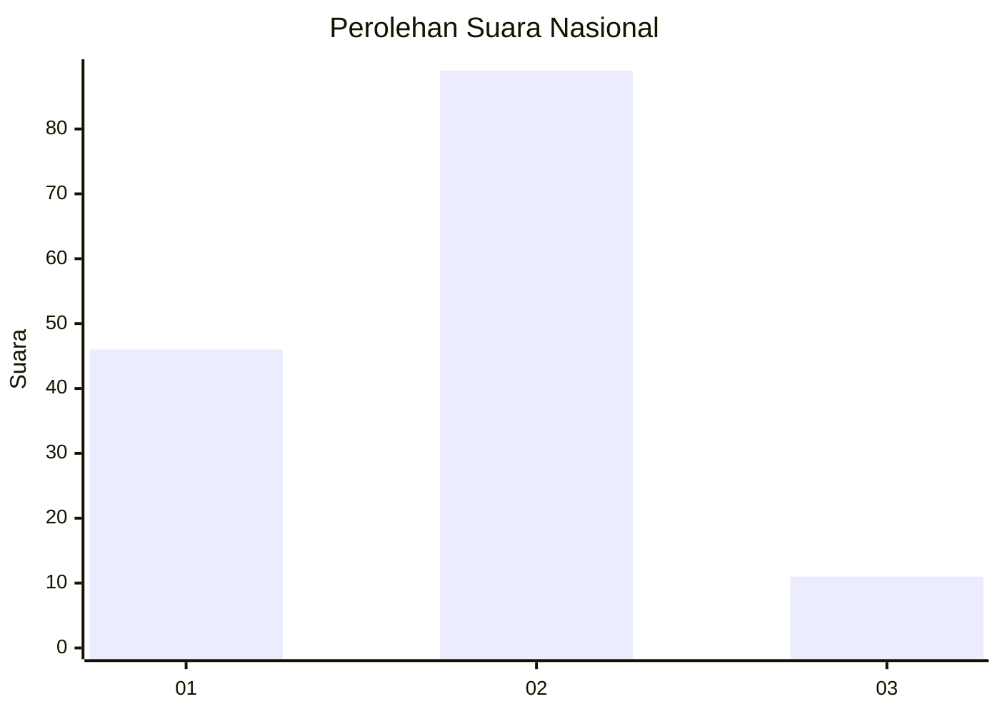
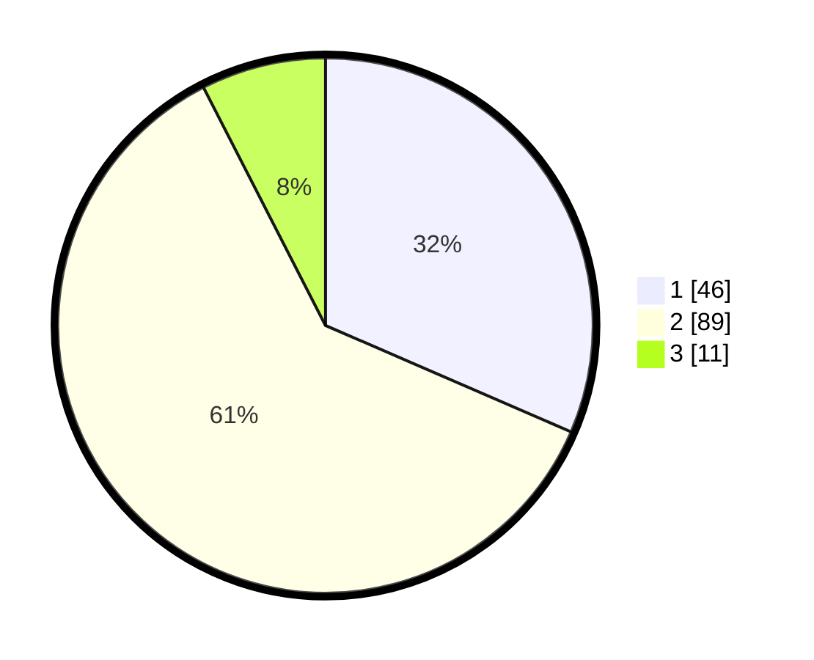

# Hasil

## Grafik

## Tabel

| No. | Nama Paslon    | Suara | Suara (raw) | Persentase |
|:--- |:-------------- | -----:| -----------:| ----------:|
| 1   | ANIES MUHAIMIN | 46    | [46][p-1]   | 31,51      |
| 2   | PRABOWO GIBRAN | 89    | [89][p-2]   | 60,96      |
| 3   | GANJAR MAHFUD  | 11    | [11][p-3]   | 7,53       |

[p-1]: https://github.com/gigit-pemilu/pemilu-2024/blob/main/pilpres/hitung-suara/sub/17-bengkulu/sub/08-kepahiang/sub/04-kepahiang/sub/1003-pensiunan/sub/002-tps/sub/paslon-1.txt
[p-2]: https://github.com/gigit-pemilu/pemilu-2024/blob/main/pilpres/hitung-suara/sub/17-bengkulu/sub/08-kepahiang/sub/04-kepahiang/sub/1003-pensiunan/sub/002-tps/sub/paslon-2.txt
[p-3]: https://github.com/gigit-pemilu/pemilu-2024/blob/main/pilpres/hitung-suara/sub/17-bengkulu/sub/08-kepahiang/sub/04-kepahiang/sub/1003-pensiunan/sub/002-tps/sub/paslon-3.txt

## Foto C Plano

https://sirekap-obj-formc.kpu.go.id/9981/pemilu/ppwp/17/08/04/10/03/1708041003002-20240214-202351--1a343efd-783a-4a9f-b6dd-e81b3dd4f8f3.jpg

https://sirekap-obj-formc.kpu.go.id/9981/pemilu/ppwp/17/08/04/10/03/1708041003002-20240214-204117--8751cb5c-43d0-4574-be78-1b4a0dfe17bc.jpg

https://sirekap-obj-formc.kpu.go.id/9981/pemilu/ppwp/17/08/04/10/03/1708041003002-20240214-203456--45932319-3af3-42ba-93f4-4675f60687c7.jpg

## Metadata

| Key        | Value               |
| ---------- | ------------------- |
| Time Stamp | 2024-02-15 12:00:28 |

