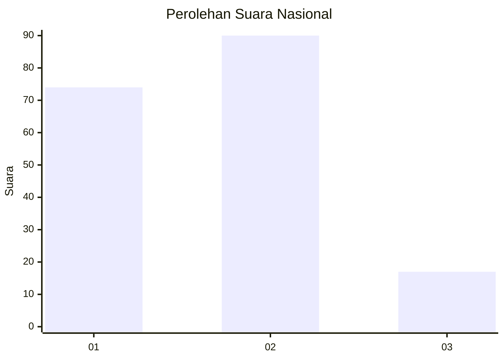
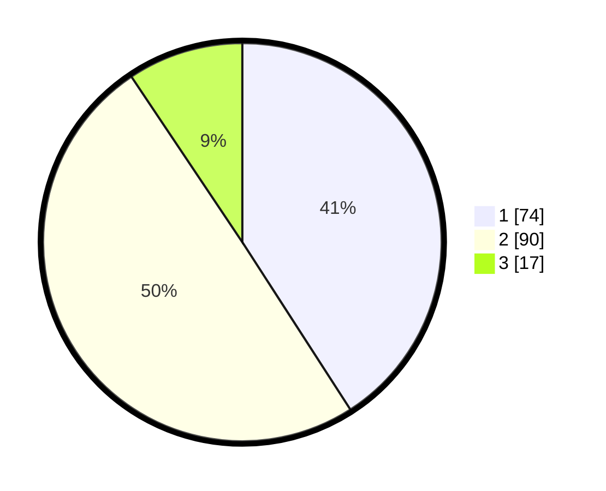

# Hasil

## Grafik

## Tabel

| No. | Nama Paslon    | Suara | Suara (raw) | Persentase |
|:--- |:-------------- | -----:| -----------:| ----------:|
| 1   | ANIES MUHAIMIN | 74    | [74][p-1]   | 40,88      |
| 2   | PRABOWO GIBRAN | 90    | [90][p-2]   | 49,72      |
| 3   | GANJAR MAHFUD  | 17    | [17][p-3]   | 9,39       |

[p-1]: https://github.com/gigit-pemilu/pemilu-2024/blob/main/pilpres/hitung-suara/sub/17-bengkulu/sub/08-kepahiang/sub/04-kepahiang/sub/1003-pensiunan/sub/005-tps/sub/paslon-1.txt
[p-2]: https://github.com/gigit-pemilu/pemilu-2024/blob/main/pilpres/hitung-suara/sub/17-bengkulu/sub/08-kepahiang/sub/04-kepahiang/sub/1003-pensiunan/sub/005-tps/sub/paslon-2.txt
[p-3]: https://github.com/gigit-pemilu/pemilu-2024/blob/main/pilpres/hitung-suara/sub/17-bengkulu/sub/08-kepahiang/sub/04-kepahiang/sub/1003-pensiunan/sub/005-tps/sub/paslon-3.txt

## Foto C Plano

https://sirekap-obj-formc.kpu.go.id/9c8b/pemilu/ppwp/17/08/04/10/03/1708041003005-20240215-014435--46e4dba0-5ea6-4332-9775-a357b5dd10d4.jpg

https://sirekap-obj-formc.kpu.go.id/9c8b/pemilu/ppwp/17/08/04/10/03/1708041003005-20240215-014544--6a255fca-233b-4eb8-9d44-0114ee930751.jpg

https://sirekap-obj-formc.kpu.go.id/9c8b/pemilu/ppwp/17/08/04/10/03/1708041003005-20240215-014618--a04b3ba4-0529-468d-9662-dcd464575a26.jpg

## Metadata

| Key        | Value               |
| ---------- | ------------------- |
| Time Stamp | 2024-02-15 09:00:24 |

