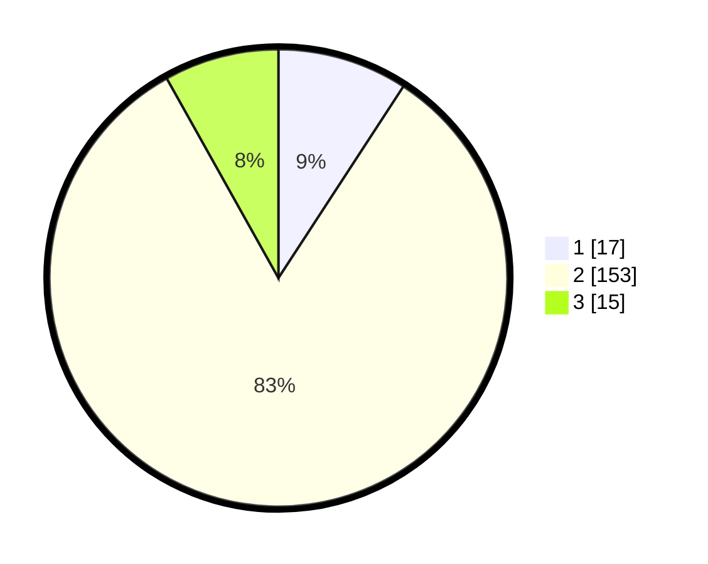

# Hasil

## Grafik

## Tabel

| No. | Nama Paslon    | Suara | Suara (raw) | Persentase |
|:--- |:-------------- | -----:| -----------:| ----------:|
| 1   | ANIES MUHAIMIN | 17    | [17][p-1]   | 9,19       |
| 2   | PRABOWO GIBRAN | 153   | [153][p-2]  | 82,70      |
| 3   | GANJAR MAHFUD  | 15    | [15][p-3]   | 8,11       |

[p-1]: https://github.com/gigit-pemilu/pemilu-2024-17-bengkulu/blob/main/pilpres/hitung-suara/sub/17-bengkulu/sub/08-kepahiang/sub/04-kepahiang/sub/1004-pasar-kepahiangan/sub/010-tps/sub/paslon-1.txt
[p-2]: https://github.com/gigit-pemilu/pemilu-2024-17-bengkulu/blob/main/pilpres/hitung-suara/sub/17-bengkulu/sub/08-kepahiang/sub/04-kepahiang/sub/1004-pasar-kepahiangan/sub/010-tps/sub/paslon-2.txt
[p-3]: https://github.com/gigit-pemilu/pemilu-2024-17-bengkulu/blob/main/pilpres/hitung-suara/sub/17-bengkulu/sub/08-kepahiang/sub/04-kepahiang/sub/1004-pasar-kepahiangan/sub/010-tps/sub/paslon-3.txt

## Foto C Plano

https://sirekap-obj-formc.kpu.go.id/2b0f/pemilu/ppwp/17/08/04/10/04/1708041004010-20240215-004101--028fe4b6-049d-450c-af7d-65af6bda6224.jpg

https://sirekap-obj-formc.kpu.go.id/2b0f/pemilu/ppwp/17/08/04/10/04/1708041004010-20240215-004054--e8f3056f-f9d3-45fa-b62f-a68e0d00098c.jpg

https://sirekap-obj-formc.kpu.go.id/2b0f/pemilu/ppwp/17/08/04/10/04/1708041004010-20240215-004154--5370f1ad-83bb-4dd1-82e1-54144bd5a5f7.jpg

## Metadata

| Key        | Value               |
| ---------- | ------------------- |
| Time Stamp | 2024-02-15 12:00:28 |

