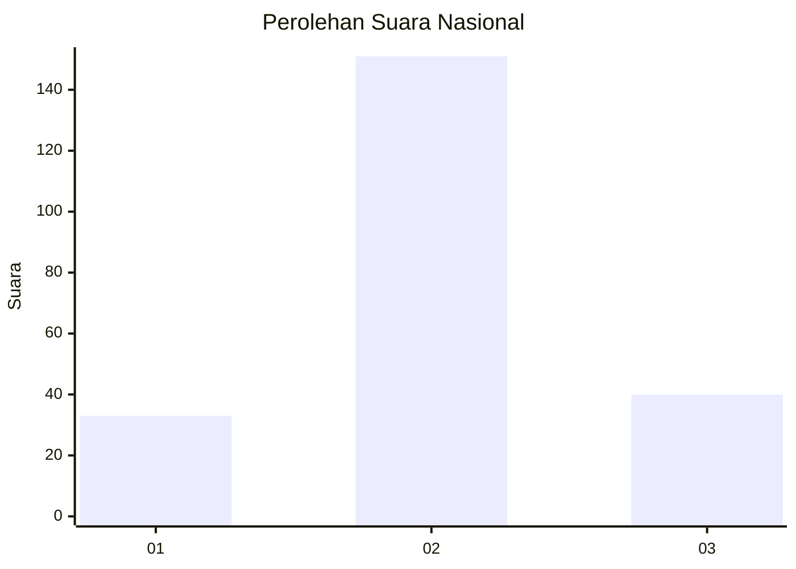
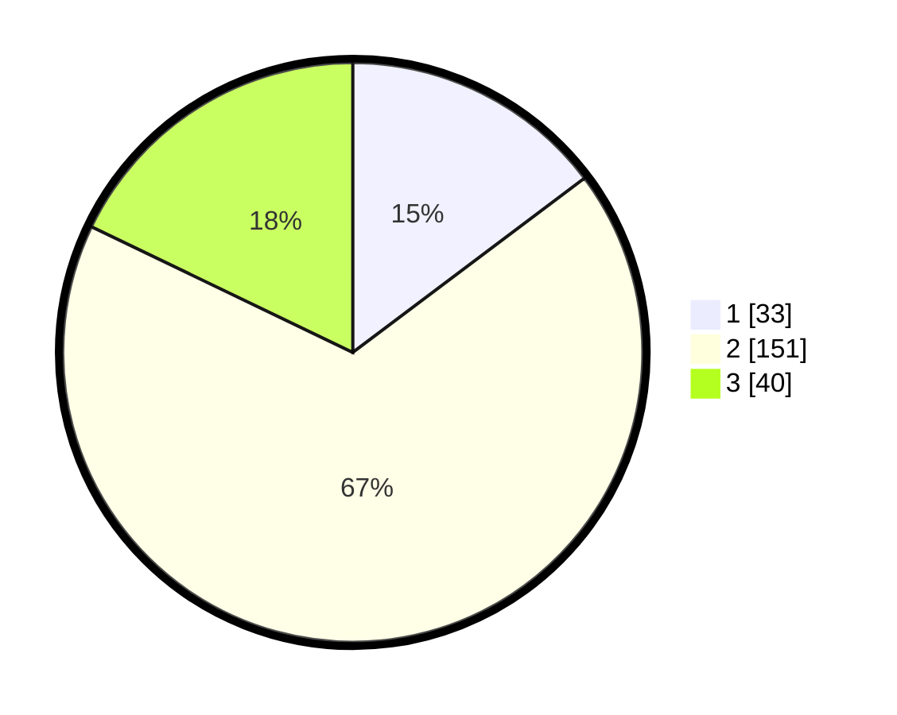

# Hasil

## Grafik

## Tabel

| No. | Nama Paslon    | Suara | Suara (raw) | Persentase |
|:--- |:-------------- | -----:| -----------:| ----------:|
| 1   | ANIES MUHAIMIN | 33    | [33][p-1]   | 14,73      |
| 2   | PRABOWO GIBRAN | 151   | [151][p-2]  | 67,41      |
| 3   | GANJAR MAHFUD  | 40    | [40][p-3]   | 17,86      |

[p-1]: https://github.com/gigit-pemilu/pemilu-2024/blob/main/pilpres/hitung-suara/sub/17-bengkulu/sub/08-kepahiang/sub/04-kepahiang/sub/1005-pasar-ujung/sub/004-tps/sub/paslon-1.txt
[p-2]: https://github.com/gigit-pemilu/pemilu-2024/blob/main/pilpres/hitung-suara/sub/17-bengkulu/sub/08-kepahiang/sub/04-kepahiang/sub/1005-pasar-ujung/sub/004-tps/sub/paslon-2.txt
[p-3]: https://github.com/gigit-pemilu/pemilu-2024/blob/main/pilpres/hitung-suara/sub/17-bengkulu/sub/08-kepahiang/sub/04-kepahiang/sub/1005-pasar-ujung/sub/004-tps/sub/paslon-3.txt

## Foto C Plano

https://sirekap-obj-formc.kpu.go.id/fbe8/pemilu/ppwp/17/08/04/10/05/1708041005004-20240214-214443--e01c5c34-7d98-4d37-a798-3519532247c3.jpg

https://sirekap-obj-formc.kpu.go.id/fbe8/pemilu/ppwp/17/08/04/10/05/1708041005004-20240214-214736--03c02a55-9380-4b8c-943b-ce64a22e9d31.jpg

https://sirekap-obj-formc.kpu.go.id/fbe8/pemilu/ppwp/17/08/04/10/05/1708041005004-20240214-215514--d4af9b4c-2c46-44fd-bf5c-d4595c8e3793.jpg

## Metadata

| Key        | Value               |
| ---------- | ------------------- |
| Time Stamp | 2024-02-15 15:00:29 |

