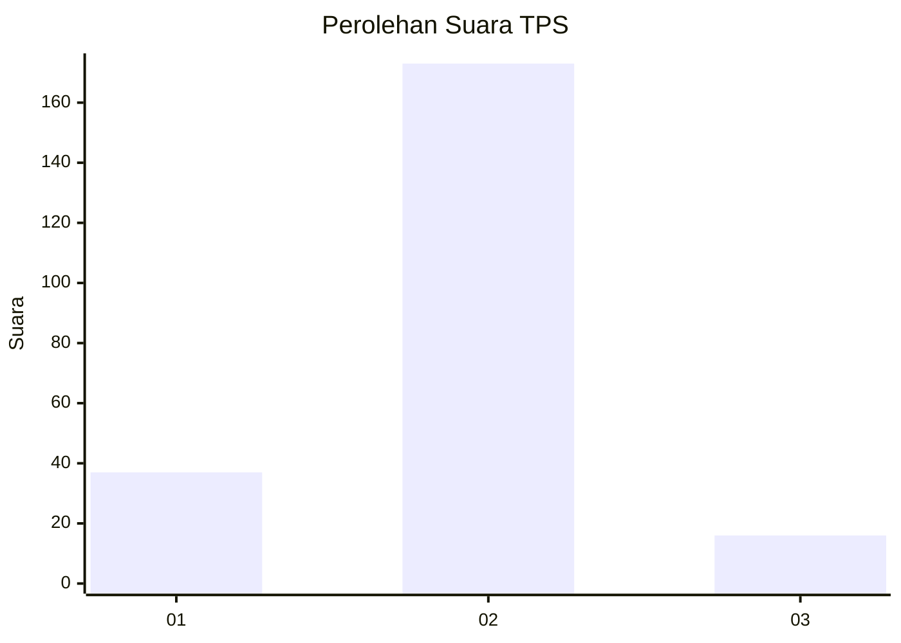
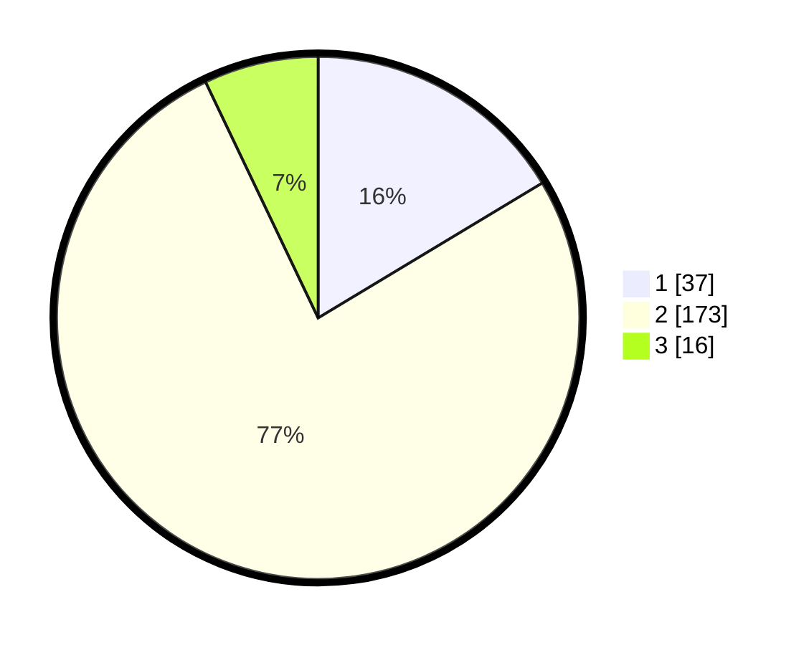

# Hasil

## Grafik

## Tabel

| No. | Nama Paslon    | Suara | Suara (raw) | Persentase |
|:--- |:-------------- | -----:| -----------:| ----------:|
| 1   | ANIES MUHAIMIN | 37    | [37][p-1]   | 16,37      |
| 2   | PRABOWO GIBRAN | 173   | [173][p-2]  | 76,55      |
| 3   | GANJAR MAHFUD  | 16    | [16][p-3]   | 7,08       |

[p-1]: https://github.com/gigit-pemilu/pemilu-2024-17-bengkulu/blob/main/pilpres/hitung-suara/sub/17-bengkulu/sub/08-kepahiang/sub/04-kepahiang/sub/1011-dusun-kepahiang/sub/004-tps/sub/paslon-1.txt
[p-2]: https://github.com/gigit-pemilu/pemilu-2024-17-bengkulu/blob/main/pilpres/hitung-suara/sub/17-bengkulu/sub/08-kepahiang/sub/04-kepahiang/sub/1011-dusun-kepahiang/sub/004-tps/sub/paslon-2.txt
[p-3]: https://github.com/gigit-pemilu/pemilu-2024-17-bengkulu/blob/main/pilpres/hitung-suara/sub/17-bengkulu/sub/08-kepahiang/sub/04-kepahiang/sub/1011-dusun-kepahiang/sub/004-tps/sub/paslon-3.txt

## Foto C Plano

https://sirekap-obj-formc.kpu.go.id/dddb/pemilu/ppwp/17/08/04/10/11/1708041011004-20240215-001339--4e890d5c-190f-463e-9ffc-ba9b3e6a24a1.jpg

https://sirekap-obj-formc.kpu.go.id/dddb/pemilu/ppwp/17/08/04/10/11/1708041011004-20240215-000819--fd55e316-b3a8-485d-aeb0-e2cf91e0df75.jpg

https://sirekap-obj-formc.kpu.go.id/dddb/pemilu/ppwp/17/08/04/10/11/1708041011004-20240215-000958--5ff5137f-1b69-47f6-b2ef-e45d67777480.jpg

## Metadata

| Key        | Value               |
| ---------- | ------------------- |
| Time Stamp | 2024-02-15 22:30:27 |

