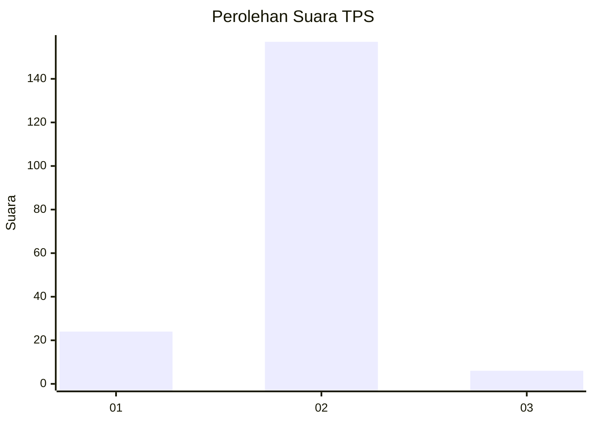
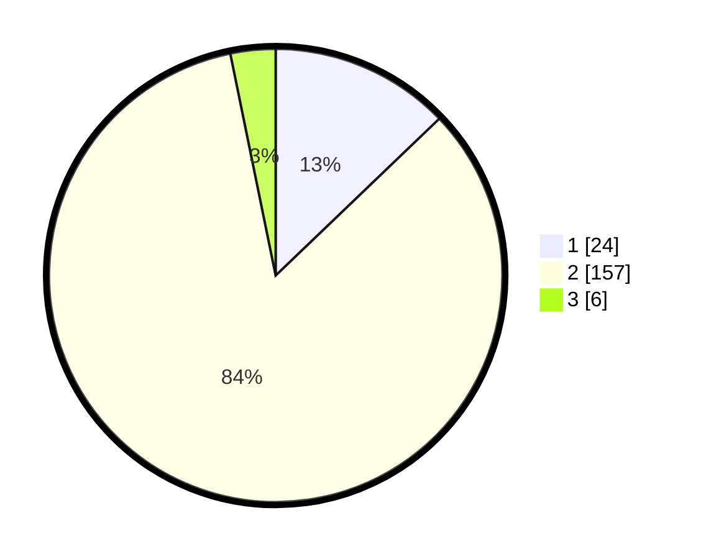

# Hasil

## Grafik

## Tabel

| No. | Nama Paslon    | Suara | Suara (raw) | Persentase |
|:--- |:-------------- | -----:| -----------:| ----------:|
| 1   | ANIES MUHAIMIN | 24    | [24][p-1]   | 12,83      |
| 2   | PRABOWO GIBRAN | 157   | [157][p-2]  | 83,96      |
| 3   | GANJAR MAHFUD  | 6     | [6][p-3]    | 3,21       |

[p-1]: https://github.com/gigit-pemilu/pemilu-2024-17-bengkulu/blob/main/pilpres/hitung-suara/sub/17-bengkulu/sub/08-kepahiang/sub/04-kepahiang/sub/1011-dusun-kepahiang/sub/005-tps/sub/paslon-1.txt
[p-2]: https://github.com/gigit-pemilu/pemilu-2024-17-bengkulu/blob/main/pilpres/hitung-suara/sub/17-bengkulu/sub/08-kepahiang/sub/04-kepahiang/sub/1011-dusun-kepahiang/sub/005-tps/sub/paslon-2.txt
[p-3]: https://github.com/gigit-pemilu/pemilu-2024-17-bengkulu/blob/main/pilpres/hitung-suara/sub/17-bengkulu/sub/08-kepahiang/sub/04-kepahiang/sub/1011-dusun-kepahiang/sub/005-tps/sub/paslon-3.txt

## Foto C Plano

https://sirekap-obj-formc.kpu.go.id/d331/pemilu/ppwp/17/08/04/10/11/1708041011005-20240215-034225--8b07197e-c7bd-4ca6-8330-bbf12e7d7c28.jpg

https://sirekap-obj-formc.kpu.go.id/d331/pemilu/ppwp/17/08/04/10/11/1708041011005-20240215-034357--e1efe127-e267-472c-8a7f-fde3c10c7e72.jpg

https://sirekap-obj-formc.kpu.go.id/d331/pemilu/ppwp/17/08/04/10/11/1708041011005-20240215-034450--1aa40137-0fff-4a4d-a24d-822cbc53a868.jpg

## Metadata

| Key        | Value               |
| ---------- | ------------------- |
| Time Stamp | 2024-02-15 22:30:27 |

