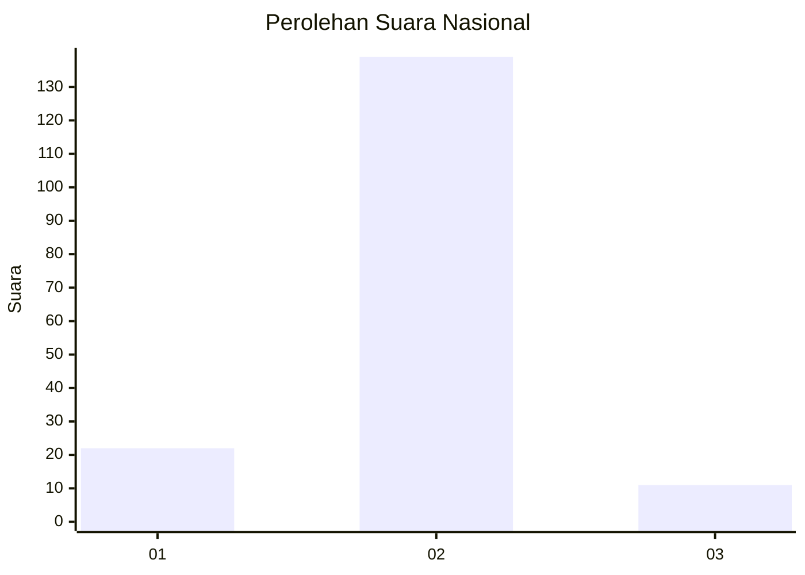
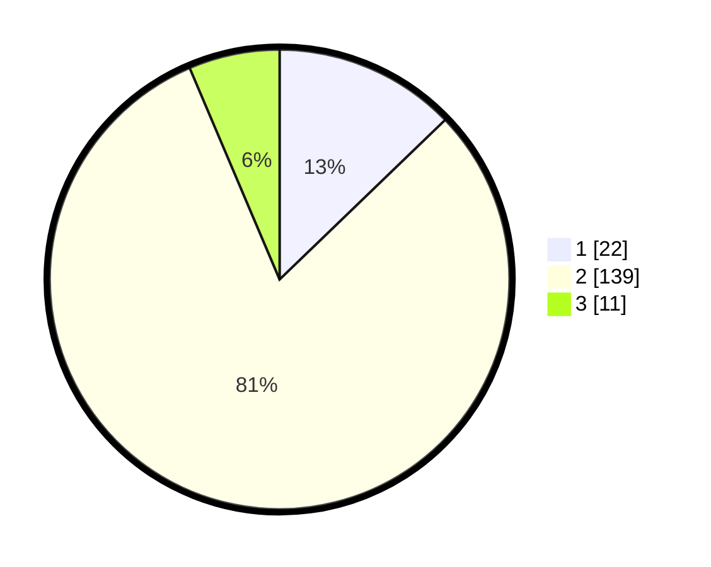

# Hasil

## Grafik

## Tabel

| No. | Nama Paslon    | Suara | Suara (raw) | Persentase |
|:--- |:-------------- | -----:| -----------:| ----------:|
| 1   | ANIES MUHAIMIN | 22    | [22][p-1]   | 12,79      |
| 2   | PRABOWO GIBRAN | 139   | [139][p-2]  | 80,81      |
| 3   | GANJAR MAHFUD  | 11    | [11][p-3]   | 6,40       |

[p-1]: https://github.com/gigit-pemilu/pemilu-2024/blob/main/pilpres/hitung-suara/sub/17-bengkulu/sub/08-kepahiang/sub/04-kepahiang/sub/1026-pasar-sejantung/sub/004-tps/sub/paslon-1.txt
[p-2]: https://github.com/gigit-pemilu/pemilu-2024/blob/main/pilpres/hitung-suara/sub/17-bengkulu/sub/08-kepahiang/sub/04-kepahiang/sub/1026-pasar-sejantung/sub/004-tps/sub/paslon-2.txt
[p-3]: https://github.com/gigit-pemilu/pemilu-2024/blob/main/pilpres/hitung-suara/sub/17-bengkulu/sub/08-kepahiang/sub/04-kepahiang/sub/1026-pasar-sejantung/sub/004-tps/sub/paslon-3.txt

## Foto C Plano

https://sirekap-obj-formc.kpu.go.id/d196/pemilu/ppwp/17/08/04/10/26/1708041026004-20240215-034919--fee7081b-9250-411b-9454-93b3c3ac44f7.jpg

https://sirekap-obj-formc.kpu.go.id/d196/pemilu/ppwp/17/08/04/10/26/1708041026004-20240215-034943--9e5b39eb-52a2-44c6-80f5-8cd3ad48b125.jpg

https://sirekap-obj-formc.kpu.go.id/d196/pemilu/ppwp/17/08/04/10/26/1708041026004-20240215-035653--8c9de621-690d-4005-ad6e-c39289f7968b.jpg

## Metadata

| Key        | Value               |
| ---------- | ------------------- |
| Time Stamp | 2024-02-15 12:00:28 |

